# AmoledOS

A smartwatch firmware for the **Waveshare ESP32-S3-Touch-AMOLED-1.8** — a
368x448 AMOLED you can hold in your hand. Seven watchfaces, twenty
built-in apps, thirty-four more loaded from the microSD as shared objects — one
of them a Lua interpreter, so a text file on the card is an app too — a web
portal, iPhone notifications over BLE, a link between two watches over ESP-NOW
with ten apps on it, and a desktop simulator that runs the same UI code so
you can build the whole thing without the board.

<p align="center">
  
  
  
</p>

<p align="center"><em>The first two are captures from the real panel over HTTP.
Everything else below comes from the simulator, which draws the same
pixels.</em></p>

<p align="center">
  
  
  
</p>

<p align="center"><em>And the thing itself. The grey case is printed in TPU —
the STLs are on
<a href="https://www.printables.com/model/1837479-waveshare-esp32-s3-touch-amoled-18-tpu-case">Printables</a>,
in a plain and a keychain version.</em></p>

---

## What it does

**Watch.** Seven interchangeable watchfaces, each with a dimmed always-on
variant. On AMOLED a black pixel is switched off, so a nearly black face costs
almost nothing to leave lit.

| | | | | | | |
|---|---|---|---|---|---|---|
|  |  |  |  |  |  |  |
| digital | analog | nixie | flip | rings | binary | minimal |

**Launcher.** Three styles — a vertical list with the watchOS scale-and-fade
effect, a grid, and a honeycomb.

| List | Grid | Honeycomb |
|---|---|---|
|  |  |  |

**Phone notifications.** With a paired iPhone the watch shows its
notifications, sets its own clock from it, reads its battery and controls its
music — all over BLE, on one connection, with no app on the phone side. A
notification takes the whole screen; messages from one conversation are grouped
(WhatsApp sends one per message) and calls carry working answer and reject
buttons.

| What comes from the phone | How |
| --- | --- |
| notifications | ANCS |
| the time, without WiFi | Current Time Service |
| its battery | Battery Service |
| music and its controls | AMS |

It is iPhone only: ANCS is published by iOS and Android has no standard
equivalent. Android phones are planned, starting with music controls over
BLE HID: see [docs/ROADMAP.md](docs/ROADMAP.md).

**Battery.** The AXP2101 is programmed rather than left at its factory
values: the cell charges at 0.5 C to 4.1 V with a proper termination current
("battery care", a switch), the watch powers itself off cleanly at 3 % instead
of running the cell down to the PMU's 2.6 V cut, and the power key works: a
click is the screen switch. With the screen off the CPU drops to 80 MHz, WiFi
goes to its deepest modem sleep and, on battery, the chip light-sleeps between
wake-ups — 58 % of the time, measured. Seven of the PMU's regulators feed
nothing on this board and are off. Settings' Battery page shows the charge,
the charger's stage, the last 24 hours as a graph (kept on the card, so a
restart does not wipe it), drain in %/h with hours left, time on battery and
charge cycles; Diagnostics adds the board and PMU temperatures and why the PMU
last powered off. `/api/status` serves the same to a home-automation poller. The whole
investigation, what the datasheet and the schematic say and what the board
said back, is in [docs/POWER.md](docs/POWER.md).

**Network onboarding.** With no stored credentials there is no way to enter
credentials, so the watch brings up its own access point and serves the form
itself. The screen shows the password in a large font and a QR code that
Android and iOS read from the camera out of the box.

**Three languages**, switchable on the device, with the packs on the microSD.
Spanish is the source language; English and German ship inside the binary.
There is also a pseudolocalisation pack for stress-testing layouts.

| Español | English | Deutsch |
|---|---|---|
|  |  |  |

**A web portal**, embedded in the binary, for uploading apps, photos, music and
recordings to the card from any browser — and for configuring the things that
are miserable to type on a 368 px screen: WiFi, the Home Assistant address and
token, the weather location, which exchange rates to watch, which sensors to
plot, and the whole remote-control profile. It also carries every switch of the
Settings app, a live view of the screen with the controls to drive it from the
browser, and the log tailed over wifi. Two of its pages are editors rather than
forms: `/pixel` for the drawings and `/lua` for the scripts, both writing the
same files the apps read. See [docs/PORTAL.md](docs/PORTAL.md).

**The menu, in your order.** The portal's `/menu` page arranges the launcher:
drag the apps into the order you want and into folders, and give each folder a
name and an icon. Folders are hexagons with a gradient and a glyph, so they
never look like an app, and they open in the launcher's own style. There is
room for 256 apps, and the launcher shows its first screen in under 200 ms
even then. See [docs/MENU.md](docs/MENU.md).

**Settings, one page per category.** The first page is six quick tiles
(Wi-Fi, Bluetooth, flashlight, always-on, power saver, do not disturb), the
brightness, and the categories with their current value; each category opens
as a page of its own. The screen timeouts are settings now, and the menu and
About pages carry a QR to the portal.

**Control centre.** A swipe down on the watchface pulls down the six quick
tiles, the brightness and the volume, the phone's player while something plays,
and a way into Settings; a swipe up puts it away. It opens in under 60 ms.

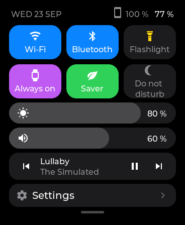

**Battery and Diagnostics, in Settings.** The Battery app is gone: its
figures live in Settings' Battery page, with the charge as a bar and the last
24 hours as a graph, discharging in teal and charging in green, one sample
every five minutes kept on the card. Diagnostics has bars for internal RAM,
PSRAM and the memory apps' code runs from, the load of each core, and the
chip's, the PMU's and the board's temperatures, with the last hour of both as
graphs. The HAL samples once a second on its own; measuring the per-core load
cost nothing measurable (a JPEG decode benchmark stayed at 111 ms).

| Battery | Diagnostics |
|---|---|
| 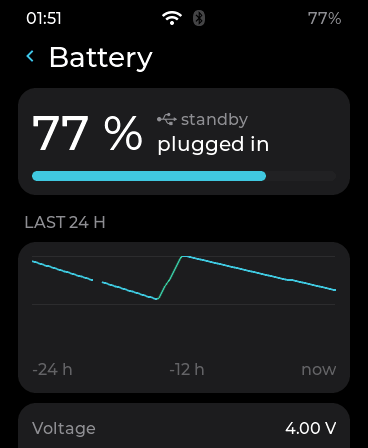 | 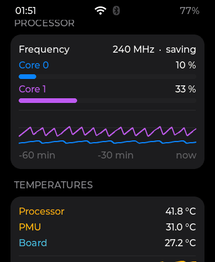 |

| Display | Menu |
|---|---|
| 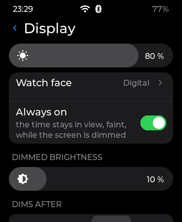 | 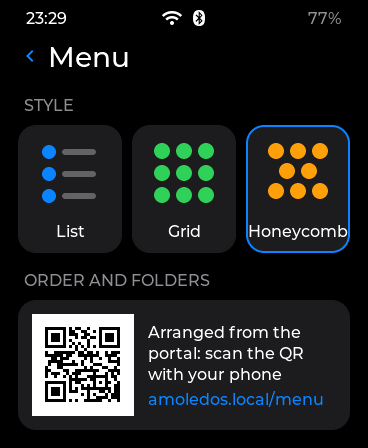 |

| Menu with folders | A folder | The honeycomb |
|---|---|---|
| 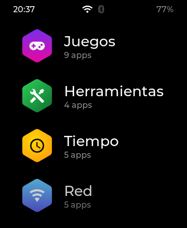 | 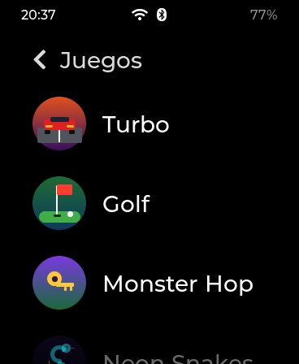 | 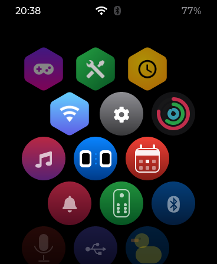 |

| Notification | Setup AP |
|---|---|
|  |  |

## The apps

Fifty-one of them, plus one for every Lua script on the card, in three
families that differ in where the code lives — not in what they are allowed
to do.

### Built into the firmware

Twenty-one ship inside the binary. They are the ones the watch cannot be without
— if the microSD is out, these still work.

| | | |
|---|---|---|
| <br>**Actividad** — steps against a goal, the week as bars, and the raw QMI8658 reading. The detector is tuned on recorded, counted walks (wrist and pocket): [docs/STEPS.md](docs/STEPS.md). | <br>**Cronómetro** — laps, and it keeps counting with the screen off. | <br>**Temporizador** — countdown with presets, and it rings through the speaker. |
| <br>**Pomodoro** — work and break cycles, with the day's tally kept across restarts. | <br>**Reloj mundial** — several cities at once, each with its own offset. | <br>**Alarmas** — up to six, each on its own days of the week, checked by a service that runs whatever app is open; also editable from the portal. |
| <br>**Calendario** — the month, drawn with the week starting on Monday. | <br>**Notificaciones** — the iPhone's, over ANCS: history, per-category filter and actions. | <br>**Control BT** — the phone's music over AMS: title, artist, album and transport. |
| <br>**Música** — plays WAV from the card through the ES8311 codec. | <br>**Fotos** — JPEG, PNG and BMP from the card, decoded and scaled to the screen. | <br>**Linterna** — the panel at full white, which on an AMOLED is the only way to make light. |
| <br>**Nivel** — a spirit level off the accelerometer, with the bubble and the angle in degrees. | <br>**Calculadora** — four operations, sized for a thumb rather than for density. | <br>**Conversor** — units across several families, with the keypad shared with the calculator. |
| <br>**Diagnóstico** — memory, the load of each core and three temperatures, with graphs; a page of Settings, next to Battery, which used to be an app of its own. | <br>**Vida** — Conway's Game of Life and Langton's ant on a 92x92 grid. | <br>**Ajustes** — six quick tiles and the brightness up top, then a page per category: display and its timeouts, sound, notifications and do-not-disturb, menu style, time, language, battery, touch, about. |
| 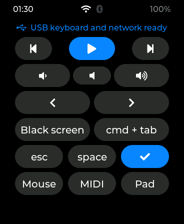<br>**Control PC** — the watch as a keyboard with media keys, a mouse, a gamepad and a MIDI port for the computer on the USB cable, one screen per role. | 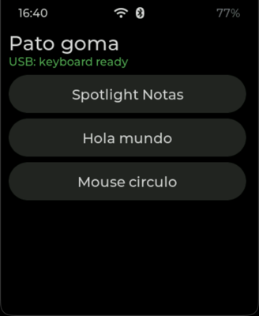<br>**Pato goma** — runs keyboard-and-mouse scripts on the computer, DuckyScript-style, picked and confirmed on the watch and edited from the portal's `/pato` page. | 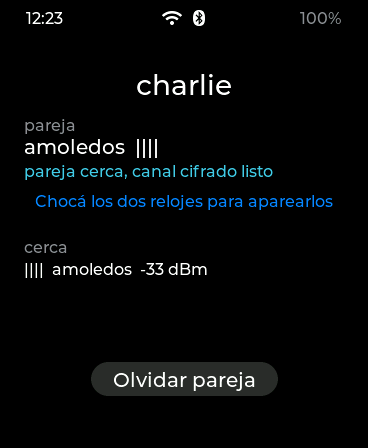<br>**Enlace** — the other watches around, and the one this is paired with. Pairing is bumping the two watches together. See [Two watches](#two-watches). |

### Loaded from the microSD

Thirty-three more live in [`apps/`](apps/) and are loaded from `/sdcard/apps` as
`.so` files at startup. The same source builds into the simulator, so they are
designed on a laptop and copied to the card without changing a line — and a new
one needs no firmware rebuild. That includes its **launcher icon**: an app
describes it as a few dozen bytes of shapes and hands them over at load, or an
`.aic` file dropped on the card does; the firmware's own icons are the same
tables. Until v0.3.7 an icon was a switch case in the firmware, and every new
app meant a reflash for that alone. See [docs/ICONS.md](docs/ICONS.md).

#### Golf, the first app built from 3D assets

<p align="center">
  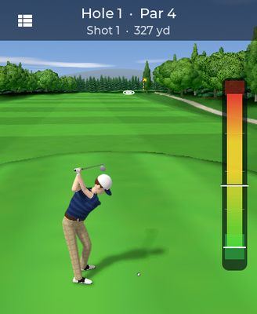
  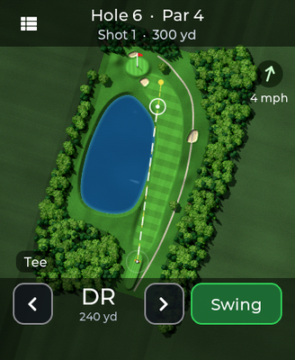
  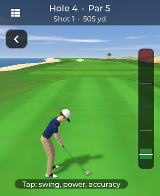
</p>

The golfer is a model built and animated in **Blender** from a script, with
no `.blend` file: a swing, a wait, a cheer, a sulk and a turntable, 750
renders packed with LZ4 into a 1.1 MB `golf.pak` that sits on the
card next to the `.so`. Every frame is rendered twice, once for the light on
neutral grey and once for which region each pixel belongs to (skin, shirt,
stripes, trousers, check, shoes, hat...), and the watch multiplies the two
with the palette of what you are wearing. So the shop sells a red striped
polo, a tartan and a cowboy hat without a single extra render:

<p align="center">
  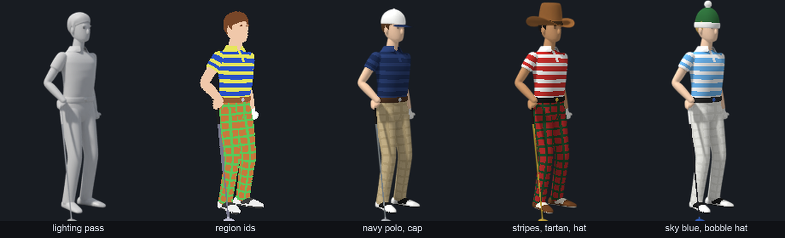
</p>

Around it the watch draws everything itself: a voxel-space 3D view of each
hole from behind the ball, from the same camera Blender rendered the golfer
with, so he stands on the ground; and a map from above, drawn from vector
shapes at any zoom, with hill shading and the ball's line. Three courses of
eight holes — woods, a windy links by the sea, a park full of water — a
tournament against three computer golfers, and the other watch over the
link. The renders run in a worker task and take 0.9 s for the map and
1.6 s for the 3D view, and the 3D is drawn ahead while you aim. Every
allocation goes to PSRAM: 11 KB of internal RAM while playing. More in
[apps/golf/README.md](apps/golf/README.md).

<p align="center">
  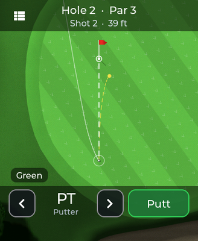
  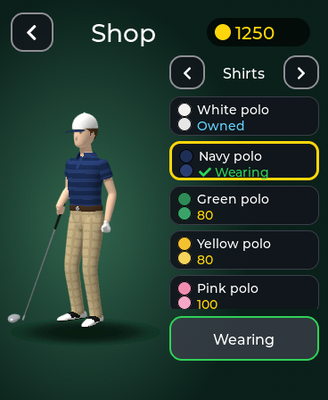
  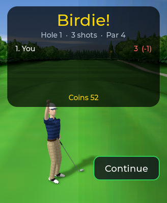
</p>

#### Turbo, an arcade racer

<p align="center">
  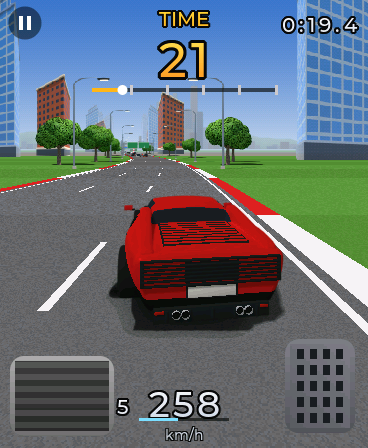
  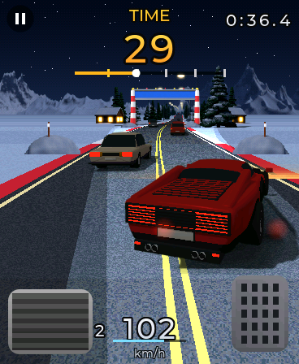
  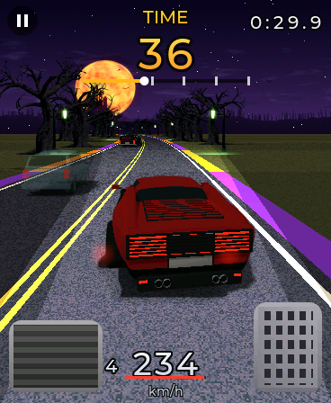
  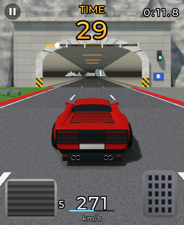
  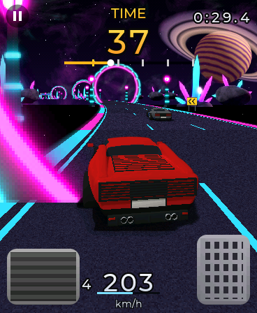
</p>

The second game built from Blender renders, and the first that moves the
whole screen every frame. The road is drawn by the watch in **pseudo-3D**,
row by row, with bends, hills and fog; the cars and everything beside the
road are sprites: nine vehicles modelled from a script and rendered as a
lighting pass plus region ids, so the traffic comes in any colour and the
garage sells twelve paints from the same pixels, and 48 props and a 360°
backdrop for each of seven stages, from a city highway with overpasses to a
road floating in space. v0.4.12 added two: Hollow Road for Halloween, with a
hearse and ghost cars you drive through, and Tunnel Ridge, with road
tunnels. Tilt the watch to steer, the pedals are on the
screen, and checkpoints refill the clock.

A full frame through LVGL is 95 ms, so the race skips LVGL: a worker on the
other core renders into PSRAM buffers, in bands of internal RAM, and an LVGL
timer pushes each frame straight to the panel. 25 to 31 fps on the board,
measured over whole races; the story of how it got there from 12 is in
[apps/turbo/README.md](apps/turbo/README.md). Two paired watches race the
same stage at once, each seeing the other as a ghost.

<p align="center">
  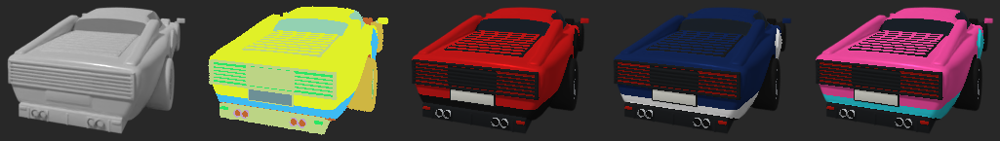
</p>

#### Monster Hop, a hop-by-hop monster maze

<p align="center">
  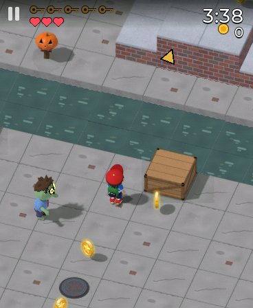
  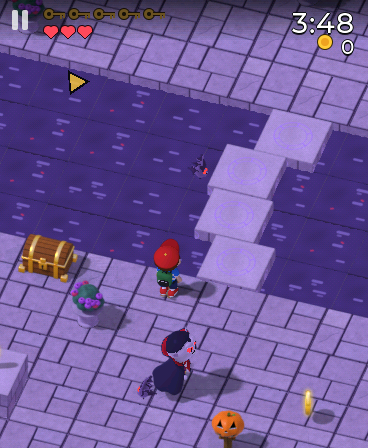
  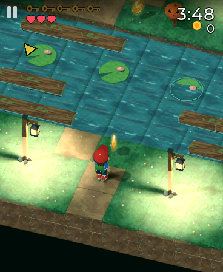
  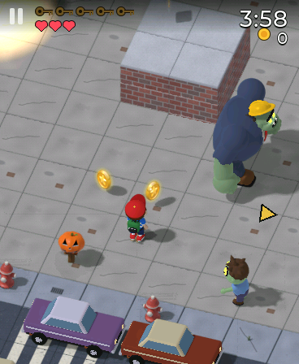
  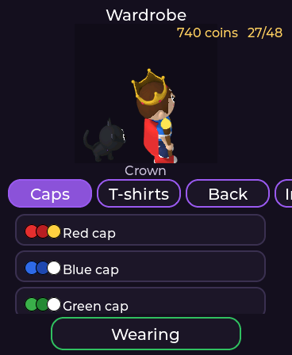
</p>

The third game from Blender renders, and the first built as a world of
blocks. Tommy, eleven and in a cap, hops cell by cell through sixteen levels
of Zombie Town, Vampire Castle, Mummy Desert and Werewolf Forest, collecting
five keys in each while zombies lunge, vampires turn into bats, mummies push
boulders and werewolves charge, with a boss in every zone's last level.
BOOT is the action: a lever, a chest, a crate to push into the water, or a
super hop. Every block, prop, monster and each of Tommy's caps, capes and
pets is a sprite with a depth pass: the watch builds each level from them
into a background cache that knows the depth of every pixel, and the
sprites are tested against it pixel by pixel, so Tommy walks behind a wall
and shows through it as a silhouette. Tommy's house is the hub: wardrobe,
shop, a sticker album with one sticker hidden per level, trophies. 25 fps on
the board. Two paired watches race for the same keys. More in
[apps/monsterhop/README.md](apps/monsterhop/README.md).

<p align="center">
  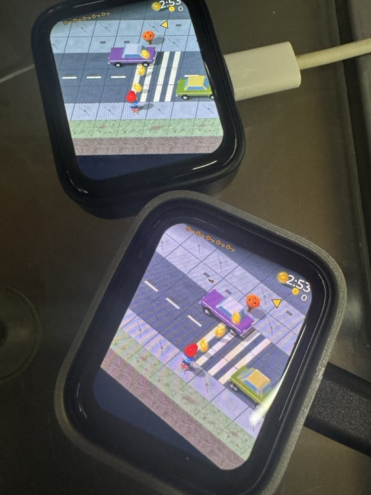
  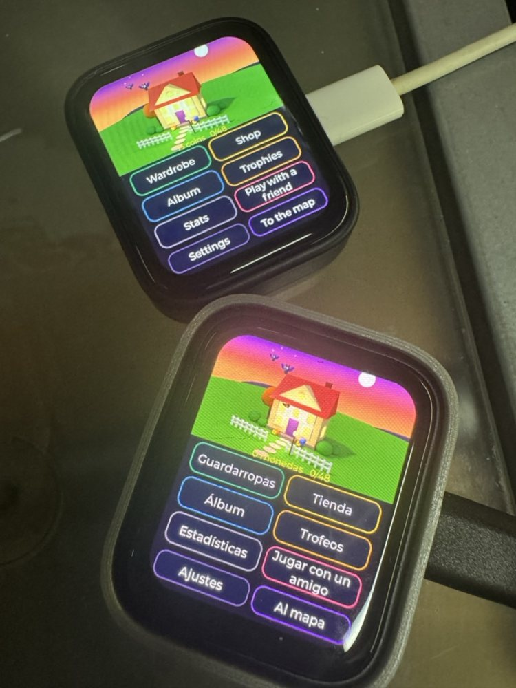
</p>
<p align="center"><em>A key race on two boards: the same cars in the same
places, each watch with its own camera. And Tommy's house on both, one in
English, the other in Spanish.</em></p>

#### Mila, a Sokoban with a black kitten

<p align="center">
  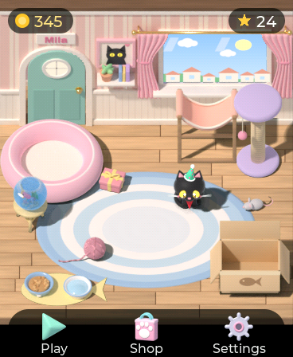
  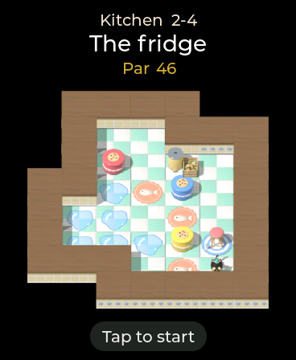
  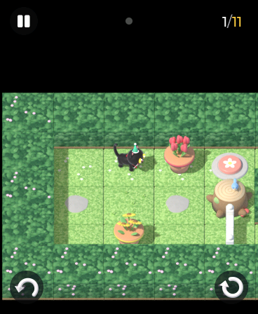
  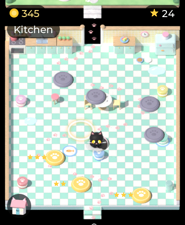
  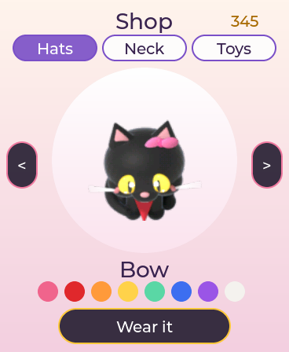
</p>

The fourth game from Blender renders, and the first puzzle. Mila, a small
black kitten with amber eyes, pushes things back to their place around the
house: yarn balls into baskets, cookie tins onto placemats (on a wet floor
they slide on), flower pots past gates that open while a plate holds
something, cardboard boxes through an attic where only she fits through the
cat flaps, and crates across the rooftops at night, into holes they fill,
with balls that roll until they hit something. Forty levels, each solved by
a solver that runs the game's own rules, which also gives its par. A level
opens on the whole room, then the camera flies down onto Mila and follows
her; a finger held on her shows the whole room again. Her casita is the hub:
she wanders, sleeps, grooms and plays with the toys you buy, chases the
mouse you drag, and leaves a small present once a day. The worlds are data
in the pack, so a new one needs no code. 25-26 fps on the board. More in
[apps/mila/README.md](apps/mila/README.md).

<p align="center">
  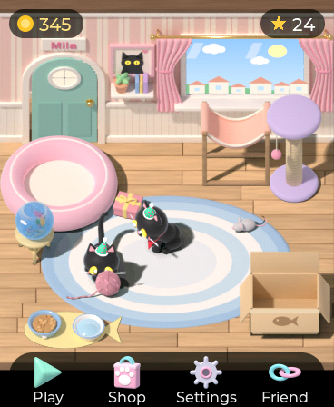
  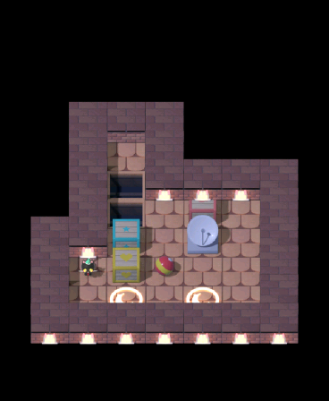
  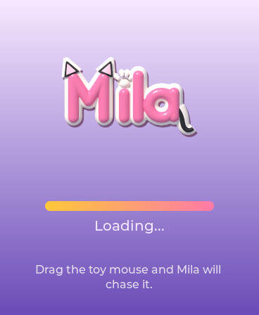
</p>

#### The others

| | | |
|---|---|---|
| <br>**Chatarra** — a turn-based robot RPG. Eight zones, 61 rooms, 64 parts drawn from descriptors rather than sprites. A team of three, a phone booth to fight another watch, a fair at the docks, weather and a day that turns to night. | <br>Its combat: six elemental types, an effectiveness table, the rival's parts as far as your register knows them, and a robot you built from parts torn off others. | <br>**Claude Jump** — a vertical platformer with five zones, coins and sixteen costumes. |
| 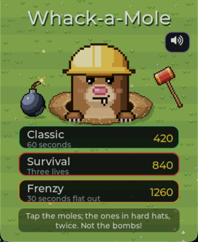<br>**Topos** — whack-a-mole in three modes. A mole in a hard hat takes two taps, a golden one is worth a lot, and a bomb must not be touched. | 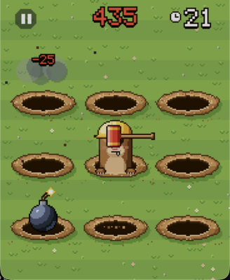<br>Frenzy: several at once and combos up to ×5. The lawn never moves, so only what comes out of the holes is redrawn — about a tenth of the screen per frame. | 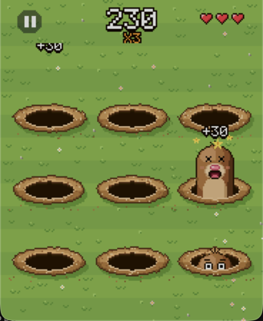<br>Survival: three hearts and a level every eight moles. Every state has its own sprite — peeking, glancing about, taunting, dizzy, the hat flying off. |
| 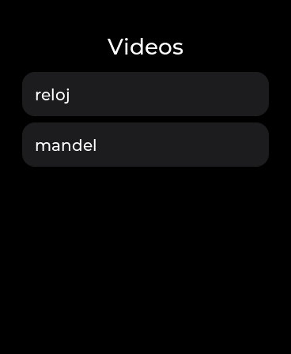<br>**Video** — plays MJPEG AVIs from the card at the screen's size, with sound, at 15 fps. `tools/video_convert.sh` makes the pair of files from anything ffmpeg reads. | 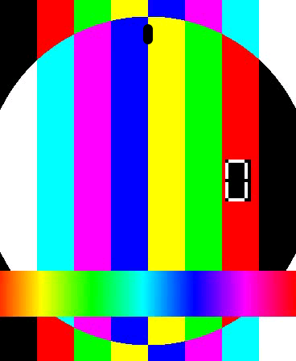<br>The sound is the clock: the frames follow the player's position and a late one is skipped, never the other way round. Reading and decoding run in a background task on the second core, the first app to have one, and the frame goes straight to the panel past LVGL's render. The numbers are in [docs/VIDEO.md](docs/VIDEO.md). | 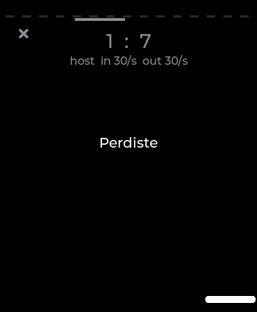<br>**Pong** — across two watches: the ball leaves the top of one screen and comes down the other's. The host simulates at 30 Hz over the link's fast channel; 30 states a second each way, measured, with an iPhone connected. |
| 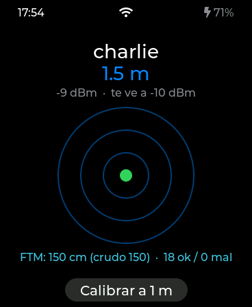<br>**Radar** — where the other watch is. Pings ten times a second carry the signal strength each side sees, and a path-loss model calibrated at one metre puts the partner on the rings; underneath, FTM time of flight (IEEE 802.11mc): one watch answers from its softAP, the other measures 16 frames every 1.5 s and both show the distance in centimetres. | 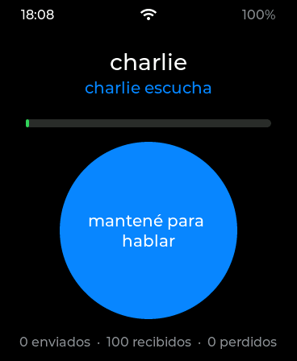<br>**Walkie** — push to talk between two watches. Hold the button and 29 ms frames of IMA ADPCM go out on the fast channel, 34 a second; let go and the speaker takes the codec back and plays what arrives through the HAL's streaming speaker. Half duplex because the ES8311 is one codec for both directions. | 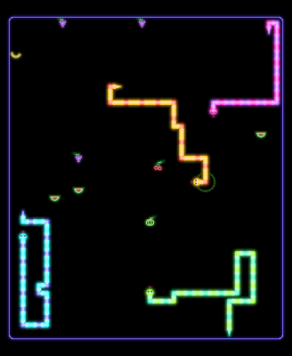<br>**Neon Snakes** — neon snakes eating neon fruit on a screen that is black everywhere else, no score. Normal is the classic; Battle pulls the camera back to four snakes, you against three bots or against the paired watch and two bots. Every sprite is drawn by code from distance fields, and only the cells that changed are repainted: 28 fps on the board. |
| 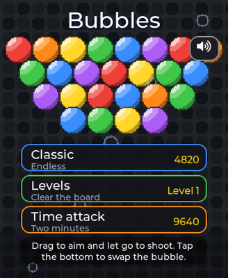<br>**Burbujas** — a bubble shooter in three modes: endless, generated levels where the ceiling comes down, and two minutes against the clock. | 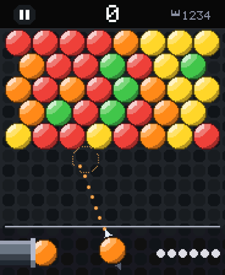<br>You aim by dragging: the dotted line is the shot itself, run ahead of time through the same stepping function, so it cannot promise a bounce the bubble will not make. The dashed circle is where it would stick. | <br>Time attack: two minutes, and the rows arrive by the clock rather than by your misses. The still board is the background rather than a sprite per bubble, so sixty bubbles hanging there cost nothing per frame: 9-18 % of the field is redrawn, and the watch holds 29 fps. |
| <br>**Blackjack** — against the house on a green table: six decks, the dealer stands on 17, blackjack pays 3 to 2, with insurance, doubling and a split. The **Hint** switch rings in gold the play basic strategy would make — here, standing on two queens. | <br>A split, each hand settled on its own. Every card is its own ARGB8888 canvas drawn once and then moved as an object, so only the area it crosses is repainted; the hole card turns over by squeezing its horizontal scale. The rules engine plays a million hands on the Mac and checks every payout: 0.46 % house edge with basic strategy, the textbook figure. | <br>The art is plain C with no bitmaps: the suits are implicit curves (the heart is the classic sextic), the indices a stroke font, and the jack, queen and king pixel art mirrored top to bottom like a real deck. The curved words on the felt are real fonts, so they are translated. |
| <br>**Gemas** — match-three. The jewels are traced in code as convex polygons with facets, not stored as bitmaps. | <br>**2043** — a vertical shooter, an homage to Capcom's 1943, with a different boss per planet. | <br>**Arkanos** — brick breaking, twelve walls, and the app that introduced dirty-rectangle drawing. |
| <br>**Claudito** — a virtual pet, entirely hand-drawn pixel art on a 92x112 grid. | <br>**Truco** — Argentine truco against the machine, with cards drawn in code and a matchstick scoreboard. Since v0.4.1 also against the other watch over the link: the same engine runs on both, and only the moves travel. | <br>**Atasco** — a sliding block puzzle. 25 levels, each with a BFS-verified minimum move count. |
| <br>**Clima** — weather from Open-Meteo over HTTPS, with the icons drawn from shape descriptions at any size. | <br>**Remoto** — a programmable Home Assistant remote: button pages, accelerometer gestures and a dial you turn with your wrist. | <br>**Sensores** — up to four Home Assistant sensors with three hours of chart, sampled by the watch itself. |
| <br>**Afinador** — a chromatic tuner (NSDF pitch detection) and a sound level meter with A weighting. | <br>**Recorder** — voice memos to WAV on the card, with a live waveform. | <br>**Buscaminas** — minesweeper on a single canvas, because 250 LVGL objects do not fit in internal RAM. |
| <br>**Laberinto** — a ball rolling through a generated maze, driven by tilting the board. | <br>**Cotizaciones** — exchange rates, configured from the portal. | <br>**Escáner** — a WiFi and LAN survey: networks around you, hosts and open ports, written to the card as NDJSON. |
| <br>**Flappy** — one button, one bird, the usual pipes. | <br>**Simon** — the colour-and-sound memory game, each pad with its own tone. | <br>**Dados** — dice of any number of sides, rolled by shaking the watch. |
| <br>**Pixel Art** — 8x8 and 16x16 drawings with a 32-colour palette, frames that become a looping GIF, exported to the card as PNG and GIF. <br>The kitten is one of the samples it seeds on first run, and this GIF is the watch's own export. Since v0.4.2 a drawing can be sent to the other watch over the link. | <br>Its gallery of eight canvases. The same files open in the portal's `/pixel` page, where they are drawn with a mouse and saved back; the watch reloads them on its own. | <br>**hello_app** — the 30-line template. It is what you copy to start one of your own; see [docs/APP-API.md](docs/APP-API.md). |

### Written in Lua, on the watch

One of those `.so` files is a **Lua 5.4 interpreter**, and with it a script is
not code you compile but a file you drop on the card. Put `cubo.lua` in
`/sdcard/lua`, open it, and it runs. Get it wrong and you get a message with
a line number on a black screen — never a reboot, which is the whole point.

| | | |
|---|---|---|
| <br>**The bench** — a wireframe cube whose two rotations, perspective divide and twelve lines are all done in Lua, per vertex, per frame. Tap for another cube. | <br>A mistake is a message, with the file, the line and the name of the variable. The watch carries on: every call into Lua goes through `lua_pcall`, and a script that will not come back is cut by an instruction hook before the watchdog notices. | <br>The whole of that one: `function draw()`, a circle and two lines of text. All four callbacks — `init`, `tick`, `draw`, `touch` — are optional. |
| <br>The scripts on the card, listed by the Lua app. | <br>And each one is an entry in the launcher of its own, beside the apps written in C: a script names itself with `-- @name Cubo` and takes an icon from a `.aic` beside it — four lines of shapes assembled with `tools/aic.py asm`, no toolchain involved. The module declares one app per script, which is a thing a `.so` could not do before v0.3.15. | <br>**Pelotas** — the other way of drawing: the world is painted once and frozen, the app puts back what the last frame drew, and only the rows that changed go to the panel. 76 of 224, and the frame goes from 40 ms to 21. The grid is the point: erasing by painting over it would leave holes. |

**It is not the interpreter that is slow.** Measured on the board: 200,000
turns of a loop in 105 ms, about 1.9 M a second, with the code running from
PSRAM through the MMU. A frame of the cube is 3 ms of script, 8 of upscaling
and 26 of pushing 368x448 pixels at the panel — so the panel is the ceiling,
and a script has some 30 ms a frame to spend before it becomes the slower
half. That is around 57,000 VM instructions.

And it only pays for what it moves: the app pushes **only the rows the script
touched**, which it works out on its own from the boxes the primitives mark.
The cube clears every frame, so it pushes all 224 rows and costs what it
always did; the bouncing balls, over a background the app puts back for them,
push 76 and take the frame from 40 ms to 21.

And it costs **52 bytes of internal RAM**, the scarce kind, because Lua's heap
is allocated straight out of PSRAM; with the default allocator the same state
took 50 KB of it. The whole story, with the numbers and the two build flags
without which none of this works, is in [docs/LUA.md](docs/LUA.md).

The loop is short on purpose: the portal's `/lua` page is an editor with a
console, and while a script is running the watch watches the file it came from
and reloads it when it changes. You save in the browser and look at the watch.

## Two watches

Two of them talk over **ESP-NOW**, with no router in between: WiFi frames
without an association, a few milliseconds one way. The **Enlace** app shows
the watches around (each beacons its name once a second) and pairs two of
them with a gesture: **bump them together**. Both feel the knock, both say
so on the air, and if the two knocks are within 400 ms and the signal says
"next to me", they are partners: a key derived from both sides' nonces, an
encrypted peer, remembered across restarts. On top of that the firmware
offers apps a fast channel (send and forget, for a game's state) and a
reliable one (in order, acknowledged, resent, for turns and files), and the
simulator has the same link over UDP, so a two-player app is designed on a
laptop with two windows.

<p align="center">
  
</p>
<p align="center"><em>Paired by a bump: the one on the left is set to Spanish, the
other to English. "Canal cifrado listo" / "encrypted channel ready" is the
proof both hold the same key.</em></p>
<p align="center">
  
  
</p>
<p align="center"><em>Pong is played with the two watches top to top: the ball
leaves one screen and comes down the other.</em></p>
<p align="center">
  
</p>
<p align="center">
  
  
</p>
<p align="center"><em>Truco for two (v0.4.1), the watches facing each other
across the table: charlie calls envido and amoledos has to answer; a hand
later amoledos calls truco. Both run the same deterministic engine from
the same seed; the host orders the moves and the guest applies only what
comes back.</em></p>

v0.4.2 adds the two smaller link apps: **Pixel Art** sends a drawing to the
other watch (the `.pix` file, in chunks over the reliable channel, into the
first empty slot on the other side), and **Radar** shows where the other
watch is, by signal strength and by FTM time of flight. v0.4.3 adds the
**Walkie**, push to talk over the fast channel, and with it the streaming
speaker the HAL lacked (`aos_hal_spk_*`). v0.4.8 brings **Neon Snakes**
in lockstep, v0.4.9 **Golf**: only the shots travel, each with the
place the ball stopped, so the two watches can check they agree, and
v0.4.10 **Turbo**: both watches race the same stage at once and see each
other as a ghost car; when both have built the stage they start together,
34 ms apart on two boards. v0.4.13 **Monster Hop** races for keys: both
play the same level with the same clock, the keys, levers, crates and chests
are shared, and a key both grabbed goes to whoever grabbed it first.
v0.5.5 **Mila** does two things: a visit, where the friend's Mila comes in
through the casita's door in her own outfit and plays with yours, and a
race on a level open on both, with the other's progress on a pill.

<p align="center">
  
</p>
<p align="center"><em>The walkie after a chat through a closed door, five metres
apart: 24 frames one way, 31 the other, nothing lost. One watch in Spanish,
the other in English.</em></p>

And the sixth app on the link is not a link app at all: **Chatarra**, the robot
RPG, grew a **phone booth** in each of its eight towns. Walk into it and the
watch goes on the air and talks to the one it is paired with — fight, swap a
robot, swap a part — and walk out and the radio comes down. The battle is
lockstep like Truco's: both watches run the same combat over the same seed and
only the two choices of the turn travel, one byte each.

<p align="center">
  
  
</p>
<p align="center"><em>The booth, and then the same battle from both sides: the
one in English is CRATE LV6 and sees the rival at LV5; the one in Spanish is
CAJA N5 and sees the rival at N6. The guest says ESPERANDO while the host
resolves the turn.</em></p>
<p align="center">
  
</p>
<p align="center"><em>And back in the booth afterwards: 17/40 against 0/36, and
both say good fight in their own language.</em></p>

The seventh is **Neon Snakes** (v0.4.8): Battle → Multiplayer puts the two
watches in the same arena with two bots. Lockstep again, but with a clock: the
host decides where both snakes turn on every step and sends that decision on
the reliable channel before applying it, eight times a second; the guest
applies exactly what arrives, and checks a hash of the board after each step.
A minute on two boards: 470 steps, none resent, no divergence. It also found
the link's newest trap, which two simulators never showed: a frame on the
reliable channel can overtake one sent earlier on the fast channel, so
nothing that travels fast may be a precondition for something that travels
reliably.

<p align="center">
  
</p>
<p align="center"><em>The same Battle on both watches, one turned towards
each player. The ring on the lower screen marks that watch's own snake for a
couple of seconds after it comes back.</em></p>

The plan, and everything measured along the way — 6000 frames with nothing
lost on the air, 3-5 ms round trip, 60 KB/s, what Bluetooth costs, what a
watch that leaves its network to sit on a channel costs, 100 KB over the
reliable channel with a third of the frames dropped on purpose, and the
knock that paired the watches seventeen times — is in
[docs/LINK.md](docs/LINK.md).

## The USB port

The USB-C port is one thing at a time, chosen in Settings or in the portal:
the **console** it boots as (the log and `esptool`), a **keyboard and
network** for the computer, the **card as a disk** of the computer, or a
**host** for a pendrive. In keyboard mode the watch is a keyboard with media
keys, a mouse, a gamepad, a MIDI port and a network card at once, and the
portal answers at `http://192.168.7.1` (and `<name>.local`, `amoledos` unless you name the watch in Settings) over the cable
with no WiFi. Everything measured is in [docs/USB.md](docs/USB.md).

| | | |
| --- | --- | --- |
| <br>**Control PC** — music, volume, slides, cmd+tab and the three keys every dialog wants, on the computer the watch is plugged into. | <br>**Mouse** — the gyroscope moves the pointer, tap clicks, hold right-clicks; four speeds and switches for the wrist. | <br>**Pad** — a cross, four buttons, shoulders, select and start; the tilt is the left stick after "Centre". |
| <br>**MIDI** — an octave of keys into any synthesizer, the octave up and down, and the wrist's roll as pitch bend. | <br>**Settings → USB** — the mode as a dropdown and what the port is doing right now. The portal's `/usb` page has the same, plus a key pad and the diagnostics. | |
| <br>**Pato goma** — keyboard-and-mouse scripts the watch plays over USB onto the computer. You write them in the portal's `/pato` page — a step builder or raw DuckyScript-like text — pick one on the watch, and confirm before anything is sent. For education and demonstration only. | <br>The confirmation, with a preview of the script and its step count. Nothing runs without this tap. | <br>Playing out: a progress bar, the current step and a Stop. Each key or typed character is one timer tick, so the screen stays responsive and Stop always answers. |

## Flash it without building

The [latest release](https://github.com/charliejgallo/ESP32S3_AmoledOS/releases/latest)
carries the firmware and the thirty-four dynamic apps already built, for the
Waveshare ESP32-S3-Touch-AMOLED-1.8.

```bash
# 1. the firmware: one file, written at 0x0
esptool --chip esp32s3 -p <PORT> -b 460800 write_flash 0x0 amoledos-full.bin

# 2. the apps: unzip onto the microSD, in a folder called apps/
unzip apps.zip -d /Volumes/<sd>/apps/

# 3. the language packs, in a folder called lang/ (English and German ship
#    inside the binary too, but a pack on the card wins, so keep them current)
unzip lang.zip -d /Volumes/<sd>/lang/

# 4. the example Lua scripts, in a folder called lua/ (optional)
unzip lua-scripts.zip -d /Volumes/<sd>/lua/
```

> `amoledos-full.bin` is a **factory image**: it spans the flash from 0x0, so it
> overwrites the NVS partition and the watch comes up with no wifi credentials,
> no language, no watchface and no app data. That is what you want on a fresh
> board. To update a watch already in use, take
> `amoledos-firmware-files.zip` instead — the same build as four separate files
> that leave NVS alone. Or, since v0.5.0, download a backup from the portal's
> `/ajustes` page first and restore it after: every setting, every app's
> data and the menu's folders come back.

The apps are loaded once at startup, so restart the board after copying them.
Then set the wifi up from the watch: Settings → Wi-Fi → Set up network raises
an access point and shows a QR code.

**After that first install the cable is optional.** The firmware updates over
WiFi — `./tools/install_fw.sh <board-ip>`, or drop the `.bin` on the portal's
front page — writing into the idle one of the two 5 MB app slots and leaving
NVS alone, so your wifi, language and app data survive. The new image boots on
trial and the bootloader goes back to the previous one on its own if it does
not come up. See [docs/BUILDING.md](docs/BUILDING.md).

## Quick start

```bash
# firmware
source ~/esp/esp-idf/export.sh
idf.py set-target esp32s3
idf.py build && python3 tools/gen_symbols.py && idf.py build
idf.py -p /dev/cu.usbmodem* flash monitor

# simulator — no board needed
brew install sdl2 cmake
cd sim && cmake -B build && cmake --build build -j8 && ./build/amoledos_sim
```

The symbol table needs two passes: dynamic apps resolve LVGL, the HAL and libc
against a table generated from the build's own libraries, so the libraries have
to exist first. See [docs/BUILDING.md](docs/BUILDING.md).

## How it is put together

```
main/                 startup on the board
sim/                  startup on the desktop (SDL2)
components/
  aos_hal/            the single contract with the platform
  aos_board/          AXP2101, PCF85063A, QMI8658
  aos_ui/             launcher, watchfaces, navigation, theme, i18n
  aos_apps/           the 20 built-in apps
  aos_dynapp/         .so loader and symbol table
  aos_ble/            NimBLE: ANCS, AMS, pairing
  aos_web/            the web portal, embedded in the binary
apps/                 34 dynamic apps
tools/                generators, test benches, board utilities
```

The rule that holds it up: **`aos_ui` and `aos_apps` include only LVGL and
`aos_hal.h`**, never an ESP-IDF header. That is why the same interface code
compiles for the board and for the desktop, and why every screen can be
designed, audited and screenshotted without hardware.

Four files are shared verbatim by both platforms because they contain no
platform code at all: the HTTP/TLS client, the notification policy, the
network survey's report format, and the link between two watches (beacons,
pairing, the reliable channel) above a raw layer that is ESP-NOW on the board
and UDP in the simulator.

## Documentation

| | |
| --- | --- |
| [ARCHITECTURE.md](docs/ARCHITECTURE.md) | how the pieces fit, the drawing model, and what the measurements taught |
| [HARDWARE.md](docs/HARDWARE.md) | the board, the pinout, and the quirks the datasheets do not mention |
| [BUILDING.md](docs/BUILDING.md) | firmware, simulator, dynamic apps, and every tool |
| [APP-API.md](docs/APP-API.md) | writing an app, and the things that will bite you |
| [APP-GUIDE.md](docs/APP-GUIDE.md) | the long form: how the apps were actually written - workflow, the four drawing techniques with their costs, data from the internet, configuration from the portal, testing without the board, and every trap that bit |
| [LINK.md](docs/LINK.md) | two watches over ESP-NOW: the plan in phases, the design, what every phase measured, and the five apps on it |
| [I18N.md](docs/I18N.md) | how translation works and why the key is the Spanish string |
| [LUA.md](docs/LUA.md) | scripts on the watch: what a script is, everything it can reach, the rules the app enforces and why, and what a frame actually costs |
| [MENU.md](docs/MENU.md) | the launcher's order and folders: `menu.txt`, the hexagon icons, the `/menu` page, and what 256 apps cost the board |
| [ICONS.md](docs/ICONS.md) | icons as data: the AIC format, how a `.so` or a file on the card brings one, how the 36 hand-drawn ones became tables, and what it saved |
| [POWER.md](docs/POWER.md) | the AXP2101, the rails, light sleep, and the measurements behind each switch |
| [PORTAL.md](docs/PORTAL.md) | the web portal: pages, API, what it costs the board, and the dev server |
| [STEPS.md](docs/STEPS.md) | the step counter: why it is software, how it was tuned on counted walks |
| [VIDEO.md](docs/VIDEO.md) | video from the card: the decoder, the background task, the direct blit, and the clock |
| [RAM-AUDIT.md](docs/RAM-AUDIT.md) | where the internal RAM went and how the apps' code moved to PSRAM |
| [ROADMAP.md](docs/ROADMAP.md) | what is planned and has no date: Android phones, and USB host (a pendrive on the watch), waiting for a way to power it |
| [USB.md](docs/USB.md) | the USB-C port as a device or a host: what the board allows, the catalogue, the test rigs, the measurements and what was found |

## A note on what is written down

Most of the comments in this repository explain *why*, not *what*, and many of
them record something that was measured rather than assumed. A few examples of
what that looks like in practice:

* The touch panel **reports nothing below y = 395**, although the display draws
  to 447. It was found by printing every touch across four apps. No calibration
  fixes it. Every screen in the project is laid out around it.
* Letting LVGL stretch a canvas costs **129 ms per frame**. Every game upscales
  by hand.
* Rebuilding a twenty-row list costs **111–124 ms** with the LVGL thread
  blocked; filling the same rows in costs 18–31.
* Dynamic apps used to take their code from a **48 KB contiguous reservation**
  claimed at startup, because the general heap fragments. Since the RAM audit
  the loader puts each app's code in PSRAM and maps it onto the instruction
  bus through the MMU; the games run at the same frame rate as from internal
  RAM, and the executable heap idles with 140 KB free instead of 30
  ([docs/RAM-AUDIT.md](docs/RAM-AUDIT.md) has every number).
* An autocorrelation pitch detector returns 146.8 Hz for a 440 Hz tone. The
  tuner uses NSDF and picks the *first* peak over the threshold, not the
  highest.

Where something is a guess, it says so.

## Status

Running on hardware. WiFi, BLE against a real iPhone, audio in and out, the
microSD, the web portal, TLS, over-the-air updates and the USB port in its
device modes (keyboard, mouse, gamepad, MIDI, network, disk) have all been
exercised on the board — most of the measurements quoted throughout the source
were taken there. The link between two watches has been played with on two
boards: Pong, Truco, a drawing sent, the radar, the walkie through a door, a
fight in Chatarra's phone booth and a match of Neon Snakes.
USB host mode (a pendrive on the watch) works but is parked: the board cannot
power a peripheral ([USB.md](docs/USB.md)).

Known gaps: MP3 — the player handles 16-bit PCM WAV only. On the power side,
the clean power-off at 3 % and the charge-cycle counter are written and
reviewed but have not yet been through a real discharge, and the night-on-
battery figure is still to be taken — [POWER.md](docs/POWER.md) section 7 is
the protocol and `tools/battery_night.py` the recorder.

## Licence

MIT — see [LICENSE](LICENSE).

`components/elf_loader/` is Espressif's, under Apache-2.0, vendored with a
small local change. LVGL and ESP-IDF are pulled in by the component manager
under their own licences.
