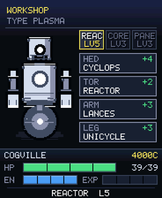
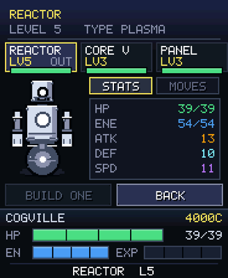
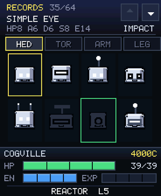
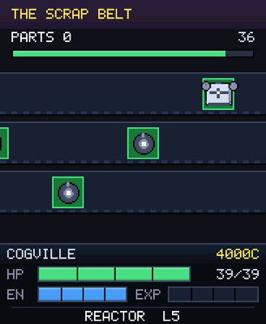
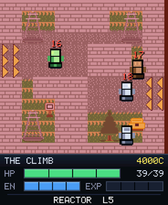
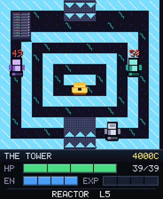
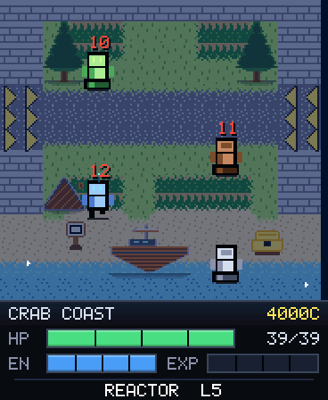

# CHATARRA — a turn-based robot RPG

An open-world RPG laid out in rooms, with turn-based combat, in which the robots
— yours and your rivals' — are put together from **four interchangeable parts**:
head, torso, arms and legs. Sixteen variants of each give 65,536 robots, and not
one of them is written down anywhere.

The game loop is: walk around, fight, **rip a part off whoever you beat**, fit it
in the workshop and head out again with a different robot.

<p align="center">
  
  
  
</p>
<p align="center">
  
  
  
</p>

**v2 (2026-09-20)** redrew the world at **12 px a cell** instead of 8 — fewer,
bigger cells, which costs the same and touches far better on a 1.8" screen — and
with it came 61 rooms, towns split into sectors, a team of three, a phone booth
per town, a fair, and the whole menu rebuilt out of tiles. Section 18 is the
short version; `docs/internal/HANDOFF-CHATARRA-V2.md` is the long one.

---

## 1. What to know before touching anything

### `.text` used to be the only scarce resource. It is not any more.

This section opened, for two weeks, by saying that dynamic apps take their code
from a reservation of **48 KB shared by every loaded app**, that `.rodata` goes
to PSRAM instead, and that therefore a line of code cost eight bytes of a pool
while a kilobyte of table cost nothing.

**Since v0.3.4 that is no longer true** (`docs/RAM-AUDIT.md`, section 8). The
loader maps the apps' `.text` into PSRAM through the instruction-bus MMU: the
reservation is gone, the executable heap went from 22 K free in one block to
131 K, and the games were measured on both builds at the same frame rate —
Claude Jump 29.2 against 29.0 fps, 2043 9.6 against 9.6, with run-to-run noise
larger than any difference between them.

Measured on 2026-09-20, with the team of three, the booth and the icon:

```
.text          55,103 B   to PSRAM, 64 K-aligned    (was 38,475 on 2026-09-08)
.rodata        31,495 B   to PSRAM
.data.rel.ro   15,628 B   to PSRAM
.bss            2,540 B   to PSRAM
```

The warning that used to live here — *watch the 78 %, a `BACKGROUND` app like
the Recorder pushes Chatarra out of the reservation* — **no longer applies, and
this paragraph is all that is left of it**. There is no reservation to be pushed
out of. If the old line

    N B of code did NOT fit in the reservation

ever shows up in the log, it means the firmware was built WITHOUT
`CONFIG_ELF_LOADER_TEXT_PSRAM_MMU`, and then everything the old section said
applies again word for word.

### What survives the change, and why

The number that proved the old rule still says something true: with only zone 1
the `.text` was **28,375 B**; adding zone 2 moved it by 228 bytes, and **adding
zones 3 through 8 — 36 more rooms — did not move it BY A SINGLE BYTE**. Three
quarters of the game cost no code.

That is no longer a saving, but it is still the reason the game can be checked.
Content that lives in tables is content a program can walk: `ch_map_check()`
reads all 51 rooms and finds a door standing on a wall, a chest on top of a
prop, an entity with no name. It could not have read a function. **The three
rules below stay, for that reason rather than for the pool.**

1. **The 64 parts are not 64 sprites nor 64 functions.** They are 64 descriptors
   of a few bytes each and four drawing functions that interpret them
   (`ch_parts.c`). The colour goes as an argument, just like `cjump`'s costumes.
2. **The world is a table.** Maps, props, entities, dialogue, items, attacks and
   quests are `const`. Adding a whole town **does not add a line of code**.
3. **Quests are flags and texts, not logic.** An entity carries two text pointers
   and two flags; that is enough for "I want something from you / thanks, here".
   A quest state machine would cost `.text`.

### The camera does NOT move

The world is split into rooms of **one screen**: 23 x 22 tiles of 8 px. Crossing
an edge changes room. That is not a limitation that was accepted: it is what
makes the game run at 30 fps.

With a moving camera you would have to upscale and invalidate the 165 thousand
pixels every frame — the 15 fps measured in 2043 — and the whole dirty-rectangle
technique falls apart. With fixed rooms the background stands still and per
frame you repaint the player's robot and the few creatures on patrol.

**A design consequence, not an implementation one:** any idea that moves the
whole background (parallax, screen shake, an animated backdrop) throws all of
this away. Best discarded before it is drawn.

### The touch panel does not reach the edges - and the TOP is the worst one

This board's CST816 **reports nothing below a real y≈354**, and in the simulator
that does not show because the mouse reaches everywhere. That is where the
screen's division comes from:

```
buffer 184 x 224, upscaled x2 to the board's 368 x 448

  y   0..175   the map / the menus / the combat   (real   0..351)  TOUCHABLE
  y 176..223   the HUD                            (real 352..447)  NOT touchable
```

Everything touchable in this game ends at **y=174 of the buffer** (348 real).
The lists are six rows of 18 px from y=64: the last one ends right there.

**And it does not reach the top either, which cost a whole direction of
travel.** The audit's envelope (`docs/APP-GUIDE.md`) is the full rectangle:

```
real y  24..410     real x  16..352
```

On the 12 px grid of v2 a cell is 24 real pixels, so:

| edge of the map | real span | usable |
|---|---|---|
| row 0 (north) | y 0..23 | **0 px of 24** |
| row 13 (south) | y 312..335 | 24 |
| column 0 (west) | x 0..23 | 8 of 24 |
| column 14 (east) | x 336..359 | 17 of 24 |

The north doors of the sectors were **entirely outside the panel**: you could
walk south from one sector to the next and never come back. The sideways ones
"worked" on a third of a cell, which is why they felt stiff. None of this
shows in the simulator, and none of it shows with an injected tap either
(`/api/mem?tap=` goes in below the panel), so it came out of arithmetic, not
of testing.

The rule that follows: **an exit never lives in the outermost row or column
alone**. Every edge opening is `PUERTA_HONDO = 2` cells deep, growing inwards,
so the second one is always well inside the envelope.

And that is why **the menu has no on-screen button**. It opens with the
**physical button** (like a console's START) or by **touching your own robot**.
Both are written on the title screen, because neither can be guessed.

---

## 2. The files

| File | What it is |
| --- | --- |
| `chatarra.h` | the whole model: parts, robot, world, savegame, modes |
| `ch_pixel.c/.h` | pixel-art engine with dirty rectangles (copied from `cjump`, with the palette extended to earth, grass, water, stone and wood) |
| `ch_parts.c` | the 64 parts, the 44 attacks, the items, the colour schemes and the four functions that draw a robot |
| `ch_world.c` | the tiles, the props, the furniture, the animals and the entity sprites |
| `ch_zonas.c` | the 61 rooms, their entities and every line of dialogue |
| `ch_map.c` | the room engine: background, pathfinding by breadth-first search, movement, encounters |
| `ch_battle.c` | the turn-based combat |
| `ch_ui.c` | HUD, dialogue, menu, workshop, items, team screen, register, shop, title |
| `ch_link.c` | the phone booth: the protocol and the screen for the other watch |
| `ch_feria.c` | the scrap belt: the minigame at Bujia docks |
| `ch_sound.c` | the four-voice synthesiser and the sixteen tunes |
| `chatarra.c` | the only thing LVGL and the HAL see: canvas, blit, touch, button, saving |

The game (everything but `chatarra.c`) **does not know that LVGL, the HAL or the
file system exist**. It can be tested without a screen.

---

## 3. How content is added to it

### A new town or dungeon

All in `ch_world.c`, and **nowhere else**:

1. A `static const char *const M_WHATEVER[ROWS]` with **22 rows of exactly 23
   characters**. Each character is a tile (see the `TILES` table).
2. Optional: a `ch_prop_t P_WHATEVER[]` with the props (trees, houses,
   machines). **A prop cannot land on an entity's tile**: the entity always draws
   its own thing, so both would be drawn.
3. A `ch_ent_t EN_WHATEVER[]` with what you interact with.
4. A row in `ch_salas[]` and a value in the rooms `enum`.

The measurements check themselves: there is a width verifier in section 5.

### A new part

In `ch_partes[]` of `ch_parts.c`: name, five stats, type, the zone from which it
appears, the drawing style (0..15) and up to two attacks. The drawing **already
exists**: it comes from the `CAB_FORMA` / `CAB_OJOS` / `CAB_ANT`, `TOR_*`,
`BRA_*` and `PIE_TIPO` tables, which are 16 bytes each. Changing a part's look
means changing a number.

### A quest

There is no quest system and none is needed. An `E_PNJ` carries:

```
p2      the flag that marks "I already solved this"
p3      the flag it wants brought to it (0 = none)
premio  the item it hands over
texto   what it says beforehand
texto2  what it says when it sees what you brought
```

The neighbour in Villa Tuerca is the complete example: he asks for the screws,
the chest in the depot drops them in your bag and lights the flag, and on
returning the neighbour pays with a Soldering Iron and 200 credits. **Zero lines
of code of its own.**

### An attack

A row in `ch_moves[]`: name, type, power, energy cost, accuracy, effect and
probability. Then it is assigned to a part by its index. Index **0 is the basic
hit** and every robot has it: that is why parts use 0 as "contributes no attack"
and the case of being left with nothing to choose never arises.

---

## 4. Simulator switches

They only exist there; on the board `getenv()` always returns NULL.

| Variable | What for |
| --- | --- |
| `CH_SALA=5` | starts straight in that room |
| `CH_NIVEL=20` | the robot's level |
| `CH_PIEZAS=1` | full bag, items, credits **and a team of three**: for the workshop, the team screen and the swap button |
| `CH_COMBATE=<1..8>` | opens straight into a fight **in that zone's arena** |
| `CH_HERIDO=1` | both robots under a quarter of their health: for the sparks |
| `CH_MEL=<1..7>` | forces a tune, to hear it without playing up to it |
| `CH_WAV=/tmp/x.pcm` | dumps everything the synthesiser makes; `tools/pcm2wav.py` makes it playable |
| `CH_SHOT=/tmp/ch` | **one `.ppm` capture per screen change** |
| `CH_FPS=1` | frames per second and % of screen pushed |
| `CH_MUDO=1` | no beeps |
| `CH_MKV2=1` | writes a save in the OLD v2 format so the conversion can be checked without the board |

### Two simulators, for the booth

The link is UDP on 127.0.0.1, one port per instance. There is **no development
flag** to force the partner, the way Truco and Pixel Art need one: the booth
brings the radio up BEFORE it asks whether there is anybody paired, which is
both the honest order and the one the simulator answers.

```bash
cd sim
env AOS_SIM_VIEW=demo.chatarra CH_SALA=1 CH_PIEZAS=1 CH_SHOT=/tmp/a_ \
    AOS_SIM_LINK_PORT=47000 AOS_SIM_LINK_PARTNER=47001 AOS_SIM_POS=0,40 \
    AOS_SIM_KEYS="ms:3000,tap:312x216,ms:7000,tap:184x188,ms:20000" ./build/amoledos_sim &
env AOS_SIM_VIEW=demo.chatarra CH_SALA=1 CH_PIEZAS=1 CH_SHOT=/tmp/b_ \
    AOS_SIM_LINK_PORT=47001 AOS_SIM_LINK_PARTNER=47000 AOS_SIM_POS=420,40 \
    AOS_SIM_KEYS="ms:3000,tap:312x216,ms:30000" ./build/amoledos_sim &
```

`tap:312x216` is the booth in Villa Tuerca and `tap:184x188` is COMBATIR. **With
two simulators the script clock runs at about half speed** while the captures
keep wall time, which is why the waits above look so long: a step that reads as
7 s takes about 14.

`CH_SHOT` exists because the app dumps its own upscaled buffer, which
`tools/ppm2png.py` turns into a PNG; it comes out more faithful than a screen
grab, because it is exactly what gets handed to the panel.

```bash
cd sim
env AOS_SIM_VIEW=demo.chatarra CH_SALA=1 CH_SHOT=/tmp/ch \
    AOS_SIM_KEYS="ms:700,tap:184x232,ms:700,tap:184x144" ./build/amoledos_sim
python3 ../tools/ppm2png.py /tmp/ch*.ppm
```

---

## 5. Checks that have to be run

**The widths of the maps and the sprites.** A 24-character row in a 23-wide map,
or a 20-px-wide sprite declared as 3 tiles, produces no compile error at all: it
leaves rubbish on the screen and trails stuck to it. This catches it:

```bash
cd apps/chatarra/main
python3 - <<'EOF'
import re
src = open('ch_world.c').read(); errs = []
for m in re.finditer(r'static const char \*const (\w+)\[(\w+)\] = \{(.*?)\n\};', src, re.S):
    name, n, body = m.group(1), m.group(2), m.group(3)
    strs = re.findall(r'"((?:[^"\\]|\\.)*)"', body)
    lens = [len(re.sub(r'\\.', 'X', x)) for x in strs]
    if   name.startswith('PX_'): er, ew = 8, 8       # tiles: 8x8
    elif name.startswith('M_'):  er, ew = 22, 23     # maps: 22 rows of 23
    else:                        er, ew = int(n), None
    if len(strs) != er: errs.append('%s: %d rows, expected %d' % (name, len(strs), er))
    if ew:
        for i, l in enumerate(lens):
            if l != ew: errs.append('%s[%d]: width %d' % (name, i, l))
    elif len(set(lens)) != 1: errs.append('%s: widths %s' % (name, sorted(set(lens))))
    elif lens[0] % 8:         errs.append('%s: width %d is not a multiple of 8' % (name, lens[0]))
for e in errs: print('ERROR', e)
print(len(errs), 'problems')
EOF
```

**The width of the dialogue.** The box is 176 px minus 6 of margin on each side:
**27 characters** fit. More than that wraps by itself, and it looks bad ("STOP /
RIGHT THERE.").

```bash
python3 - <<'EOF'
import re
s = open('ch_world.c').read(); bad = []
for m in re.finditer(r'N_\(((?:\s*"(?:[^"\\]|\\.)*")+)\)', s):
    txt = ''.join(re.findall(r'"((?:[^"\\]|\\.)*)"', m.group(1)))
    for l in txt.split('\\n'):
        if len(l) > 27: bad.append((len(l), l))
for n, l in sorted(set(bad), reverse=True): print(n, repr(l))
print(len(set(bad)), 'long lines')
EOF
```

**And the usual ones**, which are in [`docs/APP-API.md`](../../docs/APP-API.md):

```bash
./tools/build_apps.sh chatarra        # the board is a different compiler, and it rules
python3 tools/gen_lang.py unmarked    # visible text left unwrapped
python3 tools/gen_lang.py check en
./tools/audit_layout.sh es en de xx
```

Careful with `audit_layout.sh`: it walks **LVGL objects**, and this game draws
everything on a canvas. The guarantee that nothing touchable falls below the
touch panel's limit comes from this README's arithmetic, not from the audit.

---

## 6. Traps that have already bitten here

**The robot's shadow was drawn on top of the text box.** It was a disc centred on
the base, which means it stuck out of the 26x40 box by its whole radius; in
combat that covered half a word of the message. Now it is flat and lives inside
the box. What leaves the box **does not go into the dirty rectangle either**, so
it also stayed stuck.

**You could not leave the app, and there was no error.** `aos_ui_back()` asks the
app's `back` callback first. Since leaving has to be deferred — it destroys the
app — the tick called `aos_ui_back()`, which re-entered the app's `back`, which
asked to leave again. An infinite, silent loop. The `saliendo` flag cuts the
cycle.

**A translated string cannot be `snprintf`'s format.** If a translation brings a
`%` along, the formatter eats it. Write `snprintf(dst, n, "%s", _("..."))`.

**A room name can coincide with the first line of a dialogue, and an automated
rewrite takes it with it.** When reflowing the dialogue to 27 characters, the
script identified them by their first line: the town's sign reads `VILLA TUERCA`,
which is **also** the room's name, so the name ended up replaced by the whole
sign. On screen it looked like the HUD writing the sign over the credits, and it
seemed like a dirty-rectangle problem. If texts are rewritten in bulk, the search
has to be anchored to the **whole block**, not to the first line.

**An 8x8 pattern that repeats turns fine detail into noise.** The first version of
the scrap had loose pixels and from two tiles away it read as snow. One big chunk
per tile reads as broken metal.

**The grass's variation has to be DETERMINISTIC.** It alternates between two
patterns according to the coordinate and **not** with the random generator: the
background is restored by rectangles every time something passes over it, so
grass drawn at random on the fly would give a different picture on every repaint
and the map would seethe under the player. It is the same reason `arkanos`'s
stars are in a table.

**GCC counts 11 characters for each `%d`.** `char l3[30]` with three `%d`
compiles on the Mac and **stops the board's build** with
`-Werror=format-truncation`.

---

## 8. What was added on 2026-09-08

Nine things, all of them game, which took the `.text` from 29,055 to 38,475 B:

| What | Why | Cost |
| --- | --- | --- |
| **Animated combat**: a projectile per type, impact rings, fourteen particles, bars that drain by themselves and a damage number on a plate | It was the biggest quality hole: the robots shook and nothing else | ~2.0 KB |
| **Music**: a one-voice sequencer over the beeper, seven melodies, a MUTE/EFFECTS/ALL setting | The device has a speaker and the game sounded like nothing | 0.6 KB |
| **Ambience**: snow, embers, dust and drips according to the zone, plus glints on water and lava | It is what separates "a drawn map" from "a place" | ~0.9 KB |
| **Parts register**: all 64 drawn, in silhouette the ones you have not seen | It gives a collecting sense to what is already the heart of the game | ~1.6 KB |
| **World map**: the 8 zones, where you are, which bosses you brought down | Across 51 rooms you get lost | ~0.7 KB |
| **Four pages of help** | The systems were only explained in the grandmother's dialogue | ~0.6 KB |
| **A typewriter effect** in the dialogue and a **transition** on changing room | Text that appears all at once gets skipped unread; a hard cut reads as two screens | ~0.9 KB |
| **Enemies that see you** in the dungeons, with an exclamation mark and their level above them | It is what makes you watch where you walk; and knowing the level saves you from losing by surprise | ~0.8 KB |
| **A workshop that compares**, a shop that describes, effectiveness on the attack buttons, criticals, visible statuses, autosave, an ending screen | Everything the game knew and did not show | ~2.3 KB |

Two decisions from that day that are best not revisited:

- **The music does not play on the map.** A one-voice buzzer repeating a loop
  while you walk for half an hour through 51 rooms becomes unbearable and the
  user turns the sound off entirely. Leaving the map silent, the combat music
  **lands**, which is exactly what you want to happen.
- **Enemies only chase in the dungeons.** If they did it in towns and on roads
  there would not be a single place to stop and look at the map, and a game that
  never lets you breathe tires you out before it gets hard.

And one new trap, expensive to find:

**A `const` table declared by an enum's ceiling gets filled with ZEROS and nobody
warns you.** `ch_items[ITEMS]` had 10 of its 17 rows written — two bulk edits had
failed silently because the pattern they were looking for no longer matched — and
the seven quest items had a **NULL name**. Opening the chest with the screws
would have drawn a null pointer. Now `ch_map_check()` verifies the three big
tables.

---

## 7. Status

**Done:** the whole game. The engine, the 64 parts, the 44 attacks with six types
and an effectiveness table, turn-based combat with status effects, the workshop,
the shop, the items, the stat sheet, saving, flag-driven quests, and **the eight
zones across 61 rooms**, from Villa Tuerca to the Summit:

| # | Zone | Road / Dungeon | Sub-boss | Type |
| --- | --- | --- | --- | --- |
| 1 | Villa Tuerca | Sendero Norte / El Desguace | Guardián | IMPACT |
| 2 | Puerto Bujía | Costa del Cangrejo / La Bodega | Capataz | ACID |
| 3 | Alto Voltio | La Cuesta / La Subestación | Ingeniera Jefa | VOLT |
| 4 | Fundición | Valle del Humo / El Horno | Maestro Fundidor | FIRE |
| 5 | Criovalle | Paso Helado / Cueva de Hielo | Guardabosque | CRYO |
| 6 | Ciudad Malla | Autopista / El Servidor | Administradora | PLASMA |
| 7 | Villa Óxido | Llanura Muerta / Cementerio de Robots | Chatarrero Mayor | IMPACT |
| 8 | Prisma | Último Tramo / La Torre | **El Campeón** | CRYO |

Each zone has its workshop, its shop, its characters, an errand with a reward,
chests and fixed enemies that go up in level. Beating the sub-boss gives a Sector
Pass that opens the **checkpoint** of the next zone: that is the whole
progression, and it is two fields of the entity table.

**Translated in full into English and German**: 422 strings per language,
`gen_lang.py check` clean in both. Everything transliterated, because the canvas
font is 5x7 and has no accents (`gen_lang.py` already verifies that for this
app).

And one thing that is not optional in this game: **the translation has to be
measured against the width of the box it lands in**, because the text is drawn by
hand and there is nothing to lay it out. Two real cases:

- `"YOUR ROBOT USES ELECTROMAGNET"` is 29 characters and **27** fit in the combat
  box. That is why the subject became `YOUR BOT` / `DEIN BOT` / `GEGNER`, and the
  German attack names are capped at **12 characters**: `DEIN BOT NUTZT
  Flammenstoss` comes to exactly 27.
- The 105 lines of dialogue in each language are cut by hand to ≤27. A longer
  line breaks nothing, but it wraps by itself and looks bad.

**Measured on the board** at every step since 2026-09-20: 29.5 fps on the map
and 27-29 in combat, which is the ceiling the panel gives and not the game's.

**Pending:**
- The seven zones after the first came out of templates, so they share a layout
  per role. The character is in the tiles, the props and the text; giving each
  zone a floor plan of its own is hand work, one room at a time.

---

## 9. A saved structure does not grow through the middle (2026-09-08)

A user reported that the game started with six quest items at **x255**: Rusty
Anchor, Thick Fuse, Steel Mould, Flask, Master Key, Big Cog. It was not
generosity: it was a migration bug, and it is worth writing down because it is
one of the kind that gives you not a single compiler warning.

`ch_save_t` had its arrays dimensioned with the game's live constants:

```c
uint8_t obj[ITEMS];        /* ITEMS started at 11 and ended at 17 */
uint8_t piezas[MOCHILA];   /* MOCHILA started at 12 and ended at 16 */
```

and the loader migrated with a `memcpy` of `sv.largo` bytes. As long as the
fields that grow are **at the end**, that works. Here `obj[]` is **in the
middle**: on taking ITEMS from 11 to 17, everything that came after it shifted
six places, and what landed inside `obj[]` was the beginning of `piezas[]` —
which is initialised with `0xFF` because 0xFF means "empty slot". Six 0xFF bytes,
six items at x255. And the game did not complain: 255 is a perfectly valid
`uint8_t`.

The fix is three things, and none of them is enough on its own:

1. **Fixed-size arrays in the saved format**, decoupled from the enums:
   `CH_MAX_OBJ 32`, `CH_MAX_MOCHILA 16`, `CH_MAX_PIEZAS 64`, with a
   `_Static_assert` that the live constants fit. Now adding an item does not move
   a single byte of the file.
2. **SAVE_VER 3 with a field-by-field conversion**, not a byte-wise one: the v2
   structure stays declared as a mirror (`ch_save_v2_t`) and is copied field by
   field. A `memcpy` between two different formats is exactly the mistake that
   caused this.
3. **Sanitising on load**: quest items are capped at 1 and consumables at 99,
   slots outside `MOCHILA` are forced to `0xFF` and the room is validated against
   `ch_nsalas`. A damaged save should not be able to put the player in a room
   that does not exist.

The rule: **a saved format is not versioned by its size, it is versioned by its
version number, and it is converted by reading fields.** The size is good for
discarding a broken file, not for knowing what is inside it.

It was checked without the board with `CH_MKV2=1` (simulator only), which writes
an authentic v2 save with the bag full of 0xFF; the next run converts it and the
item list ends up with what it should.

## 10. Taller rows for the finger

The lists used a single geometry of 18 px of height per row. On the board that is
36 real px and with a finger you miss. Now the geometry is per screen —
`lista_geom(y0, height, rows)` — and it came out like this:

| Screen | y0 | row height | rows | reaches down to |
|---|---|---|---|---|
| Items / Shop | 46 | 21 (42 real) | 6 | 172 |
| Workshop | 62 | 21 (42 real) | 5 | 167 |
| Menu | 28 | 16 (32 real) | 9 | 172 |

The menu has nine entries and cannot be given 21 without dropping one, so space
was won by compacting the header (title at y=8, subtitle at 20, rule at 31). The
ceiling of 172 is the usual one: **below y=172 of the buffer the CST816 touch
panel reports nothing**, so a row that lands there can be seen but not touched.

---

## 11. Three robots, an icon of its own and a phone booth (2026-09-20)

### 11.1 A team of three

`save.yo` is still the robot that is out, and it is still read by every line of
the combat, the workshop and the HUD. The reserves went into `save.banco[2]` at
the **end** of the structure, which is the rule section 9 wrote in stone, and
`SAVE_VER` went to 4. The conversion from v3 is a copy of the prefix plus a
zeroed tail — with, in `chatarra.c`:

```c
_Static_assert(offsetof(ch_save_t, banco) == sizeof(ch_save_v3_t),
               "v3 dejo de ser un prefijo de v4: el campo nuevo no va en el medio");
```

which is the x255 lesson turned from a paragraph into a build error.

**A robot is broken when its health is zero.** There is no `roto` flag: the
state was already in the structure, and a second copy of a truth is a second
chance for the two to disagree.

Everything outside `ch_parts.c` talks in **slots**: 0 is the robot that is out,
1 and 2 the bench. Nothing else needs to know that the active one lives in a
different field.

| What | Where | Rule |
| --- | --- | --- |
| build one | team screen, ARMAR | needs one loose part of each of the four categories; takes the best of each; comes out at **your level minus two, minimum one** |
| strip one | team screen, DESARMAR | its four parts go back to the bag; needs four free slots; never the active one |
| swap | team screen, or CAMBIAR in combat | in combat it **costs the turn**, as it should |
| repair | any workshop | **the whole team**, not just the one that was out |

Two decisions worth keeping:

- **A built robot does not start at level 1.** You assemble it out of parts torn
  off opponents your own size; a level-1 robot in a level-20 dungeon is not a
  reserve, it is a second loss. Nor at your own level, or the reserve would be
  free and the robot you have been raising would stop mattering.
- **When your robot falls you choose the replacement — except over the link,
  where it is automatic.** A choice in the middle of a shared turn would be a
  message the lockstep does not have; the first one standing comes out, the same
  on both watches, because the bench never takes damage and both sides can work
  out which one that is.

The combat menu went from four cells to **six**: three columns of 56 px, the
same height as before, so the row got no shorter and the finger no smaller.
Five are buttons (ATACAR, OBJETO, CAMBIAR, ANALIZAR, HUIR) and the sixth is not
a button at all — it is the team, three lamps as long as each robot's health, in
the one place you are already looking when you decide what to do. The
sub-lists — attacks, items, the team — keep the wide 2x2, because there an
attack's name has to fit.

### 11.2 The icon lives in the `.so`

Chatarra wore a gamepad because there was no robot in the firmware's list. Since
v0.3.8 it does not have to: `aos_icon_set_ops(app, CHATARRA_ICON, sizeof
CHATARRA_ICON)` in `init()`, after `desc.id`, hands the launcher an 86-byte AIC
blob (`docs/ICONS.md`) — an aerial with a red lamp, shoulders, a head with two
yellow eyes and a grille. Every number is a percent of the icon size, so one
blob draws at 66, 74 and 82 px.

`desc.icon_vec` stays as it was: a firmware older than the call falls back to
it, and falling back to a gamepad beats falling back to nothing.

### 11.3 The phone booth

Every town has one, at the side of the square. Walk into it and the watch goes
on the air and talks to the one it is paired with: **fight, swap a robot, or
swap a part**. It is the sixth app on the link and the lessons of the other five
are in `docs/APP-GUIDE.md` section 16; what this one added:

**The radio goes up BEFORE asking whether anybody is paired.** On the board the
partner lives in NVS and either order works. In the simulator it does not — the
partner is only put there by the link's own tick — so Truco and Pixel Art each
carry a development flag to skip the question. Asking in this order needs none,
and it is the honest order anyway: you cannot ask whether somebody is on the air
with the radio off.

**The radio is not on while you play.** It goes up at the booth's door and comes
down when you leave (and in `destroy()`, for the way out that skips the door).
The link costs 4.5 KB of internal RAM and radio time, and nearly every minute of
this game is played alone — which is also what makes the booth a *place*.

**A battle between two watches sends choices, never results.** Truco's lesson:
the engine is deterministic given its dice, so both watches run the same combat
and only the two choices of each turn travel. Nobody sends "I did 14 damage";
both compute 14. Three things had to be right:

1. **The dice are the host's.** `g->rng_bt`, seeded from the frame the host
   sends, read by the five rolls that decide something and by nothing else. The
   particles and the prizes keep rolling on `g->rng`: the particles because they
   change nothing, the prizes because the WINNER works them out alone, and a
   draw one side makes and the other does not is exactly how a shared sequence
   comes apart.
2. **The host orders.** The guest sends its choice and applies nothing — its own
   tap included — until the host echoes both.
3. **A tie on speed is decided globally.** The local engine breaks a tie with
   "does the rival go first?", which is the *opposite* question on the two
   watches: the same coin would have both answering yes. The link draws "does
   the HOST go first?" instead, and each side turns that into its own answer.

And one thing that is insurance rather than design: every choice carries the two
health totals as the sender sees them, and a mismatch stops the battle with
`LOS DOS COMBATES SE DESINCRONIZARON` instead of drifting into two games that
both look fine.

The choice is **one byte** — `0..3` an attack slot, `0x10+i` an item, `0x20+s` a
robot coming out — because that is all the other watch needs: it was sent the
whole team when the battle started, and it has the same item table. Items and
running away are off over the link (greyed out, not explained after the tap).

A swap is symmetric by construction: both sides put something on the table,
neither moves until both have, and then each gives what it offered and takes
what the other did. That is the same operation seen from the two ends, so there
is no "who applies first" and no way for one to apply and the other not.

### 11.4 The one crash the booth produced, and what it is

The first battle between the two real watches ran — both started, both drew
their mirror of it, both read the same levels — and then `amoledos` **rebooted**
on the turn where both had chosen. The core dump (`/api/coredump`, then
`esp-coredump info_corefile`) says precisely where:

```
taskLVGL:  esp_lcd_panel_io_tx_color -> spi_bus_lock_bg_request
           -> req_core -> bg_enable -> spi_bus_intr_enable
wifi/ISR:  spi_intr -> spi_bus_lock_bg_exit -> bg_exit_core
           -> resume_dev_in_isr(dev_lock = 0x0)        <- LoadProhibited, excvaddr 0
```

It is a race **inside ESP-IDF's SPI bus lock**, not in this game. In
`bg_exit_core()` (`components/esp_hw_support/spi_bus_lock.c:589`), the branch
that runs when no device is acquiring calls `schedule_core()` and then
`resume_dev_in_isr(lock->acquiring_dev, ...)` — and the check that
`acquiring_dev` is not NULL is a `BUS_LOCK_DEBUG_EXECUTE_CHECK`, which compiles
to nothing in a release build. If the SPI interrupt lands in the window where
the LVGL flush is inside `req_core()` and has not published the device yet,
`resume_dev_in_isr(NULL)` dereferences address 0. That is exactly the
`excvaddr 0x0` in the dump. IDF here is release/v5.5 of 2026-08-24.

What was measured, because one crash is an anecdote:

| Condition | Result |
| --- | --- |
| Link app (`aos.link`) open on the board, radio up, still screen | 90 s, survived |
| Chatarra in the booth, radio up, only the blinking dot moving | 3 min, survived |
| Chatarra in a **battle** over the link: radio up AND the panel pushed hard | rebooted |

So the radio alone is not enough and the drawing alone is not enough: it takes
both at once, which is what makes the battle the place it shows up. The other
watch, on the same firmware and doing the same thing, did not crash.

Nothing in `ch_link.c` can fix that, and nothing in it should pretend to. What
this section is for is that the next person who sees a board reboot in a link
app looks at the SPI bus lock first instead of at the protocol.

And it is **not** systematic: a full game between the two watches was played
afterwards and finished clean — one watch at 17/40, the other at 0/36, both
back in the booth saying good fight.

<p align="center">
  
  
</p>

### 11.5 What this update is worth watching for

- **`.text` went from 38,475 to 49,059 B.** Over the old 48 KB reservation, and
  it does not matter: see section 1. On a firmware built without the MMU option
  it would matter a great deal.
- **A save from before today converts on load**, keeps everything, and comes up
  with a team of one.
- **The world check found the first booth placement wrong** the moment it ran:
  the one in Ciudad Malla was sitting on the cell a door from Llanura Muerta
  lands on. That is the fourth time `CH_CHECK=1` has caught something the
  compiler could not, and the first time it caught something the same day it was
  written.


---

## 12. What the ceiling coming down actually bought (2026-09-20)

Three things went in on the strength of `.text` no longer being scarce, and
the most useful part of the story is that **one of them was the wrong idea and
a measurement said so before it was written**.

### 12.1 The measurement that changed the plan

The plan was to pre-render each robot once into a buffer in PSRAM and blit it,
to buy back frame time for everything else. Then `CH_FPS=1` was pointed at a
fight:

```
[chatarra] 29 fps, 40 % of the screen
```

**Forty per cent, idle**, every frame, with nothing moving. And the reason is
not how long the robot takes to draw: it is that `ch_bt_dibujar()` dirties both
robot boxes unconditionally, and what a frame costs in this engine is the AREA
pushed, not the work done filling it. Pre-rendering optimises the half that was
never the problem; it would have changed that line by nothing.

So the idea was dropped, and the real finding taken instead: **that budget is
already being spent, and what it was buying was a one-pixel bob**
(`bob = ((cuadro >> 4) & 1)`). Anything drawn inside those rectangles is free.

### 12.2 So the idle got spent properly

- A three-step breath of about two seconds, `RESPIRO[8]`, the two robots four
  steps out of phase so they do not look like one object moving.
- **The shadow stays on the ground.** `ch_robot_draw()` took a new argument,
  `flota`, for how far above its resting place the robot is: the shadow is
  drawn at the ground and narrows by that much. A shadow that rises with the
  robot is a sprite sliding; a shadow that stays and shrinks is a robot
  lifting.
- **A robot under a quarter of its health throws sparks**, and browns out for
  one frame every so often. That one is not decoration: it is the only thing
  on that screen that says "this is about to end" without reading a number.
  Its dice are the GAME's (`g->rng`) and never the combat's (`g->rng_bt`) —
  over the link both watches must roll the same numbers for the same reasons,
  and a spark is not one of them.

Measured afterwards: **29 fps, 40 % of the screen.** Unchanged, which is the
whole point.

### 12.3 Water and lava that flow

The tiles are animated by ROLLING their own eight-row pattern
(`ch_tile_anim()`): row `fase` becomes the top one and the rest wrap. Not one
byte of new art — the speckles that were already in `PX_AGUA` and `PX_LAVA`
become a current and a churn.

What makes it affordable is again not memory, it is the **rectangle budget**.
A pond of 6x4 is 24 cells and the dirty list holds 24 in total; past that
`ch_dirty_add()` merges rectangles far apart and ends up pushing half the
screen. So on entering a room the map is scanned once into horizontal RUNS of
at most `FLUJO_MAX` cells (`flujo_buscar()`), and only `FLUJO_POR_CUADRO` of
them are repainted per frame, in turn. They all read the same phase, so a run
repainted two frames late still lines up with its neighbours: what is
staggered is the work, not the picture.

Measured on the map: **29 fps, 2 % of the screen.**

### 12.4 Eight arenas

`ARENAS[ZONAS]` is a row per zone — two gradients, a horizon, two platform
colours — plus one painter per kind of scenery: stars, waves, a circuit grid
with lit nodes, embers over a furnace glow, snow, a skyline of masts, rusted
spires with dust, crystal shards. Drawn **once, into the background**, when the
phase changes, which is the only place in this engine where detail is free.

The scenery rolls from a seed fixed per zone, so an arena is a place you
recognise rather than noise that reshuffles every fight — and, more to the
point, it does not touch `g->rng` and so cannot drag the combat's dice along
with it.

The one that needed a second pass was Criovalle: the first version was a bright
daylit sky and a pale grey robot vanished into it. It is a cold mid blue now
and the snow does the lifting.

A link battle uses the arena of **the town you are standing in**, which means
the two watches can legitimately show different ones. That is right: you are
not in the same place.

New development switches: `CH_COMBATE=<zone>` opens a fight in that zone's
arena (it used to be a flag), and `CH_HERIDO=1` leaves both robots under a
quarter, which is the only way to look at the sparks without losing a fight
first.


---

## 13. What the board said, and the two things it changed (2026-09-20)

The three additions above were measured in the simulator, where every one of
them read **29 fps**. Then they were measured on the board with
`/api/mem?fps=N`, which counts LVGL's `LV_EVENT_RENDER_READY` over N seconds:

| Where | Pushed | Simulator | **Board** |
| --- | ---: | ---: | ---: |
| Map, walking | 2 % | 29 fps | **29.4 fps** |
| Combat | 40 % | 29 fps | **22.4 / 21.4 fps** |

The simulator says the same number for both because LVGL costs twenty or
thirty times less there. **The board is the only place this question has an
answer**, and the answer was that combat was giving away eight frames a second.

### 13.1 Only what changed gets pushed

The 40 % was two robot boxes dirtied every frame whether or not a pixel of
them differed — and between two steps of a breath that moves every eighth
frame, none does. Each robot now carries a signature of everything that can
change how it looks (its phase, its shake, its lunge, its four parts, and
whether it is sparking, which changes by definition), and its box is dirtied
when the signature moves.

The frame AFTER a change still pushes the box, and that is not a leak: `d_prev`
is what the engine restores and pushes next time round, which is how it erases
what it drew.

| | Pushed | Board |
| --- | ---: | ---: |
| Combat, both robots healthy | 40 % → **12 %** | 22.4 → **27.4 fps** |
| Combat, one robot sparking | 40 % (correctly: it changes every frame) | — |

Five frames a second, for a comparison and a `continue`. And note what it is
NOT: pre-rendering the robots into PSRAM, which was the plan in section 12.1
and would have changed this table by nothing, because the cost was never the
drawing.

### 13.2 The side that is waiting to be answered had no way out

Found by playing a full battle between the two watches: one won, went back to
the booth and hung up, and **the other sat on ESPERANDO for ever** — with
`rel_tx 9, rel_acked 9`, nothing pending, nothing wrong.

That is the hole: `ch_net_caido()` only fires when OUR frames are not being
acknowledged, and the side that has already spoken has none outstanding. It was
waiting for a message that was never going to come, and nothing was watching.

What settles it is their **beacon**: it says which app they are offering and it
stops five seconds after they leave. Two checks a second apart, and the battle
closes into the booth saying `SE FUE DE CHATARRA` — repairing the team on the
way out, because `cerrar_combate()` is on every exit path including this one.
Underneath that there is a 60-second cap so no combination of losses can leave
the screen stuck; it is generous on purpose, because on the other side there is
a person deciding, not a machine.

The same watchdog covers a swap left hanging (`LK_OFRECIDO`), which had exactly
the same shape and exactly the same hole.

### 13.3 And the crash from section 11.4 is somebody else's now

It was **espressif/esp-idf#18527**: `lock->acquiring_dev` is `volatile` and
`bg_exit_core()` reads it twice, with the other core able to null it in
between. Fixed in the firmware (v0.4.4) by putting the panel's SPI interrupt,
`taskLVGL` and the panel commands on core 1 and leaving WiFi on core 0 — the
opposite of "separate SPI from WiFi": what has to be together is the interrupt
and every task that uses that bus. `docs/internal/HANDOFF-SPI-WIFI-NUCLEOS.md`
has the whole story. Nothing in this app changed for it.


---

## 14. The blink at the water's edge, and the music (2026-09-20)

### 14.1 Things standing in the water were blinking

Reported from the board with a photograph: the sign at the edge of the first
town's pond appeared and disappeared.

Props and entities are painted **into the background**, on top of the ground.
The flowing water repaints its own cells into the frame buffer — and a cell
with a sign standing on it got the sign wiped, then restored from the
background next frame, then wiped again on that run's next turn. The blink rate
was the run's turn coming round.

The runs now stop at anything drawn over them (`ch_celda_tapada()`). A few
tiles of water under a sign do not ripple, which nobody can tell, and it is a
great deal better than the blinking.

The first version of that test used a generous three-by-three envelope around
each entity and **swallowed six of the pond's twelve cells** — half the water
stopped moving. So the box is taken from what `ch_ent_draw()` actually blits:
a sign is fourteen pixels tall drawn six above its cell, so it covers two rows,
not three. Three water cells excluded instead of six, and the sign region
measured at **0 pixels of change** between frames a second apart.

### 14.2 The music: a synthesiser, not a sequencer

`ch_sound.c` was a one-voice sequencer over `aos_hal_beep()`, because that was
all the board had: one tone at a time, an API of (frequency, duration).
v0.4.3 added `aos_hal_spk_*` for the walkie — PCM in, a ring of one second in
PSRAM, a task feeding the codec 20 ms at a time. That is a different
instrument, and this file now plays it: **three voices and a drum**,
synthesised a frame at a time.

- **Lead** and **bass** are square waves by phase accumulator, at 1/4 and 1/2
  duty so two square waves can be told apart. The lead lines are the melodies
  this game always had; the bass is a short loop of roots that runs
  **independently** of the lead, which is both what chiptune does and what
  keeps the table worth having — three lines of data buy the difference between
  a tune and a piece of music.
- **Drums** are a 15-bit shift register and a string, one character per quaver:
  `K` kick, `S` snare, `h` hat, `.` nothing. `"K.h.S.h.K.h.S.h."` is the
  combat.
- Envelopes are two straight lines. A note that starts at full volume clicks;
  two milliseconds of ramp is inaudible as a ramp and removes it.

**And the consequence that decided the design.** The tone task checks
`s_spk_task` and stays quiet while the streaming speaker holds the codec
(`aos_hal_esp32.c`). So the moment this file opens the speaker, **every
`aos_hal_beep()` in the game goes silent** — the hits, the taps, the chest.
That is not a problem to work around: the effects became a **fourth voice of
the same mix**, and along the way they got an envelope, which is what stops
them sounding like a microwave. `ch_sfx()` is still the one call the game
makes; if the speaker cannot be opened it falls back to the beeper and the
game is exactly what it was.

**Confirmed on the board, and it had to be**: with the synthesiser holding the
codec, touching your own robot to open the menu still clicks. That is the one
thing the simulator could not prove — its speaker is a stub — and the one
thing that would have been invisible if it had broken, because a map with no
music and no effects sounds exactly like a map with no music.

Two details that are not obvious and are worth keeping:

- **The clock is the sample, not the frame.** The old sequencer counted frames
  because a frame was the only clock it had. Here a note lasts exactly as long
  as it says even when a frame of the game runs late, which is why the music
  does not wobble when the board is busy.
- **The ring is topped up towards a target** (150 ms) rather than filled on a
  schedule, so a slow frame is absorbed by the buffer instead of becoming a
  gap. And the speaker is opened on the first TICK, not in `create()`:
  `aos_hal_spk_open()` waits up to 800 ms for the microphone and the codec's
  own open costs about 200, and that is time better spent on the title screen
  than in front of a black one.

**What it costs, measured on the board** with `/api/mem?fps=N`, the
synthesiser holding the codec and a tune playing:

| Screen | Before the music | With the music |
| --- | ---: | ---: |
| Map (effects only, no tune) | 29.4 fps | **29.4 / 28.8 fps** |
| Combat, combat theme playing | 27.4 / 28.6 fps | **28.5-29.5 / 28.5-28.8 fps** |

Nothing. Four voices of integer arithmetic over 528 samples is below the
noise of the measurement — three consecutive samples of the same screen span
a whole frame per second on their own. Which is what the arithmetic said, and
this time the board agreed with it.

A number that is NOT a measurement of anything: the title screen reads about
8 fps, because nothing on it animates and `LV_EVENT_RENDER_READY` only fires
when LVGL actually draws. A static screen has a low frame rate by definition.

**How to hear it without the board.** The simulator's speaker is a stub that
swallows the samples, so `CH_WAV=/tmp/x.pcm` writes what the synthesiser
produced and `tools/pcm2wav.py` puts a header on it. `CH_MEL=<n>` forces a
tune so it can be listened to without playing up to it.


---

## 15. Edge tiles: where one ground spills over another (2026-09-20)

Until now grass met a path in a perfectly straight step eight pixels long, and
a map made of those reads as a spreadsheet with a robot walking on it. What
fixes it is not more tiles: it is the two terrains **overlapping by two or
three pixels, raggedly**, wherever they touch.

Two decisions keep the tables small and the cost at zero:

1. **One pattern per terrain, written for its NORTH edge**, and the other
   three sides are that pattern *turned* (`borde_dibujar()` reads it rotated).
   A full autotiler needs twelve per terrain — four sides, four outer and four
   inner corners — which is why most of them are generated rather than drawn.
   One and a rotation is a tenth of the art and, at eight pixels, looks the
   same.
2. **Drawn once, into the background**, when the room is built. Same licence
   the combat arena has: the background is the one place in this engine where
   detail costs nothing per frame. Measured on the board afterwards: **29.4
   fps**, unchanged.

Which ground spills over which is a **priority**, not a special case: grass
grows over a path, sand lies on stone, snow covers everything. The two new
fields go at the END of `tile_t`, so the thirty-eight rows of `TILES` that say
nothing about them get zero and NULL — which reads exactly as *this ground has
no fringe and gives way to everything*, and that is the right default.

The priority that matters most is the lowest. **Water and lava are zero**, so
whatever surrounds a pond hangs into it: that is the difference between a pond
with a shore and a blue rectangle.

Two things it had to be taught, both of them lessons this file already had:

- **A second pass.** A fringe drawn in the same loop as the tiles gets painted
  over by the neighbour that comes after it, and half the seams of a room go
  missing. Every tile goes down first, then every fringe.
- **The flowing water repaints its own cells**, so it wipes the fringe on the
  shore — the same bug as the blinking sign in section 14.1, one step further
  in. `flujo_dibujar()` puts the fringe back after the tile, every time.


---

## 16. The door that tells you where you went (2026-09-20)

Every room change used to be the same nine-frame fade, whether you had walked
off the north edge of a town or stepped into a house. Now **a door at the edge
of the map slides**: the new room comes in from the side you walked towards
and pushes the old one out. A door in the middle of a room still fades,
because walking into a house is not walking east.

That distinction is the whole feature. What it buys is that the world stops
being fifty-one screens and becomes a layout you can hold in your head -
without a map, without a word of text, and without moving the camera, which
this engine cannot afford: a scrolling camera invalidates all 165 thousand
pixels every frame, which is the 15 fps of `2043`.

The test for "is this door an exit" is the SAME one `ch_ent_draw()` uses to
decide between drawing an arrow and drawing a hatch. It has to be: a door
drawn as an arrow out of the room that then fades like a doorway is a door
that lies.

**Nothing moves during those nine frames**, so the slide is a copy and not a
re-render: two still frames, the room leaving and the room arriving, composed
at an offset. They cost 82 KB each in PSRAM, which is nothing there - and they
are **optional**. If they do not fit, `trans_dir` is never honoured and every
door fades, which is what the game did before. A nicety is not worth failing
to open over.

**What it costs, from the board's own frame log:**

```
normal      frame 34.0 ms = draw  5.6 + flush 0.18 + gap 28.4   (29.4 fps)
sliding     frame 41.6 ms = draw 13.9 + flush 1.69 + gap 27.6   (24.1 fps)
```

Nine full-screen pushes in a row, which is the one thing this engine is
otherwise careful never to do. It is affordable for exactly the reason the
room change already was: it happens once per room, and a room lasts minutes.
The transition takes 0.37 s instead of 0.30, and nothing else in the game
gives up a frame for it.


---

## 17. Shadows, the air of each zone, and the legs a creature left behind

### 17.1 The bug the photograph found

A creature walking through tall grass left a yellow streak behind it. The
arithmetic says exactly why:

```
the sprite    py    ..  py+15          (MINI_H is 16)
the rectangle py-10 ..  py+7           sucio_mini(g, px, py - 9)
              the bottom eight rows were never restored
```

The call was passing `py - 9` so that the level number floating above the
creature would be covered — which **moved** the rectangle up nine pixels
instead of **growing** it. Those eight uncovered rows are the legs, and they
were never erased.

It had been there for weeks and nobody saw it, because on plain grass the
leftovers are the same green as what is underneath. Tall grass is a different
green, so there they show. **The bug did not appear when the tall grass did;
the tall grass is what made it visible** — and that is worth remembering the
next time something "starts" happening after an unrelated change.

`sucio_bicho()` grows the box up by nine for the label and out by eight for
the alert mark.

### 17.2 Shadows

Three rows of dark pixels at the foot of every prop, narrowing as they go
down, inside the sprite's own width. Without one a house is a drawing pasted
on the grass; with one it is standing on it.

Flat and not a disc, for the reason the combat robot already learned: a disc
centred on the base sticks out below by its whole radius, and here it would
run under the next tile and be cut by whichever prop is painted after it.

### 17.3 The air of each zone

The combat arenas got eight skies and the map kept the same green light
everywhere, so walking from the foundry into the ice valley changed the tiles
and nothing else. `ch_aire[ZONAS]` is a colour and a strength per zone, washed
over the finished background — over the props and the signs too, because a
wash that only covered the ground would make the houses look cut out of
another room.

Villa Tuerca is zero on purpose: it is the light everything else is a
departure from, and you cannot tell the ice valley is colder than home if home
is tinted too.

### 17.4 And the scale that bit twice in one afternoon

**`ch_mix()`'s blend is out of SIXTEEN, not out of 255**, and at 16 it returns
the target colour and nothing else.

The first version of the zone table used numbers between 14 and 22 thinking
they were out of 255, and turned four zones into flat rectangles of paint. The
prop shadows, written in the same half hour, asked for 46 and got solid black.
Two or three is a wash; seven, five, three is a shadow. It is written at
`ch_tint()` now, where the next person will be standing when they need it.

Measured on the board afterwards: **29.2 fps**, unchanged. All three are
background work, and the background is free.

---

## 18. v2: twelve pixels a cell, and everything that followed (2026-09-20)

The map was 21 x 22 cells of 8 px. v2 draws **15 x 14 cells of 12 px**, and the
whole rework hangs off one measurement: **in a dirty-rectangle engine what
costs is AREA pushed, not drawing**, so fewer and bigger cells cost the same as
more and smaller ones. 29.2 fps before, 29.2 fps after. What it buys is that a
door is 24 real pixels instead of 16, and a finger can hit it.

### The world

- **61 rooms** instead of 51. Every town is two or four sectors — Cogville is
  four — because a road crossing, a workshop, three neighbours, the booth and
  the checkpoint out do not fit in 210 cells without going back to the cramming
  v2 exists to stop.
- The seven zones after the first were rebuilt **from seven templates**, one per
  role (approach, town, east sector, interior, two dungeon floors, boss), which
  take the zone's TILE LETTERS and nothing else and read every text, flag, item
  and level out of the tables that were already there. Every template mistake
  then shows up 6 or 42 times at once, which turns the world check from a sieve
  into a test bench: the first pass gave 47 problems and they were five causes.
- **Edge tiles**, directional room transitions, **per-zone air** (a colour wash
  over the finished background), flowing water and lava, prop shadows.
- Towns got **seven new ground tiles** — a denser grass, a flowerbed, warm
  sandstone paving, slabs, parquet — plus benches, bins, planters, and **a black
  cat and a bird that walk**. The animals join the creatures' loop instead of
  getting one of their own, so they are already a dirty rectangle in a list that
  was being drawn anyway.
- **Furniture is an entity, not a decoration**: eleven pieces, each with its own
  text, and any of them can hide one thing once. A house with a table you cannot
  look at is a house with a picture of a table in it.

### The robots

They are drawn by code on a 26 x 40 unit grid and scaled whole, so scaling them
added no detail — the smallest unit was three pixels and a rivet did not fit.
Two functions (`RH`, `REM`) take their coordinates in **half units**: at scale 1
they round to zero and are not drawn, from scale 2 up they are real detail. The
same code draws the small robot on the map and an effective 52 x 80 one in the
sheet, the workshop and combat. On top of that, a detail pass per category —
lit and shaded plate edges, rivets, a jaw seam, a waist, vent grilles, elbow and
knuckles, knee, ankle and sole — all derived from measurements the part already
computed, so it covers all 16 variants of each.

### Playing it

- **A team of three**: the starting robot plus two built from spare parts, and a
  reserve to fall back on when one breaks.
- **Parts of the same type work together**: two of the torso's element +10%
  attack, three +20% and +10% defence, four +30/+20/+10. That is the difference
  between a menu and a decision. It is computed and not stored, because
  `ch_save_t` is accepted by SIZE and a new field throws away every game in
  progress.
- **Fast travel** from the map screen to any zone you have set foot in, always
  to its town.
- **A diary** of the eight errands, which walks the world rather than keeping a
  table of its own, so it cannot fall out of step with them.
- **The phone booth** in every town: fight or swap robots and parts with another
  watch over the link.
- **The scrap belt** at Bujia docks: a three-lane conveyor, grab the green parts
  and let the rusty ones through, forty seconds for credits and — once — a part.
- **Eight zone themes** on the four-voice synth. What separates them is the
  pulse and the register, not the tune.

### The interface

Every list became tiles or tall rows: the menu is two pages of icons, the items
and the shop are 42 px rows with a 24 x 24 icon and the description wrapped
underneath, the register is eight parts a page at twice the old cell, the map is
eight cards, the booth's menu is four tiles.

Behind all of it, one rule learned three times on the board: **everything is
measured from the top and the only thing with a variable height is whatever is
left over.** The HUD owns everything from y=168, and the register's card, the
team's buttons and the help's hint were each anchored to the bottom while what
came above them grew freely. After the third one I swept for every constant
between 155 and 223 used as a Y in a drawing call.

### What the board caught and the simulator did not

- `-Werror=format-truncation`: a `snprintf` into a `char[30]` compiles clean in
  the simulator and is an **error** for the board.
- Two right-aligned strings on one line fit in Spanish and were a mess in
  English. Render with `lang=en` before installing.
- Uploading a `.so` does **not** reload an app that is already open: the ELF
  stays in memory. Restart, then open.

### Measured

- `CH_CHECK=1`: **0 problems** across the 61 rooms.
- Board: **29.5 fps** on the map, with music, the idle, the animals and the
  furniture — the same as the empty v1 map.
- Catalogues: 554 strings in Spanish, English and German.

---

## 19. The world by hand, and six things that change how it is played (2026-09-21)

<p align="center">
  
  
  
</p>

### The 42 rooms are drawn, not generated

Section 18 explains why the last seven zones came out of seven templates, one
per role: 42 rooms correct at once is what took the world check from 671
problems to zero. What it could not do is make a place feel like somewhere —
every approach was the same crossroads with a different green.

They are hand-drawn now, and each zone has a shape:

| Zone | What its plan says |
| --- | --- |
| Alto Voltio | it CLIMBS: the Slope is a zig-zag of terraces, and the substation is transformer cells off a central corridor |
| Fundicion | it is CROSSED: the lava tile is solid, so it draws the walkways instead of decorating them |
| Criovalle | it PINCHES: a pass between rock, a village around a frozen pond, caves of pillars |
| Ciudad Malla | it is a GRID: a highway of lanes, city blocks, server halls in rows |
| Villa Oxido | it is OPEN: a dead plain with loose rock, and a town whose grid is broken |
| Prisma | it CLOSES: two floors that spiral inwards, with the last chest at the centre |

The harness is the templates turned inside out: the maps are hand-drawn and
the only thing automatic is that it keeps every text, flag, item and level
from the tables that were already there and gives them the cells the new plan
has. Five rounds of the world check, four causes, all mine — and all of them
the kind that only a checker finds:

1. **The workbench has to be the FIRST entity of an interior**, because it is
   the one exempt from having a decoration on top of it, and the slots are
   handed out in table order.
2. The town's workshop building is **4 x 3**: it covers x10..13 of rows 1..3.
3. **A landing cell cannot be on the door it came through.**
4. **The inner door is TWO cells wide**, so 12,4 is part of the opening and
   not a free slot.

### Where the new state lives, which is the whole trick

Difficulty, bag size and the upgrades all have to be remembered, and
`ch_save_t` is accepted by SIZE: a new field throws away every game in
progress. None of them is a new field.

| What | Where it lives | Why it fits |
| --- | --- | --- |
| difficulty, bag size, treads | flags **240 and up** | the array is 256 bits and the world uses 131; a `_Static_assert` stops the world's enum ever reaching the reserve |
| three new items | `obj[]` | it is `CH_MAX_OBJ` = 32 with 17 used — exactly the slack the x255 fix left |
| +4 bag slots | `piezas[]` | it was always 16 long while the game used 12: the upgrade stops ignoring the last four |
| the hour | `pasos` | it has been in the save since the first version |
| the fair's record | `ch_t` | a run of the fair has no business surviving the game closing |

`ch_save_t` is **200 bytes in v0.4.5 and 200 in v0.4.6**, measured, so a game
in progress carries straight over.

### The six

- **Difficulty** in Settings, changeable whenever — whoever is stuck on a boss
  at eleven at night does not want to restart. It does not touch stats or
  levels, which would desynchronise the register and the set bonus: it touches
  what hurts, and how often you are stopped.
- **The scrap dealer** closes a hole we opened ourselves. The price comes from
  the part — its four stats times four — and not from a table, so a good part
  is worth thinking about instead of being a button.
- **A bigger bag**, a **repellent** and **treads**. `TILE` has to divide by the
  walking step or the robot lands between cells.
- **Eight sub-bosses with one trick each.** The three that need it ANNOUNCE
  themselves: a boss that does something strange without saying so reads as a
  broken boss.
- **A clock**, and a wash on top of the zone's air. The first try used five
  sixteenths of blue; the difference was real — 326,700 bytes of 494,592
  changed between noon and midnight — and it still did not READ as night,
  which is the only thing that matters.
- **Weather on certain hours**, because if it rains always it is not weather,
  it is a texture. A room that declares its own ambience keeps it: the hold's
  leak is the hold's, and it drips at four in the morning too.

### Measured

- `CH_CHECK=1`: **0 problems** across the 61 rooms.
- Board: **29.3 fps** on the map, with the clock, the weather, the animals and
  the idle.
- Catalogues: 575 strings in Spanish, English and German.
- New switches: `CH_HORA=<0..23>`, which has to run **before** `CH_SALA` —
  the room builds its background on entry, so setting the hour afterwards
  tints nothing.

---

## 20. One corner, three problems (2026-09-21)

The fair can hand you a part and the bag can be full. What the corner actually
held:

1. **The part vanished silently.** You walked out of a twenty-point run
   thinking twenty points was not enough. It says so now — and the flag is NOT
   set when it does not fit, so the part waits for you to make room, which is
   what sends you to the scrap dealer.
2. **The prize loop ran to `MOCHILA` and not `ch_mochila()`**, so the four
   slots you can buy were never used for it. One of seven bag loops converted
   when the big bag went in, missed because it lives in `ch_zonas.c` with the
   flags rather than with the other six. If a constant becomes a function,
   grep for the constant afterwards — the compiler cannot help, because both
   still compile.
3. **The result went into `fe.aviso`**, which is the red flash of grabbing a
   rusty part and is decremented every frame by the tick: the message would
   have lasted exactly one. Reusing a field that something else already
   decrements is a bug that looks like a rendering bug.

And the check that closed it: the other two places a bag can be full. Combat
already announced it; the link swaps one part for one part in the same slot,
so it has no full case. Three places, three answers, none of them assumed.
