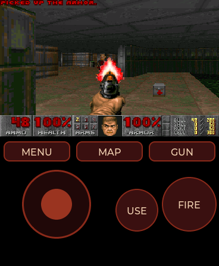
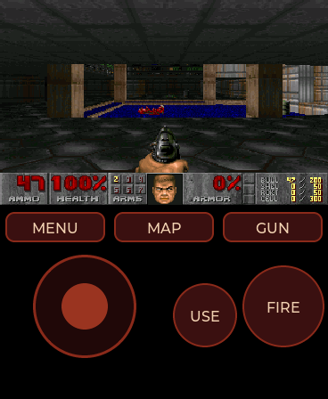
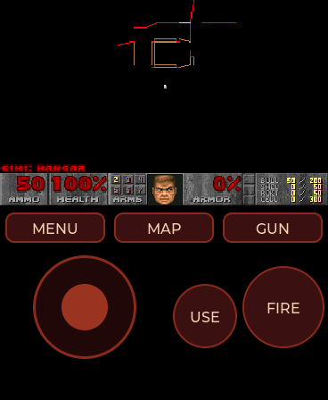

# Doom

Yes, it runs Doom. Chocolate Doom, through
[doomgeneric](https://github.com/ozkl/doomgeneric), as an ordinary app from the
card: a 428 KB `.so` that the firmware loads like any other, with no line of
the firmware changed for it. E1M1 runs at **35 fps on the board** (measured
from the start of the level), which is Doom's own tic rate and so its
ceiling; with the cap lifted the renderer did 43-61 fps in the attract demos.

| | | |
|---|---|---|
| <br>The attract demo, as Doom plays it on start-up. The picture is 320x200 scaled to 368x230. | <br>E1M1, Hangar. The pad sits below the picture, above where the glass stops reading reliably. | <br>The automap, from the MAP button. |

## The WAD

The game's data (levels, graphics, sounds, music) lives in a WAD file, and
the WAD is **not** part of this app, of the repository or of the releases:
you bring it, and copy it to the card's `doom/` folder. The portal's file
explorer does it (`sd/doom`; the folder is also created on the first run), or
by hand:

```bash
curl -X POST "http://<watch>/api/mkdir?dir=sd&name=doom"
curl -X POST "http://<watch>/api/upload?dir=sd/doom&name=doom1.wad" --data-binary @doom1.wad
```

The config (`default.cfg`, `doomgenericdoom.cfg`) and the saves (`saves/`)
land in the same folder.

### What it was tested with

**The shareware `DOOM1.WAD`, version 1.9**: episode 1, *Knee-Deep in the
Dead*, nine levels, 4,196,020 bytes, SHA-1
`5b2e249b9c5133ec987b3ea77596381dc0d6bc1d`. Every number in this README was
measured with it, on two watches.

### What its licence allows

The shareware WAD is **id Software's copyrighted data**, not free software
and not under the GPL that covers the code. What makes it usable here is
the licence it has always shipped with: it may be **copied and given to
other people, for free**, whole and unmodified; nobody may charge for it or
for its use. John Carmack put it shortly: the Doom shareware WAD is freely
distributable. That is why so many source ports and Linux distributions
point you to it (Ubuntu has packaged it as `doom-wad-shareware`).

What it does **not** allow: selling it or charging for it, modifying it, or
treating it as open data. id also asked back then that nobody make levels
that run on the shareware version, since it was the demo for the paid game.

This repository does not ship it anyway: the code is GPL v2 and the WAD's
terms are different, so it stays a separate download. This is a summary to
explain the choice, not legal advice; the licence text comes with the
original shareware package. Sources:
[the copyright file of Ubuntu's doom-wad-shareware](https://launchpad.net/ubuntu/trusty/+source/doom-wad-shareware/+copyright)
and [the Doom Wiki's page on licences](https://doomwiki.org/wiki/Licences).

### The full games (in theory)

Chocolate Doom plays every official IWAD, and the app looks for them
**before** the shareware one, in this order: `doom.wad` (registered or *The
Ultimate Doom*), `doom2.wad`, `doomu.wad`, `plutonia.wad` and `tnt.wad`
(*Final Doom*), then `doom1.wad`, then Freedoom's `freedoom1.wad` and
`freedoom2.wad`. So with a WAD from a copy of the game you own (the Steam
and GOG editions carry them) it **should** work: the engine is the same and
nothing here is specific to episode 1. **It is not tested**, and two things
to know:

- The commercial WADs are **not** redistributable: yours, for your watch.
- They are bigger than the portal's 8 MB upload limit (`doom.wad` ~12 MB,
  `doom2.wad` ~14 MB): copy them with the card in a reader, or through the
  watch's USB disk mode. Doom II's bigger levels also want more of the zone;
  5.25 MB is well above the 4 MB DOS Doom II ran in, but it is not measured.

[Freedoom](https://freedoom.github.io/) is the other road: complete games
built from new, BSD-licensed data, which can be shared freely.

## Playing

- **The stick**, bottom left, appears where the thumb lands. It is analogue:
  a small push turns and walks slowly, the edge runs and turns like the
  keyboard's fast turn. It always runs (Doom's old `joyb_speed 31`).
- **FIRE** fires, and so does **pressing the picture**. The touch is one
  finger, so walking and shooting at once takes the **side button**: it fires
  while held.
- **USE** opens doors and presses switches.
- **MENU** is Doom's own menu (Escape). In a menu the stick moves the cursor,
  FIRE picks (Enter), USE goes back; on a yes/no question FIRE is *yes* and
  USE is *no*.
- **MAP** is the automap, **GUN** the next weapon.
- Saving: the slot gets a name (`SLOT 1`...) and one more FIRE confirms it,
  since there is no keyboard.
- **Quit Game** in Doom's menu returns to the watch. Swiping back is off
  while playing; if the game ever stopped answering, holding the side button
  for five seconds with no finger on the glass leaves.

Sound effects and **the music** play through the speaker: Doom's own OPL2
soundtrack, synthesised on the watch. Doom's Sound menu sets both volumes,
and the options (volumes, screen size, mouse sensitivity, which is the
stick's turn speed) are kept in `default.cfg` between games.

## How it is put together

```
main/doom.c          the app: the pad, the blit, the life cycle (LVGL's task)
main/doom_port.h     the seam between the two sides, nothing but plain memory
main/port/           the platform layer doomgeneric asks for
    dg_system.c      the engine's life: worker, exit(), memory, files, stdout
    dg_video.c       I_VideoBuffer -> RGB565 in three frame slots
    dg_input.c       the pad as keys, the stick as a mouse
    dg_sound.c       the mixer: effects, plus the music on the same clock
    dg_opl.c         opl.h on DOSBox's OPL2 emulator, without threads
    dg_compat.h      what the engine sees instead of the C library
main/doomgeneric/    the engine, vendored (see below)
```

**Two tasks, two cores.** The engine runs in the app's worker on core 0
(`aos_hal_worker_start_on`), and never touches LVGL or the SPI. Each finished
frame is scaled into one of three slots; LVGL's task, pinned to core 1 with the
panel, takes the newest one every 8 ms and pushes it straight to the panel
(`aos_hal_display_blit`: 368x230 is half the bytes of the full screen the
Video app measured at 16.5 ms). The slots change hands with a
compare-and-swap, and a frame nobody took yet is simply overwritten by a newer
one, so the engine never waits on the display. The pad below is plain LVGL
objects that only redraw when a button lights.

**exit() is a longjmp.** Chocolate Doom has no way out but `exit()`, from the
Quit menu, from `I_Error` or anywhere else; on the watch there is no process to
end. `dg_compat.h`, included by every engine file through `doomtype.h`,
reroutes it to a `longjmp` back to the top of the worker, and so does a stop
asked by the app when it closes. From there every block the engine allocated
and every file it opened is given back: the heap is not the `.so`'s and would
outlive it. Measured: after playing, the PSRAM free is within 200 bytes of
what it was before opening the app.

**Memory.** The engine's heap is PSRAM, always (small blocks would otherwise go
to internal RAM, `CONFIG_SPIRAM_MALLOC_ALWAYSINTERNAL`). Doom's zone takes what
the PSRAM gives in one block, up to 6 MB and leaving 768 KB for the watch: 5.25
MB on a v0.5.5 watch, more than DOS Doom ever had. The worker's stack is 16 KB
of internal RAM; its measured peak is 3.9 KB.

**The stick is a mouse.** Doom adds a mouse's motion to the tic it is building
(`angleturn -= mousex * 8`, `forward += mousey`), so posting one `ev_mouse` per
tic makes an analogue stick with no change to the game. In the menus and on
the screens between levels the stick becomes the arrow keys, with auto-repeat.

**The music is the Sound Blaster's.** Doom's music is MUS, which DMX played
on the OPL2 FM chip with the instrument patches in the WAD's `GENMIDI` lump.
Chocolate Doom 2.2.1's player does the same (`i_oplmusic.c`, MUS converted
to MIDI and stepped through by timed callbacks) on DOSBox's DBOPL emulator,
both GPL v2 and vendored here. Their SDL driver ran the chip in SDL's audio
thread; `port/dg_opl.c` implements the same `opl.h` with no threads at all:
the mixer asks for as many samples as it is about to queue, and the chip is
generated up to each callback's time, which then runs. The song's clock is
the sample count, so the tempo holds whatever the frame rate does. The Nuked
OPL3 that replaced DBOPL in Chocolate 2.3 is more exact and heavier (it
emulates the chip at its own 49716 Hz and resamples; not measured here);
DBOPL generates at 16 kHz directly, skips silent channels and costs **3-7 % of core 0**, measured with the cycle counter while E1M1 stays
at 35 fps. A one-pole high-pass takes off the DC DBOPL's output carries, and
the music is mixed at four times the emulator's level: at 1:1, E1M1 measured
470 RMS against the pistol's 20000 peaks. A soft knee above three quarters
of full scale keeps a shotgun over the music from clipping flat.

**One frame per tic.** `TryRunTics` returns to redraw after a tic's worth of
waiting even when no tic ran, and drawing the same state again is a whole core
for nothing: 46 frames a second for 35 tics. The loop now draws only when
`gametic` moved.

## The engine

`main/doomgeneric/` is doomgeneric at
`dcb7a8dbc7a16ce3dda29382ac9aae9d77d21284`, only the files the watch uses
(the SDL, X11, Allegro and Windows back ends and the original `i_video.c` are
left out), plus the music from Chocolate Doom 2.2.1 (tag
`chocolate-doom-2.2.1`): `i_oplmusic.c`, `midifile.c/.h`, `dbopl.c/.h`,
`opl.h` and `opl_queue.c/.h`. Every change is marked `AmoledOS:` in the
source:

| File | Change |
| --- | --- |
| `doomtype.h` | includes `port/dg_compat.h` |
| `doomfeatures.h`, `i_sound.c` | sound on, through `port/dg_sound.c`, no SDL_mixer |
| `i_system.c` | the zone from `dg_zone_alloc()`; `I_Quit` and `I_Error` leave through the port |
| `m_config.c` | config and saves in `<card>/doom/`, the saves folder without a dot; saving and loading the config back on (off in doomgeneric), a line at a time, without the keys |
| `m_controls.c` | always run; `[` and `]` bound to previous/next weapon |
| `m_menu.c` | a name for an empty save slot; `dg_menu_state()` for the pad |
| `d_main.c` | no ENDOOM; draw only when a tic ran |
| `doomgeneric.c` | no 1 MB RGBA screen |
| `i_input.c` | the stick, once per tic |
| `v_video.c` | a float compare instead of a double one |
| `m_misc.c` | `M_TempFile` on the card: there is no `/tmp` |
| `i_oplmusic.c` | the module under the name `i_sound.c` looks for; Chocolate 2.2's `opl_driver_ver_t` |
| `dbopl.c` | tables and rate set-up in `float` (bit-exact against the `double` original on a test note) |
| `midifile.c` | its own big-endian swaps instead of SDL's |
| `opl_queue.c` | the engine's malloc; tempo changes in 32 bits |

The simulator builds the engine and the port as a library of their own
(`sim/CMakeLists.txt`), without our warnings, and the app on top. In the
simulator the engine's globals live as long as the process, so Doom runs once
per simulator run; on the board every open is a fresh `dlopen`.

## Traps

- **A byte swap that called itself.** `sha1.c` shifts bytes around and gcc
  turns that into `__bswapsi2`, which the firmware does not lend; the port
  supplies it. Written with the same shifts, gcc recognised the idiom inside
  the replacement too and compiled it into a call to itself. The recursion ate
  the worker's stack and then the kernel's lists beside it, and the board
  died three different ways, always on the *other* core: a corrupted TCB in
  the tick interrupt, the scheduler reading `0xa5a5a5a5`, an `assert` in the
  SPI driver. The give-away was the backtrace: one address of the `.so`
  repeated with frames 32 bytes apart. It is built at `-O0` now, and
  `objdump` shows no call in it.
- **`build_apps.sh` checks every undefined symbol**, and it caught the only
  two the engine needed from outside: that `__bswapsi2` and a `double`
  compare in `v_video.c`. Everything else is in the firmware's table, so the
  app works on any firmware from v0.4.10 (the worker on a chosen core).
- **`OPL_Delay` would hang forever.** Chocolate's version sets a callback and
  waits on a condition variable for the audio thread to fire it; with the
  chip generated from the game's own task nobody ever would. The only caller
  is the chip detection, which a software chip skips.
- **The music brought four more symbols** the firmware does not lend:
  `__assert_func` (now an `I_Error`, which shows and returns to the watch
  instead of restarting it), `fgetc` (through `dg_compat.h`), and float to
  64-bit conversions in the callback queue's tempo change (done in 32 bits:
  a pending callback is seconds away at most).
- **The config kept nothing.** doomgeneric ships `M_SaveDefaults` and its
  loader switched off. Switched on as they were, the keys would break: they
  are written as keyboard scan codes and doomgeneric's own have none
  (`KEY_FIRE` is `0xa3`), so they would read back as 0. The keys are left
  out; the pad owns them anyway.
- **A DC blocker that stuck.** `y * 1019 >> 10` rounds negatives down, and
  any output a couple of hundred below zero was a fixed point: silence came
  out as a constant -260. `/ 1024` truncates towards zero and it decays.
  Found in the simulator with `DOOM_WAV=<file>`, which dumps the mix as raw
  16 kHz mono so it can be measured without listening.
- **The screenshot does not see the game.** The portal's capture and the
  simulator's shot read LVGL's pixels, and the picture goes to the panel past
  LVGL. The images above are from the simulator, which draws through a canvas.

## Licence

Doom's source code, Chocolate Doom's music player and DOSBox's DBOPL, and so
this app, are under the **GNU GPL v2** (`main/doomgeneric/LICENSE`); the
rest of AmoledOS is MIT. The WAD files are
not part of it: the shareware one is freely distributable, the commercial
ones are not.
