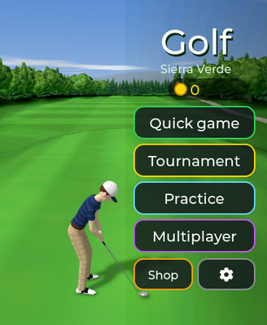
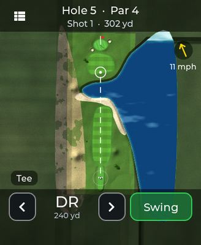
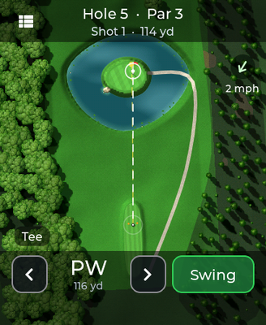
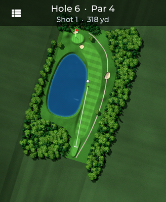
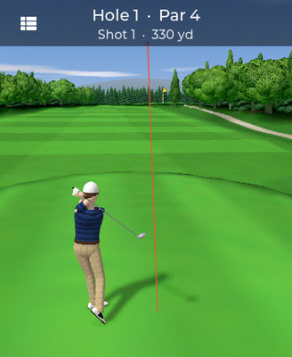

# Golf

A golf game that tries to look like a phone game on a watch: a golfer
modelled and animated in Blender, a 3D view of each hole from behind the ball
with hills, trees and a sky, and a detailed map from above that shows where
the ball flew. Three courses of eight holes, each with its own look:

| Course | Theme | What it plays like |
| --- | --- | --- |
| Sierra Verde | woods | parkland: pines, oaks and poplars, a creek, doglegs, par 32 |
| Dunas del Faro | coast | links by the sea: the sea beside most holes and all the way to the horizon, beaches, marram dunes, pot bunkers, palms, 1.6× the wind |
| Parque de los Lagos | lakes | water on every hole: ponds, a creek, an island green, lilies; calm air |

A course is data (`gf_holes.c`, `gf_courses_extra.h`): about 3.5 KB of the
`.so` for eight holes. The theme (`GF_THEME`, the low bits of each hole's
`flags`) repaints the rough, sand and water on the map, and on the coast puts
the sea beyond the course and on the horizon of the 3D view.

| | | |
|---|---|---|
| <br>The menu, over the first hole of the chosen course: the golfer waits in the outfit you bought. | <br>The swing, at the top of the backswing: the power bar on the right, the flag in the distance, the golfer a Blender render coloured on the watch. | <br>The shop: each item on a turntable of eight rendered angles, bought with the coins from rounds. |
| <br>Dunas del Faro, hole 5: the fairway along a cove, the sea to the right and the wind in the corner. | <br>Parque de los Lagos, hole 5: the island green, a lake painted under the land. | <br>The coast in 3D: beach, dunes and the sea to the horizon. |

| | |
| --- | --- |
| Quick game | three holes of the course, at random |
| Tournament | the eight holes against three computer golfers |
| Practice | any hole, as many times as you like, no coins |
| Multiplayer | 2 to 4 players passing the watch around, or against the paired watch (Link) |
| Difficulty | easy (little wind, slow meter, the map shows where the shot will really go and how a putt breaks), normal, pro (strong wind, fast meter, back tees) |

Rounds earn coins (more in a tournament, on the harder levels and for birdies)
and the **shop** sells shirts, trousers, hats (six models), shoes and clubs,
tried on a turntable before buying. Skin tone and hair are free.

---

## Playing

1. **The map.** Turned so the hole goes up and zoomed to what matters for the
   shot. The caddie picks a club and a line; the finger moves the line, the
   arrows change the club. The ring is where a clean shot lands; on easy, the
   dotted yellow line is where it really goes, wind and roll included.
2. **Swing.** The 3D view. Three taps: start the backswing, stop the power
   (above the top of the bar is an overswing: more distance, less control),
   and stop the marker on its way down in the green band. Early hooks, late
   slices.
3. **The flight.** Back on the map, the ball flies with its shadow and leaves
   its line, which stays for the rest of the hole.
4. **On the green** the view closes in and the slope shows as chevrons
   (downhill). Two taps: start and stop the power.

| | | |
|---|---|---|
| <br>Aiming on easy: the ring is a clean carry, the dotted line where the ball really ends up. | <br>The ball in flight over the map, with its shadow and the line it leaves. | <br>On the green: the chevrons point downhill and, on easy, the dashed curve is how the putt breaks. |
| <br>The follow-through, with the tracer of the shot. | <br>The hole's card: a birdie, and the golfer cheers under it (sad after a double bogey). | |

Water costs a stroke and a drop where it went in; out of bounds costs a stroke
and the shot is replayed; a hole is picked up at three times par.

## How it is built

| File | What |
| --- | --- |
| `gf_holes.c` · `gf_courses_extra.h` | the courses as data: shapes with a few control points, trees, mounds; water with param 1 is a lake that islands sit on |
| `gf_world.c` | loading a hole: smooth polygons, the height grid (greens are tilted planes, bunkers hollows, water flat), normals, forests filled with trees |
| `gf_map.c` | the top-down renderer: vector coverage at any scale, textures in world space, hill light, the trees from Blender |
| `gf_view3d.c` | the 3D view: a voxel-space renderer over the heights, sky with perspective clouds, hills, tree billboards tested against depth |
| `gf_phys.c` | the ball: drag, lift and curve from spin, wind, bounce and roll per surface, trees, the cup; deterministic |
| `gf_game.c` | rules, turns, penalties, rivals, coins |
| `gf_art.c` | `golf.pak`: the golfer coloured with the outfit's palette, trees and flag with mip levels |
| `gf_audio.c` | a small synthesiser on the streaming speaker: birds, wind, whoosh, impact, splash, cup, applause |
| `gf_play.c` | a hole being played; the worker task that renders |
| `gf_link.c` | two watches: only the shots travel |
| `golf.c` · `gf_shop.c` | the app and its panels |

### The golfer: 3D renders that take any colour

`tools/blender/golfer.py` builds the golfer in Blender from code (no .blend
file) and renders every frame twice: a **lighting pass** on neutral grey and
a **region-id pass** (skin, hair, shirt, stripes, trousers, check, shoes,
belt, glove, club...; `tools/blender/SPEC.md`). On the watch each pixel is
`palette[id] × light`, so a red striped shirt and a navy one are the same
render and the shop costs nothing. Hats are separate layers rendered with the
body held out. The swing camera is shared between Blender and `gf_view3d.c`,
which is why the golfer stands on the ground the watch draws.

<p align="center"></p>

Sequences: swing (24 frames; the backswing follows the power meter), idle,
cheer, sad, and an eight-angle turntable for the shop.

### golf.pak

Everything rendered in Blender, packed by `tools/pack_assets.py` into one
LZ4-compressed file (~1.1 MB) that goes to `/sdcard/apps/golf.pak` next to
`golf.so` (`install_apps.sh` uploads it). Without it the game still runs,
with trees drawn by code and no golfer.

`golf.so` needs firmware **v0.4.3** or newer (the link and the streaming
speaker; checked against each tag's symbol table).

```bash
cd apps/golf/tools/blender
/Applications/Blender.app/Contents/MacOS/Blender -b -P golfer.py -- --out ../../assets/render
/Applications/Blender.app/Contents/MacOS/Blender -b -P props.py -- --out ../../assets/props
python3 ../pack_assets.py
```

## Memory, measured on the board

| | internal RAM | PSRAM |
| --- | --- | --- |
| in use while playing | 10.9 KB (the worker's 10 KB stack) + 5.1 KB with sound (the streaming speaker) | 6.15 MB of 7.8, 1.67 MB left |

Every allocation goes through `gf_malloc()`, which asks for PSRAM even below
1 KB (plain `malloc` hands those out of internal RAM). The big PSRAM items:
the golfer's coloured frames (1.7 MB for the swing and the wait), the four
screen buffers (1.3 MB), the ground texture and grid sized for the biggest
hole of all the courses (1.8 MB). The 1.1 MB pack stays on the card and is
read by the worker when something must be coloured.

## Measured on the board

The renders run in the app's worker task, never in LVGL's (in LVGL's they
tripped the five-second task watchdog):

| | |
| --- | --- |
| opening, to the menu | **2.3 s** (8 s the very first time: the menu's picture is rendered once and saved as `golf_menu<course>.bin` next to the pack; bump `MENU_CACHE_VER` in `gf_play.c` when the renderers or hole 1 change) |
| of which: the pack's table and the trees / calibrating the clubs | 0.7 s / 0.8 s |
| a hole: world / ground texture | 1.2 s / 1.6 s (behind the hole's card) |
| the map | 0.9 s (behind the previous shot's banner) |
| the 3D view | ~1.6 s, rendered **ahead** while aiming, so the swing usually opens at once |
| the swing | **23 fps** on the panel: the golfer is a ~200x300 px rectangle that changes every frame |
| the ball's flight over the map | **29 fps** |
| the menu | the waiting golfer at one frame every 150 ms, on purpose (the loop runs at 27) |

The log says the frame rate of each state when it ends
(`golf: state 4: 156 frames in 6829 ms, 22.8 fps`; 4 is the swing, 5 the
flight), and `/api/mem?fps=N` counts what LVGL really rendered.

## Traps found on the board

- **The .so loader dropped the addend of `R_XTENSA_GLOB_DAT`** until v0.4.9.
  A global table read from another file as `table + 4` got `table + 0`: the
  club table came out shifted (carries of 24,848 yards), and only in some
  builds, because it depends on how the compiler folds the offset. The
  firmware is fixed (`components/elf_loader/src/arch/esp_elf_xtensa.c`, test
  in `tools/so_tests/globtest`), and Golf keeps its tables `static` behind a
  function (`gf_club()`, `gf_item()`, `gf_course()`) so it also runs right on
  older firmware: `readelf -r golf.so | grep GLOB_DAT` shows only the
  firmware's fonts.
- **Outfit requests pile up.** The worker's recolouring takes its parameters
  from the app; a second request made before the first ran used to replace
  them, and the menu's palette followed by the hole card's cheer coloured the
  cheer with no palette at all: a black golfer. They are now OR-ed together
  and taken as a whole by the job.
- **`floorf`, `expf` and integer division are library calls** on the S3 and
  were a large share of every render; `gf_floorf()`, tables and shifts.
- **The .so is compiled with `-Os`** by `elf_loader.cmake` and per-file CMake
  options do not reach that compile: the pixel loops get `-O2` through a
  `#pragma GCC optimize` in each file.
- **`aos_hal_worker_sleep(2)` is `vTaskDelay(0)`** at 100 Hz: it yields to
  nobody below the worker's priority. The render yields 10 ms every 60.

## The test bench

```bash
cd apps/golf/tools && ./build.sh
/tmp/gfh map 3 /tmp/m.ppm        # the whole hole as the aiming screen shows it
/tmp/gfh green 1 /tmp/g.ppm      # the green close up
/tmp/gfh view 6 /tmp/v.ppm       # the 3D view from the tee (or: x y aim_degrees)
/tmp/gfh clubs 4 x               # each club's carry and roll
/tmp/gfh bot 1 20                # a bot plays 20 rounds at three skills
python3 ../../../tools/ppm2png.py /tmp/m.ppm
```

## Simulator switches

| | |
| --- | --- |
| `GF_MODE=0..4` | straight into quick, tournament, practice, 2 players, or the link lobby |
| `GF_HOLE=1..8` | the practice hole |
| `GF_DIFF=0..2` | difficulty |
| `GF_AUTO=1` | the bot plays by itself |
| `GF_COINS=n` | coins for the shop |
| `GF_SCREEN=shop\|settings\|boot\|card` | straight into that panel (`boot` holds the loading screen, `card` is a birdie on hole 1) |
| `GF_LINK=1` | offer the link game without a paired partner |

## Preferences

`gf_coins`, `gf_own0..5` (owned items per category), `gf_eq` (worn item per
category, 4 bits each), `gf_units`, `gf_sfx`, `gf_diff`, `gf_best0..2`.
