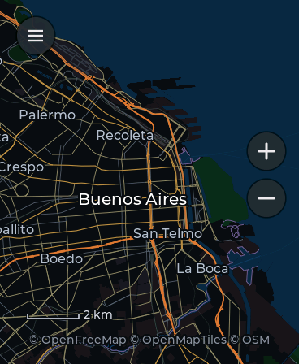
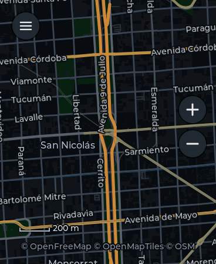
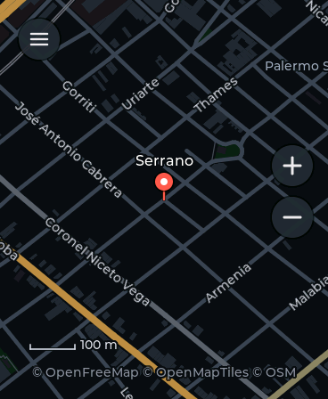

# Mapas

OpenStreetMap on the watch: OpenFreeMap's vector tiles drawn by the watch in a
dark style, zones saved from the portal, whole zones downloaded to the card for
use without a connection, and a search with an old phone's keypad.

  

## Using it

| | |
| --- | --- |
| one finger | moves the map; a flick keeps it going |
| two fingers | zoom about the point between them |
| double tap | a level closer, there |
| + / − | a level in or out |
| long press | the coordinates of that point |
| ≡ | search, save this view, the zones, the offline zones, Clima's city, settings |

The first time it opens where Clima is set, or in the centre of Buenos Aires;
after that, where it was left.

**Search:** tap a key again within a second for its next letter (the letters
of the key show under the text, the one that would go in marked); ⌫ deletes,
a long press on it clears, 0 is the space, ✓ searches. The downloaded zones
answer first; with a connection, Photon adds places and street numbers
(marked with the WiFi sign).

**Settings (≡):** *Download: yes/no* turns the network off for the map (only
what is on the card is drawn); *Clear cache* deletes the tiles kept from
browsing online.

## The portal: /mapas

Search a place, move the map, and:

- **Save what is shown as a zone** - it shows up in the app's ≡ menu.
- **Show it on the watch** - the watch opens Mapas there.
- **Download and save to the watch** - the tiles of what the map shows, from
  zoom 6 to the detail chosen, packed on the card with an index of every
  name in them (streets, places, shops, stations) for the search.

The page needs internet on the computer; the watch only needs to be on the
same network. For zones too big for the portal there is
`tools/map_pack.py`, which writes the same files for copying to the card.

## Files

| | |
| --- | --- |
| `main/mapas.c` | the app: UI, gestures, the network, cutting and pushing frames, search |
| `main/mp_render.c` | tiles to pixels: which tiles, the style, the labels |
| `main/mp_draw.c` | filled polygons, anti-aliased lines, text from a glyph atlas |
| `main/mp_mvt.c` | the vector tile decoder, and the stripping of unused layers |
| `main/mp_store.c` | RAM, the offline packs, the card's cache |
| `main/mp_search.c` | the offline indexes and Photon's answers |
| `main/mp_mem.h` | every allocation to PSRAM, and why |

How it is built and what it measured on the board:
[docs/MAPS.md](../../docs/MAPS.md). Development switches for the simulator:
`MAPAS_Q=text` opens the results of a search, `MAPAS_PICK=1` picks the first;
on the board, a file `maps/bench.txt` times a scripted pan and zoom in the log.

Data © OpenStreetMap contributors (ODbL), OpenMapTiles and OpenFreeMap;
search by Photon (komoot).
