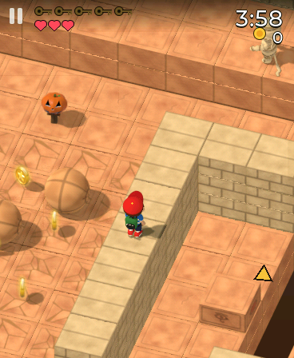
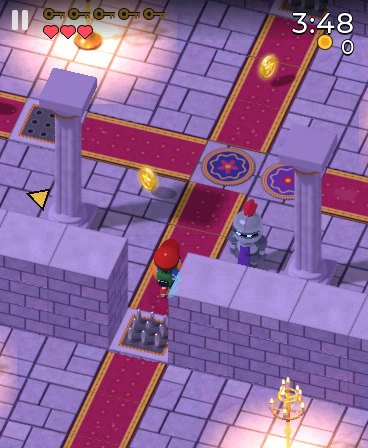
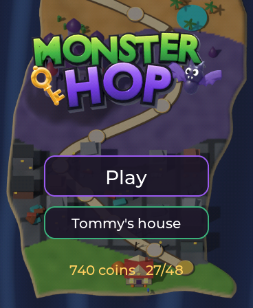
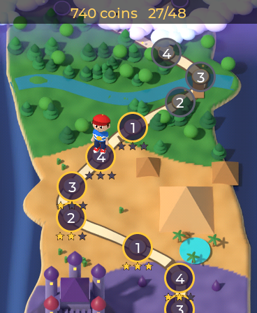
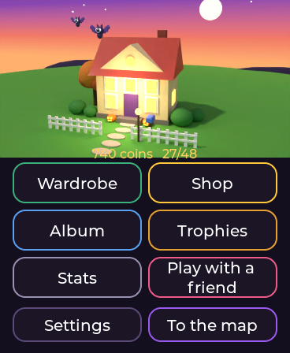
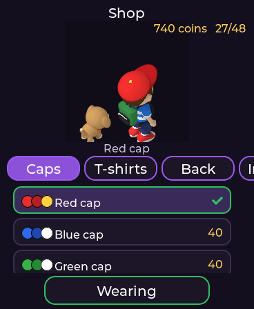
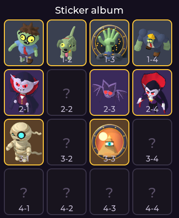
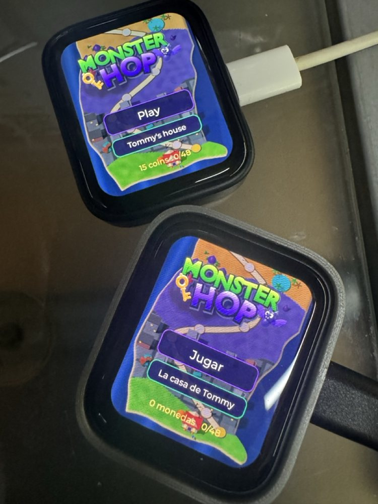
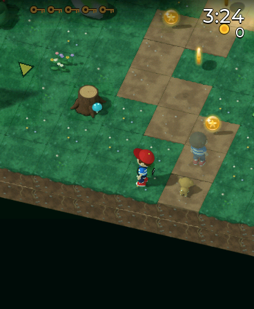

# Monster Hop

A hop-by-hop action game on a grid, in the manner of the late-90s 3D
Frogger: Tommy, an eleven-year-old in a cap, crosses sixteen levels full of
monsters to collect five keys in each and reach the exit. The world is seen
from above at three-quarters, and every block, prop, monster and outfit is
modelled in Blender and rendered to sprites that the watch lights, colours
and sorts by depth.

| | | |
|---|---|---|
|  The Sewers: a zombie on the walkway, a crate to push into the channel, steam vents. |  The Moat: rafts slide across the water; a vampire walks the bank. |  Temple Halls: boulders roll down the hall, a mummy guards the ledge. |
|  Rushing River: logs and lily pads to hop across, lanterns on the bank. |  The Great Hall: suits of armour on the carpets, spikes in the doorways. |  City Hall, the first lair: the Brute stomps round the statue. |

| Zone | Monsters | Hazards | Lair |
| --- | --- | --- | --- |
| Zombie Town (grey) | zombies that notice you and lunge, zombie dogs | runaway cars, sewer water, steam vents | City Hall: the Brute, whose stomp shakes the plaza |
| Vampire Castle (violet) | vampires that turn into bats, haunted armour | the moat, spikes, moving platforms, bats | the Count's Chamber: he throws a ring of bats |
| Mummy Desert (brown) | mummies that push boulders, scarabs in lines | quicksand, darts, rolling boulders | the Pharaoh's Tomb: the Pharaoh cracks his whip |
| Werewolf Forest (green) | werewolves that charge on sight, crows that dive | the river and its logs, bear traps | Moon Clearing: the Alpha |

The four levels of a zone go from an easy walk to the lair with the boss.
Zones open with stars: Zombie Town from the start, then 6, 14 and 22 stars.
Two more zones, a witch swamp and a skeleton graveyard, wait on the map as
locked spots: what each would be, and every place in the code a new zone
touches, are in [ZONE-IDEAS.md](ZONE-IDEAS.md).

## Playing

- **Swipe** to hop one cell that way; a **tap** hops up the screen.
- **BOOT** is the action: it pulls the lever, opens the chest or pushes the
  crate in front of Tommy, and when there is nothing to use it is a **super
  hop** over two cells or up two floors. Long press: pause, with the level's
  map.
- Five **keys** open the exit. The arrow at the screen's edge points to the
  nearest one, then to the exit. The level's start flies over the keys.
- Crates fill the water or the hole they are pushed into. Levers lay bridges
  and start platforms. Checkpoints (the pumpkin posts) are where Tommy comes
  back.
- **Difficulty**: Easy has 5 lives and no clock; Normal has 3 lives and a
  clock; Hard has one life and 85 % of the time. Running out of time costs a
  life and gives a minute back.
- **Stars**: one for finishing, two under the level's par time, three under
  par without losing a life.

## Tommy's house

The first spot on the map, below Zombie Town:

| | | |
|---|---|---|
|  The title, over the world map. |  The map: the house at the bottom, four zones of four levels, stars under each. |  Tommy's house, the hub. |
|  The wardrobe: a crown, a hero cape, a torch and a black kitten. |  The shop: everything costs coins from the levels. |  The sticker album: one sticker hidden in every level. |

| | |
| --- | --- |
| Wardrobe and shop | caps (the bill always shows), shirts, backpacks and capes, things in hand, pets that follow him, trails, skin and hair. Skin and hair colours are free; the odd skins (Martian, ghost, zombie, pumpkin, robot, lava, rainbow) cost coins |
| Sticker album | one sticker hidden in every level, sixteen in all |
| Trophies | fourteen, bronze to gold |
| Stats, settings | difficulty, sound effects, music |
| Play with a friend | the key race, below |

## Two watches: the key race

| | | |
|---|---|---|
|  On two boards: a race on Main Street, the same cars in the same places on both, each watch with its own camera. |  One watch in English, the other in Spanish. |  In the simulator: the other player's Tommy is the pale ghost ahead; its keys light up blue in the row at the top. |

With a partner paired in Enlace, the house offers **Play with a friend**. The
host (the lower MAC) picks a level open on both watches, and both play it
from the same moment, each seeing the other's Tommy as a pale ghost in the
other player's colours. The keys, the levers, the crates and the chests are
shared. A key is a point and the first one out gets two more, so there are
no ties. A key both took goes to whoever took it first by the level's clock,
with the host winning a tie. Both watches apply that rule to the same two
times, so they agree without a referee. Lives never run out in a race, and
the level's clock ends it.

Tested on the two boards: the lobby with each watch in its own language,
both starting together, the guest's clock within 0-48 ms of the host's, and
the host carrying on alone when the guest leaves. A key both grabbed and the
end with points were tested on the bench (`mhh racetest`), not yet on the
boards.

The lanes, the traps and the platforms are functions of the level's clock
alone, so they match on both watches without talking. The host's clock is
the reference: the guest eases towards it from the time in every position
message (15 a second), because if both corrected they would chase each
other's old positions.

## How it is built

| File | What |
| --- | --- |
| `mh_game.c` | the rules: Tommy, the monsters' patterns, lanes, traps, platforms, crates, levers, the clock, the race's shared keys |
| `mh_world.c` | the background cache: a 512×576 toroidal image with depth, redrawn in 64×64 blocks as they come into view |
| `mh_render.c` | the frame in 64-row bands: the cache, then the sprites depth-tested per pixel against it, with an x-ray silhouette behind walls |
| `mh_scene.c` | from the game's state to the draw list: animations, palettes, the pet, the ghost, the trails, the camera |
| `mh_art.c` / `mh_cast.c` | `monsterhop.pak`: LZ4 sheets of region id + light + depth coloured through 16×64 lookup tables |
| `mh_level.c` | the `MHLV` level format |
| `mh_hud.c` | keys, lives, the clock, coins, the arrow, the banners |
| `mh_ui.c` | the LVGL panels: title, map, house, shop, album, trophies, stats, lobby, results |
| `mh_audio.c` | the synth voices, a theme per zone and the effects |
| `mh_link.c` | the key race |
| `mh_shop.c` / `mh_prog.c` | the catalogue, and what the player has (in preferences) |

The worker runs on core 0 and renders into PSRAM frame buffers; the LVGL
timer on core 1 pushes the newest one to the panel. Measured on the board:
25.5 fps over a minute of Main Street, 4.4 s to open and 4.0 s to load a
level (a loading bar shows past 2 s, measured in bytes read against what the
same load read last time). Every picture of the menus is let go while a
level plays, which leaves 888 KB of PSRAM free.

## Tools

| | |
| --- | --- |
| `tools/blender/` | the art: `SPEC.md` is the art bible (projection, passes, palettes), `mh_common.py` the shared camera and passes |
| `tools/levels.py` + `tools/levels/*.py` | the levels as text maps; `python3 tools/levels.py` checks that every key, the exit and the sticker are in reach and that nothing stands on a prop or walks through one |
| `tools/pack_assets.py` | runs `levels.py` (and stops if a level has problems), then packs every `assets/*/meta.json` and the levels into `assets/monsterhop.pak`, and the same in 7 MB parts in `assets/card/` (`monsterhop.pak`, `monsterhop.pak.1`...) because the portal takes 8 MB per upload; copy the parts to the card's `/apps/` and the game reads them as one file |
| `tools/build.sh` → `/tmp/mhh` | the test bench on the Mac: `frame`, `bench`, `play` (the rules from a script of hops), `shot` (the same, then the whole scene to a picture), `racetest` (the shared keys) |

Simulator switches: `MH_LEVEL=<0..15>|test`, `MH_DIFF`, `MH_UNLOCK=1`,
`MH_COINS`, `MH_TRAIL=1..4`, `MH_START=x,y` (the level starts in that cell),
`MH_SCREEN=map|house|wardrobe|shop|album|trophies|stats|settings`, and
`MH_RACE=<level>` with two simulators linked by `AOS_SIM_LINK_PORT` /
`AOS_SIM_LINK_PARTNER`.
