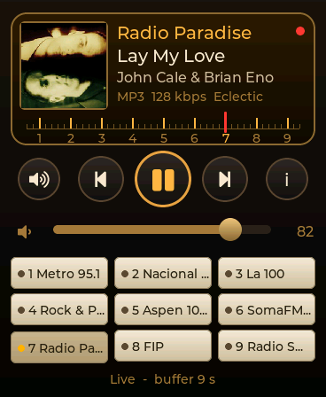
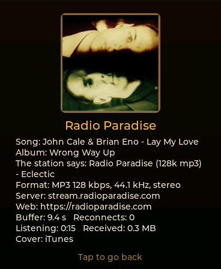
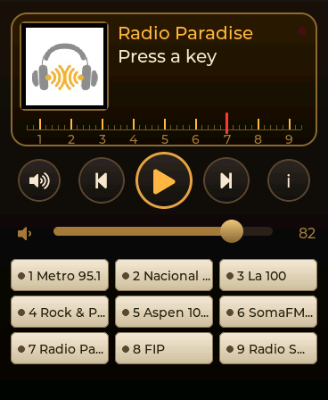

# Radio

Internet radio on a front panel from the sixties: nine preset keys with a
lamp each, a lit amber dial with the station, the song, its artist, the
stream's format and the cover, and a red needle that travels over a numbered
scale to the key on air.

  

---

## Using it

| | |
| --- | --- |
| a key | tunes that station. The key on air is pushed in and lit; pressing it again does nothing, like a real one. An empty key says where to fill it |
| ⏮ ⏭ | the previous or next key with a station |
| ▶ ⏸ | pause and resume; with nothing playing, the last key you listened to |
| 🔈 | mute, and back to the volume it had |
| the fader | the volume |
| **i**, or the dial | everything the stream says of itself: the song and its album, what the station calls itself and its genre, format, server, buffer, reconnections, time listening and data received |

The station keeps playing when you leave the app, and the control centre
drives it: its music row shows the song, or the station's name between songs,
and its previous and next walk the same keys.

A pause shorter than the buffer (about 16 s at 96 kbps) resumes where it
stopped; a longer one, more than 20 s, resumes **live**.

## Choosing the stations

On the computer, at `http://<name>.local/radio`, the portal's Radio page:

- **Now on the watch**, with play, pause, previous, next, stop and the volume.
- **The watch's keys**: drag a station from your list onto a key, or a key
  onto another to swap them. Each key can be played or cleared from there.
- **My list**, kept on the card as `radio/library.json`. The first time it
  holds 25 stations checked against the watch's own stream code.
- **Find radios** in radio-browser.info's open directory, by name, country and
  genre. "Only the ones the watch can play" is on by default; with it off, an
  AAC station is marked in red.
- **Add by hand**: a name and a stream address.
- **Album covers**: the switch for the iTunes lookup.

Every station can be heard in the browser (🎧) or tried on the watch (⌚)
without putting it on a key.

## What plays

MP3 over `http://` or `https://`: Icecast, Shoutcast and the big stations'
CDNs, following redirects and `.pls` / `.m3u` playlists. **AAC, Ogg and HLS
do not play**: the watch refuses them and says why ("Format not supported: MP3
only"). Many stations offer an MP3 stream beside their AAC one; the search
with "only MP3" finds those.

## The cover

The song's cover comes from the iTunes Search API, looked up by the stream's
"Artist - Title"; it is only used when iTunes' artist matches the title's, so
a jingle does not borrow somebody's record. Without one, the key's logo: the
page draws the station's logo on a 160 px square **in the browser** and saves
it to the card as `radio/logoN.jpg`, so the watch only ever decodes a small
JPEG. With neither, a speaker grille.

What leaves the watch for the cover is "artist title", to Apple. Turn it off
in the page if you would rather not.

## How it is built

The app plays nothing itself. It hands its nine keys to
`aos_hal_radio_play()` and reads back `aos_hal_player_info()` (what is heard)
and `aos_hal_radio_status()` (how the stream is doing) five times a second.
The connection, the ICY titles, the buffer and the decoding are the
firmware's player, the one that plays the card's MP3s: that is why it keeps
playing with the app closed.

| File | What |
| --- | --- |
| `radio.c` | what the panel does: the keys from NVS (`rad0`..`rad8`, rebuilt when `rad_gen` moves), the transport, the dial's words, the tick |
| `radio_ui.c` | the panel: LVGL objects that stand still, the scale drawn once on an ARGB8888 canvas, the needle moved by a 30 ms timer only while it travels |
| `radio_art.c` | the covers: the iTunes lookup through the HAL's HTTP client, the logos from the card, JPEG to a 160 px square |

It needs firmware **v0.8.0** or later (`aos_hal_radio_*`). The measurements
(time to sound, CPU, RAM, what a station URL turns out to be) are in
[docs/RADIO.md](../../docs/RADIO.md).

## In the simulator

The simulator plays the stations for real, through SDL:

```bash
cd sim && cmake --build build -j8
AOS_SIM_VIEW=aos.radio ./build/amoledos_sim
```

`AOS_SIM_RADIO_MUTE=1` decodes without sound. The keys are read from
`sim/sim_fs/prefs.txt`, which `tools/portal_dev_server.py` writes when you use
the `/radio` page at `http://localhost:8088/radio`.
