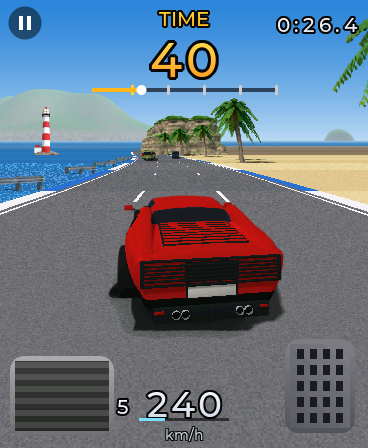
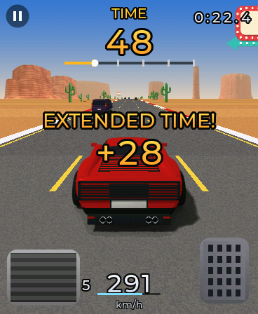
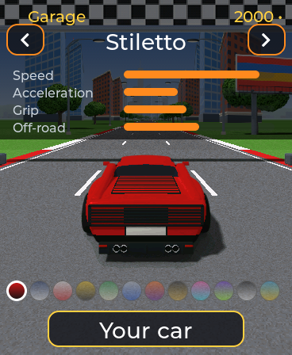
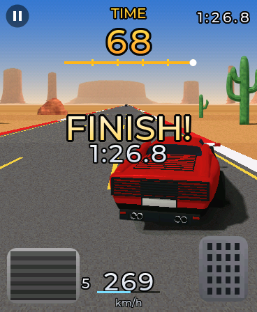
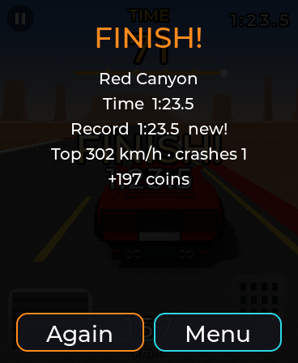

# Turbo

An arcade racer in the manner of the mid-90s arcade drivers: a red wedge
supercar seen from behind, three lanes of traffic, bridges over the road, and
a clock that only the checkpoints refill. The road is drawn by the watch in
pseudo-3D, one screen row at a time; the cars and everything standing beside
the road are modelled in Blender and rendered to sprites. Tilt the watch to
steer; the pedals are on the screen.

| | | |
|---|---|---|
| <br>Metro Freeway: towers, lamps, overpasses and three lanes of traffic in any colour. | <br>Costa Azul: the sea beside the road, palms, a lighthouse. | <br>Red Canyon: long straights, mesas and saguaros; a checkpoint gives time back. |
| <br>Snow Pass, at night: two lanes, snow and pines, the headlights light the road ahead. | <br>Orbit 9, the final stage: a road floating in space, neon edges, rings to drive through. | <br>The garage: four cars and twelve paints, bought with the coins from races. |

| Stage | What it plays like |
| --- | --- |
| Metro Freeway | a city highway with overpasses and sign gantries, gentle bends, dense traffic |
| Costa Azul | the coast road: the sea on the left, cliffs on the right, sweeping curves |
| Red Canyon | the desert: long straights over dunes, the fastest stage |
| Snow Pass | a mountain pass at night on two lanes, hairpins and steep climbs |
| Orbit 9 | the bonus and the tour's last stage, a rollercoaster through space |

| Car | |
| --- | --- |
| Stiletto | the 80s wedge: the highest top speed (free) |
| Bulldog | a 70s fastback: the best acceleration |
| Rallye | a group-B hatch: the most grip, and quick off the road |
| Mule | a lifted pickup: slow, but it barely notices the gravel or a crash |

## Playing

- **Tilt** the watch left and right to steer, holding it flat or upright like
  a wheel. The steering centres itself during the countdown: hold the watch
  the way you are going to drive. Three sensitivities in Settings.
- **The pedals**: brake bottom left, gas bottom right. The pause button is
  the top-left corner.
- **The clock** at the top counts down; each of the four checkpoints adds
  time ("EXTENDED TIME!"). Reach the finish before it runs out. The score is
  the total time, top right.
- Bends push the car to the outside in proportion to the speed squared; off
  the asphalt the top speed drops; props and traffic are hit.

| Mode | |
| --- | --- |
| Full tour | the five stages in a row, the times added up; finishing it opens Orbit 9 in the time trial |
| Time trial | any stage open so far, against your record |
| Against *the paired watch* | both watches race the same stage at once, each sees the other as a ghost car; the lower time wins |

Races earn coins (more for time left, passes and the harder levels, 200 for a
finished tour, 60 for beating the other watch).

| | |
|---|---|
| <br>The finish. | <br>The results: time, record, top speed, coins. |

## Two watches

With a partner paired in Enlace, the menu offers **Against *name***. Both
pick a stage; the host's (the lower MAC) is the one raced. Each watch drives
its own car and sees the other's as a translucent ghost ahead of it, with a
blue dot on the progress bar; positions travel 15 times a second over the
fast channel, the start and the results over the reliable one. When both
have built the stage the countdown starts on both: measured on two boards,
34 ms apart. Records travel too: the stage list shows the other watch's best
times even when the two never race at once.

## How it is built

| File | What |
| --- | --- |
| `tb_track.c` | the five stages as data: sections (length, bend, climb, ground each side) and decoration rules; built into 5 m segments |
| `tb_game.c` | the car, the traffic, checkpoints and the clock; the bot the test bench and the simulator drive with |
| `tb_render.c` | the pseudo-3D renderer: a prepare pass per frame (segments projected, rows assigned, the draw list), then bands |
| `tb_art.c` | `turbo.pak`: vehicles as region id + light coloured through a LUT, props with mip levels, the backdrops |
| `tb_hud.c` | the clock, the speed, the pedals, the banners, drawn into the frame |
| `tb_audio.c` | the engine (two pulse waves following the revs), tyres, gravel, wind and the effects, on the streaming speaker |
| `tb_link.c` | racing the paired watch |
| `turbo.c` | the app: the worker, the timer that pushes frames, touch and IMU, the panels |

### The frame goes straight to the panel

A full-screen canvas through LVGL costs ~95 ms a frame (docs/VIDEO.md), so
the race does not use LVGL at all: the app's worker steps the race and
renders into three PSRAM buffers (four when there is room), and an LVGL timer pushes the newest one
with `aos_hal_display_blit()` (16.5 ms). The HUD is drawn into the frame;
its words are rendered once from `_()` by LVGL into masks when the app opens,
so they follow the language. The panels (menu, garage, results) are LVGL
objects over a canvas that shows the last frame.

The worker runs on **core 0** (`aos_hal_worker_start_on()`, new in v0.4.10):
LVGL has been pinned to core 1 since v0.4.4, and a worker there at a higher
priority kept it off the CPU, so render and blit went in series (16 fps).

### The cars: one render, any paint

`tools/blender/cars.py` builds the eight vehicles from code (the four the
player drives and four for the traffic) and renders them the way Golf's
golfer is rendered: a **lighting pass** on neutral grey and a **region-id
pass** (paint A, paint B, glass, chrome, trim, tyres, rims, tail lights...;
`tools/blender/SPEC.md`). The watch colours each pixel as
`palette[id] × light` through a 16 × 32 table, so the traffic comes in any
colour and the garage sells paints without a single extra render. The
player's car is seen from the game's own camera (2 m up, 3.2 m behind) in
seven yaw frames; everything else from further away in three views.

<p align="center"></p>

`tools/blender/props.py` renders the scenery in final colour (36 props, the
checkpoint arches, and a 360° backdrop per stage). `tools/pack_assets.py`
packs it all into `assets/turbo.pak` (2.9 MB, LZ4), which goes to
`/sdcard/apps/` next to `turbo.so`. Without it the game still runs, with
boxes for cars and props.

```bash
cd apps/turbo/tools/blender
/Applications/Blender.app/Contents/MacOS/Blender -b -P cars.py -- --out ../../assets/cars
/Applications/Blender.app/Contents/MacOS/Blender -b -P props.py -- --out ../../assets/props
cd .. && python3 pack_assets.py
```

`turbo.so` needs firmware **v0.4.10** or newer.

## Measured on the board

Frames per second over whole races with the bot driving (charlie.local,
2026-09-22), and where the milliseconds go (CPU cycles, averaged):

| Stage | fps | render | |
| --- | --- | --- | --- |
| Metro Freeway | 26.7 | 36 ms | props 12, copy 7, road 6, car 4, HUD 3, sky 2 |
| Costa Azul | 30.3 | 32 ms | |
| Red Canyon | 31.5 | 30 ms | |
| Snow Pass | 24.7 | 39 ms | road 12 (the headlights) |
| Orbit 9 | 28.9 | 34 ms | |

It started at 12 fps. What moved it, in order: the worker off LVGL's core
(16 → 19); `tb_blend()` inline instead of a call into another file for every
pixel; a draw list built once per frame instead of every band walking every
segment, the HUD formatted once, the player's car coloured once per paint
with its opaque middle copied by `memcpy`, the traffic's colour tables
rebuilt only when their fog step changes (19 → 24.5); at night the headlights
painting each row in five pieces from brighter palettes instead of scaling
every pixel after painting it (Snow Pass 19.5 → 24); and a fourth frame
buffer, because with three the worker waited 2-4 ms a frame for LVGL to push
one (its sleep is a whole 10 ms tick): 24.9 → 26.7 in the city, 26 → 30 on
the coast, 26.6 → 31.5 in the desert. The frame is drawn in
bands of 64 rows in internal RAM and copied out, which by itself did not
speed anything up (the CPU is the wall, not the PSRAM) but is what the rest
is built on.

Memory: internal RAM 46 KB for the band plus the worker's 12 KB stack. The
fourth frame (330 KB of PSRAM) is asked for after the race's first frame,
once the car is coloured, and only if 600 KB stay free after it; it is given
back when a stage loads or the menu opens. Measured while racing with four:
0.84 MB free in the city, 1.02 on the coast, 1.37 in the mountains; the
lowest point since boot is 0.72 MB, when the app opens (the coloured car is
dropped while a stage loads, or its 600 KB plus the new stage's backdrop
left 371 KB at the worst moment).

Each race appends a line to `/sdcard/apps/turbo_stats.txt` with its frame
rate and the milliseconds of every part of the frame (the log's ring turns
over in a few minutes). `tools/board_race.sh <stage>` runs one on the board
and prints it; with `/sdcard/apps/turbo_dev.txt` saying `auto unlock` the
bot drives and every stage is open, `reset` puts the progress back to a fresh
install. Delete the file afterwards.

## The test bench

```bash
cd apps/turbo/tools && ./build.sh
/tmp/tbh frame 0 900 /tmp/f.ppm ../assets/turbo.pak    # one frame 900 m into the stage
/tmp/tbh strip 3 /tmp/s.ppm ../assets/turbo.pak        # 8 frames along Snow Pass
/tmp/tbh drive 2 0 1                                   # the bot races Red Canyon: time, crashes
/tmp/tbh bands 4 ../assets/turbo.pak                   # banded render against the whole frame
python3 ../../../tools/ppm2png.py /tmp/f.ppm
```

## Simulator switches

| | |
| --- | --- |
| `TB_STAGE=0..4` | straight into a time trial of that stage |
| `TB_TOUR=1` | straight into the tour |
| `TB_AUTO=1` | the bot drives |
| `TB_COINS=n` | coins for the garage |
| `TB_SCREEN=garage\|settings\|select` | straight into that panel |
| `TB_LINK=1` `TB_LINKGO=<stage>` | offer the link without a paired partner / go straight to the lobby (with `AOS_SIM_LINK_PORT`/`PARTNER` crossed on two simulators) |

The simulator reads `sim/sim_fs/apps/turbo.pak` (copy it there).

## Preferences

`tb_coins`, `tb_cars` and `tb_paints` (owned, bit masks), `tb_car`, `tb_pnt`
(paint per car, 4 bits each), `tb_diff`, `tb_sens`, `tb_sfx`, `tb_unl`
(stages open), `tb_best0..4` and `tb_tour` (tenths of a second), `tb_rb0..4`
and `tb_rname` (the other watch's records).
