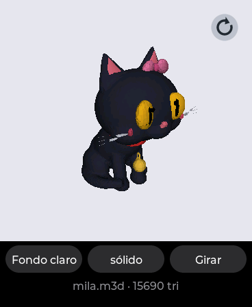
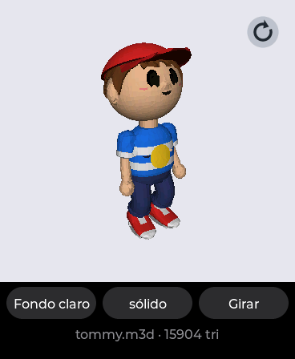
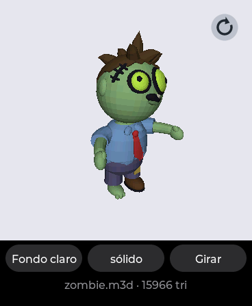
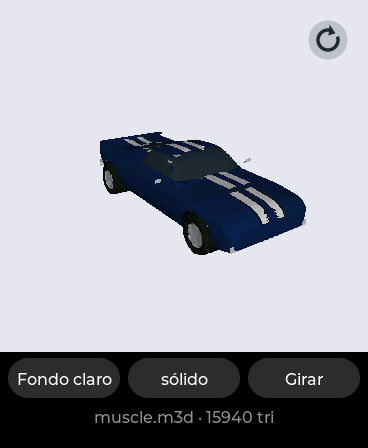

# VISOR 3D — 3D models on the watch

Turn a model with one finger, zoom it with two. The files live in the card's
`3d/` folder: **STL** (binary or ASCII) straight from any CAD program or
slicer, and **M3D**, what the portal's `/3d` page makes out of STL, OBJ and
GLB — with their colours. Since v0.6.0, and the first app built for two
fingers (see [docs/GESTURES.md](../../docs/GESTURES.md)).

| | | | |
|---|---|---|---|
| <br>**Mila**, the mascot | <br>**Tommy** (Monster Hop) | <br>**the zombie** (Monster Hop) | <br>**the muscle car** (Turbo) |

## Using it

A list of the models, by name; tap one. Then:

| | |
|---|---|
| one finger | turns it; let go with a flick and it keeps turning, slowing down |
| two fingers | zoom about the point between them, and move it |
| **↻** (top right) | back to the first view: its size, centred, the first angle |
| double tap | the same |
| tap | the turntable on or off |
| long press | solid or wireframe |

Under the view, three buttons: the **background** (dark, grey or light — a
black cat on a black AMOLED is a hole, so it is a choice, and it is
remembered), **solid / wireframe**, and **Turn** (the turntable). Under them,
the name, the triangles drawn (and the file's, when it was reduced) and the
frames per second while anything moves.

## The samples

`models/` has four, made from the games' own Blender builders — the same
meshes and palettes their sprites are rendered from — so they are as much a
showcase of those apps as of this one:

| file | from | triangles |
|---|---|---|
| `mila.m3d` | Mila, the kitten of the Mila app and AmoledOS's mascot, sitting with her bow and bell | 15 690 |
| `tommy.m3d` | Monster Hop's hero, idle, with his red cap | 15 904 |
| `zombie.m3d` | Monster Hop's zombie, in its default clothes | 15 966 |
| `muscle.m3d` | Turbo's muscle car, navy with white stripes | 15 940 |

Copy them to the card's `3d/` folder (the release has them as
`3d-models.zip`), or upload them from the portal's `/3d` page. To make them
again, or other poses:

```bash
B=/Applications/Blender.app/Contents/MacOS/Blender
$B -b -P apps/visor3d/tools/mila_obj.py -- --out /tmp/m [--anim c_sit] [--items hat_bow,neck_bell]
$B -b -P apps/visor3d/tools/models_obj.py -- --model tommy|zombie|muscle --out /tmp/m
```

Each writes an OBJ with its MTL; the portal's `/3d` page turns it into an
M3D (16 000 triangles is what these use). `mila_obj.py` builds her with the
game's rig and poses; `models_obj.py` loads Monster Hop's `chars.py` and
`monsters.py` and Turbo's `cars.py` without running them, gives every face
the colour the game paints its region with, and for the car — whose stripes,
windows and lamps are masks in the shader, not separate meshes — evaluates
those masks per face after cutting the body finer.

`tools/samples.py` writes four test models with no colour or with simple
colours: a torus knot, an ASCII gear, a bumpy sphere of 80 000 triangles
(over the budget: the watch reduces it while loading) and a low-poly planet.

## The portal's /3d page

Pick an STL, an OBJ (with its `.mtl`, for the colours) or a GLB; the browser
reads it, welds it, reduces it to the triangle cap you choose, shows a
preview you can turn, lets you recolour a one-colour model, and saves the
M3D into `3d/`. Reducing clusters vertices on a grid, **per colour**, so a
small coloured part — Mila's pupils — does not melt into its neighbours.

## How it is built

- The model is drawn by the app's worker on core 0 (`v3_raster.c`: flat
  shading, a 16-bit z-buffer, back faces skipped only for closed meshes wound
  consistently), never in LVGL's task — a busy LVGL task is what used to
  steal touch samples. LVGL's side moves the view and blits the newest of
  three finished frames straight to the panel.
- While anything moves it draws at half resolution and doubles the pixels;
  once the view has been still for 160 ms, one frame at full.
- The reset button is drawn into every frame by the worker (the frames are
  blitted over whatever LVGL has there), from two coverage masks made once.
- Loading (`v3_mesh.c`) welds an STL's loose triangles and reduces anything
  over 24 000 triangles, a few passes if needed, with its progress in the
  strip; leaving mid-load cancels it at once, since the app's code is
  unloaded as soon as it closes.

Measured on the board (v0.6.0 development, before the last raster tuning):
the torus knot (8 640 triangles, solid) ~36 ms a frame at half size, the
planet ~31 ms, the 24 000-triangle sphere 53-59 ms; full frames 45-70 ms.
The 80 000-triangle STL loads and reduces in about 10 s.

## Formats

- **STL**: binary or ASCII, Z up as CAD writes it (turned Y up on loading).
- **M3D**: `"M3D1"`, vertex and triangle counts, flags, float vertices,
  uint32 triangles and, with flag 1, a RGB565 colour per face; Y up,
  little-endian (`v3_mesh.h`).
