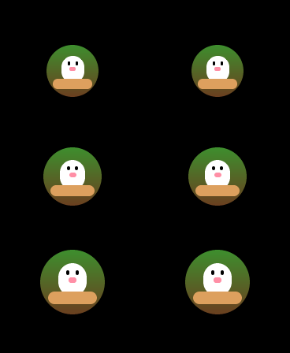
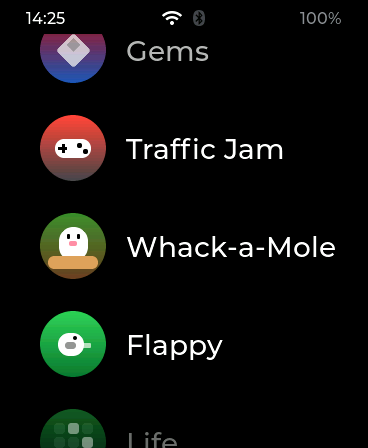
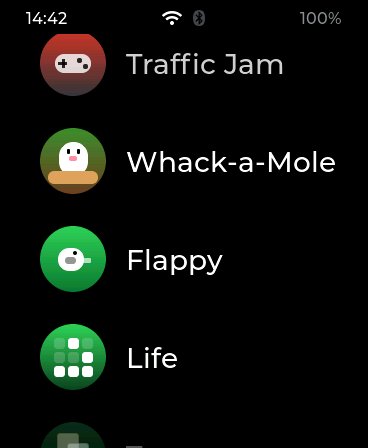

# Icons without a reflash

Design study, branch `icons`, started 2026-09-15. The question it answers:
can a dynamic app (`.so` on the card) bring its own launcher icon, so that
adding an app never again means compiling and flashing the firmware?

Short answer: **yes, and the drawings we have are already halfway there.**
Phase F1 (the interpreter, one icon ported, the diff to zero) is built and
measured; see section 7 for the numbers and section 9 for what it left.

## 1. The problem, measured

Every icon today is a `case` in `draw_vector()` (`components/aos_ui/aos_icon.c`)
selected by an `aos_icon_id_t` enum baked into `aos_app.h`. A `.so` picks its
icon by number: `app->desc.icon_vec = AOS_ICON_MOLE`.

| | |
|---|---|
| Icons in the enum | 44 (36 drawn, the rest reuse a case) |
| `.text` of `aos_icon.c` on the board | **25,707 bytes** (~700 B per drawing) |
| Dynamic apps using `icon_vec` | 22 of 23 |
| Firmware releases whose only mandatory change was an icon | most of the app batches in `HANDOFF-NUEVAS-APPS.md` |

The consequence is written down in that handoff more than once: *"if it needs
its own icon, make it built-in, the icon is firmware anyway"*. The `.so`
mechanism, the portal's `/api/upload`, the whole point of not reflashing to
add a game, is defeated by 40 lines of `lv_obj_create()`.

The language packs already solved the same shape of problem for strings:
files on the card, keyed by `desc.id`, loaded at boot, no firmware involved.
This document does the same for icons.

## 2. What an icon actually is

The 1271 lines of `aos_icon.c` use a very small vocabulary. Counting calls
inside `draw_vector()`:

| Primitive | Uses | What it is |
|---|---|---|
| `lv_obj_create` + `remove_style_all` + `set_size` + `bg_color` + `bg_opa` + `radius` + `align` | 93 | a rounded rectangle, centred with an offset |
| `border_width` / `border_color` / `border_opa` | 11 | a border on one of those |
| `ring()` | helper | circle with a border, no fill |
| `hand()` | helper | rotated bar with the pivot at one end |
| `activity_arc()` | 2 | an `lv_arc` with a dim track |
| `transform_rotation` + pivots | 4 | a rotated square (ears, ship body) |
| `lv_label` | 1 | a glyph |
| gradient on a shape | 1 | |

And **every single coordinate is `s * N / 100`**: a percentage of the icon
size, so the same drawing works at 66, 74 and 82 px (list, honeycomb, grid).
Colours are `AOS_C_TEXT` 79 times, six other theme colours, and 25 literal
`lv_color_hex()`.

That is not C code that happens to draw; it is a **data description written
in C syntax**. Ten opcodes with percent coordinates reproduce all 36 drawings
exactly, because the drawings never branch on anything but the icon id.

## 3. The proposal: a byte-code for icons ("AIC")

An icon becomes a short blob of bytes interpreted by one function,
`draw_ops(base, blob, len, size)`, that creates the same LVGL objects the
`switch` creates today. Same objects, same styles, same cost per frame - the
launcher does not know anything changed.

### 3.1 Format v1

```
'A' 'I' 'C' 0x01          magic + version
<ops...>                   until END
```

Coordinates and sizes are **`int8_t` percent of the icon size**, exactly the
`s * N / 100` idiom (the drawings use 2..88, so ±127 is plenty). Angles are
`int16_t` in tenths of a degree, as LVGL takes them. Colours are one byte: an
index into a **palette table** (`0 = AOS_C_TEXT, 1 = AOS_C_BG, 2 = YELLOW,
3 = TEAL, 4 = PINK, 5 = ORANGE, 6 = GREEN, ...`) or `0xFF` followed by three
RGB bytes for a literal. Opacity is one byte (`LV_OPA_*`). Radius is percent,
with `0xFF = LV_RADIUS_CIRCLE`.

| Op | Bytes | Params | Creates |
|---|---|---|---|
| `END` | 1 | | |
| `RECT` | 9 | align x y w h radius colour opa | rounded rectangle, `lv_obj_align(align, x, y)` - the mole's eyes hang from `TOP_MID` of the body, so alignment is a parameter and not always `CENTER` |
| `RING` | 5 | d border colour opa | `ring()` |
| `ARC` | 6 | d width value rot colour | `activity_arc()` |
| `HAND` | 7 | w len angle(2) colour | `hand()` |
| `TEXT` | 3+n | font n utf8[n] | `lv_label` (body/title font) |
| `ROT` | 3 | angle(2) | rotation on the **last** object, pivot 50/50 |
| `BORDER` | 4 | width colour opa | border on the last object |
| `GRAD` | 3 | colour dir | gradient on the last object |
| `INTO` / `OUT` | 1 | | next objects become children of the last one (the cat's eyes live inside its head) |

The interpreter clamps every non-zero dimension to `LV_MAX(2, px)`, which is
what the code does by hand with `LV_MAX(2, s / 26)` and friends.

Measured size: the mole (`AOS_ICON_MOLE`, five shapes with three literal
colours) is **64 bytes**, header included. Cap per icon:
`AOS_ICON_OPS_MAX = 256`.

The palette indices are **append-only**, for the same reason the enum is:
a `.so` has them baked in. The lesson is already written at the top of
`aos_icon_id_t`; it moves one level down and stops mattering for shapes.

### 3.2 Authoring in C, not in a binary editor

A header `aos_icon_ops.h` with macros keeps the app source readable and
compiles the blob at build time, in the `.so` and in the simulator alike:

```c
static const uint8_t MOLE_ICON[] = {
    AIC_HEADER,
    AIC_RECT(  0, 22, 62, 22, 0xFF, AIC_C_LIT(0x3A2A1A), 255),  /* the hole  */
    AIC_RECT(  0,  4, 36, 34, 40,   AIC_C_LIT(0x6B4A2E), 255),  /* the mole  */
    AIC_RECT(-7, -2,  6,  6, 0xFF,  AIC_C_TEXT, 255),           /* eyes      */
    AIC_RECT( 7, -2,  6,  6, 0xFF,  AIC_C_TEXT, 255),
    AIC_RECT( 0,  8,  8,  5, 0xFF,  AIC_C_PINK, 255),           /* nose      */
    AIC_END
};
```

`tools/aic.py` reads a blob back: `lint` (header, size cap, palette range,
nesting, and **a warning on `ROT`**, because `ARCHITECTURE.md` measured that
rotation costs a layer per frame and the launcher redraws every visible icon
while scrolling - two of the 36 icons use it today; that stays allowed, and
flagged), `dump` (one line per op, written as the C macros), and `halves`
(the pixel diff of section 7). It does not render: the pixels that matter
are LVGL's, and the simulator produces those. A browser renderer of the
same ten opcodes comes with the portal preview in F3.

## 4. Where the blob lives: two sources, one format

### 4.1 Inside the `.so` (the default, no new file anywhere)

The app hands its icon to the runtime from `init()`:

```c
aos_icon_set_ops(app, MOLE_ICON, sizeof MOLE_ICON);
```

Why a call and not a new `desc` field or a new exported symbol:

- **A field in `aos_app_desc_t` bumps `AOS_ABI_VERSION` to 3** and every `.so`
  on the card stops loading until rebuilt. A rebuild is a card upload, not a
  reflash, but it is 23 uploads for a feature none of those apps asked for.
- **An exported `aos_app_icon()` function** keeps ABI 2 and is optional for old
  firmware, but Espressif's `dlsym()` only sees `STT_FUNC` symbols (the trap
  documented in `aos_app.h`), so it has to be a function returning a pointer -
  fine on the board, and unmappable in the simulator, where 23 apps live in
  one binary and cannot all export the same symbol name.
- **A runtime call** is one new symbol in `aos_symbols.c` (ABI stays 2, as
  when `aos_tr()` was added), works in the simulator with no special case, and
  fails loudly rather than silently: a `.so` that uses it will not load on a
  firmware that lacks it, and `build_apps.sh` already flags the missing
  symbol at build time.

Mechanics, and why they cost nothing new: `register_stub()` already
`dlopen()`s every `.so` at boot, runs `init()` to read the descriptor, copies
`id`/`name`/`icon` into a `dynapp_t` slot **because the `.so`'s rodata
vanishes at `dlclose()`**, and closes it. `aos_icon_set_ops()` copies the
blob into a pending buffer during that same `init()`, and `register_stub()`
moves it into the slot next to the other copies. `init()` runs again when the
app is really opened; the second call overwrites the slot with the same bytes.

Cost: `MAX_DYNAPPS (32) x 256 B = 8 KB`, in the `s_apps` table that is
already `AOS_BSS_PSRAM`.

### 4.2 A file on the card (override, theming, no rebuild at all)

Mirroring `/sdcard/lang/`:

```
/sdcard/icons/
├── aos.topos.aic        keyed by aos_app_desc_t.id, like the catalogs
├── demo.claudito.aic
└── aos.timer.aic        a built-in one, overridden
```

Same blob, same interpreter. What it buys on top of 4.1:

- **Retouch an icon by uploading a file**, without rebuilding the `.so`:
  `POST /api/upload?dir=icons&name=aos.topos.aic`, which the portal's
  whitelist already knows how to gate.
- **Override any icon, built-in included**, which is a theme mechanism for
  free.
- The portal can list them and preview them with a JS renderer of the same
  ten opcodes (the `Pantalla` page already draws the watch state).

Loaded once at boot into a table keyed by id, and again on request after an
upload, through the same deferred tick that `aos_ui_request_language()` uses -
the launcher is rebuilt at the top of `aos_ui_tick()`, never from inside the
HTTP handler.

Location: SD when there is a card, SPIFFS `/storage/icons` when there is not,
like every `aos_hal_path_*` except `_lang`. The card is preferred because
that is where the `.so` files and the packs already are, and a card can be
written from a computer.

### 4.3 Precedence

```
file on card/SPIFFS  >  blob from the .so  >  desc.icon_vec (enum)  >  desc.icon (glyph)
```

The enum stays forever - append-only, as today - but nothing new is added to
it. The two-letter `desc.icon` reserve the apps already carry stays the last
fallback, as it is now.

## 5. The alternative considered: bitmaps

`LV_USE_LODEPNG` is on and the Photos app already decodes `A:/sdcard/...`
paths through LVGL's decoder, so `/sdcard/icons/aos.topos.png` works **today**
with an `lv_image` instead of `draw_vector()`. It was not chosen as the base
because:

- Three sizes (66/74/82) means either three files or scaling, and scaling an
  image is a layer per icon per frame; `ARCHITECTURE.md` measured what that
  costs.
- A decoded 82 px ARGB icon is ~27 KB; 44 of them is 1.2 MB of PSRAM or
  decoder churn while scrolling. The vector version is a few hundred bytes of
  LVGL objects.
- The gradient circle, the theme colours and the look would be the artist's
  job, per icon, instead of the runtime's.

It is still worth having **as an opcode**, later: `IMG path` inside an AIC
blob, for an app whose icon really is a piece of art. Nothing in the format
prevents it.

## 6. What it does to the firmware itself

Once the interpreter exists, the 36 `case` blocks are tables too. Rough
budget: 36 x ~100 B of rodata plus a ~2 KB interpreter, against 25.7 KB of
code now. That is a **~20 KB** saving of flash *and* the end of the enum as a
growing thing - measured, not estimated, in F4 below. The enum values become
indexes into the built-in table, so the numbers the `.so` files carry keep
meaning what they mean.

## 7. Phases

| | | |
|---|---|---|
| **F0** | This document | **done** |
| **F1** | Interpreter + `aos_icon_ops.h` + `tools/aic.py`; port ONE icon (`AOS_ICON_MOLE`) to a table next to its `case`; draw both at 66/74/82 in the sim, diff to zero; run the table on the board; measure flash and RAM | **done 2026-09-15**, below |
| **F2** | `aos_icon_set_ops()` + a registry keyed by `desc.id` + symbol export; `topos` calls it and drops `icon_vec`; the bench's right column takes the production path with the blob Topos registered; on the board, the icon out of the `.so` | **done 2026-09-15**, below |
| **F3** | `/icons` on card and SPIFFS, boot scan, portal upload + list + JS preview, deferred rebuild after upload; the override of a built-in icon as the test | |
| **F4** | Port the 36 cases to tables, delete the `switch`, measure the flash delta; enum stays as an index | |
| **F5** | Optional `IMG` opcode for bitmap icons | |

F1 is the gate: if the interpreter cannot reproduce the mole pixel for pixel,
the format is missing an opcode and that is where to find out, not in F4.

### 7.1 What F1 measured

**The gate passed.** The simulator's `AOS_SIM_VIEW=icontest` draws the mole
by its `case` on the left and from `ICON_MOLE_OPS` on the right, at the
launcher's three sizes, and `AOS_SIM_SHOT` dumps LVGL's own pixels:

| | |
|---|---|
| Object trees, walked side by side (position, size, radius, colour, opacity, border) | identical at 66, 74 and 82 px |
| `tools/aic.py halves` on the dump | **0 differing pixels** |
| Blob | 64 bytes, 5 shapes |

 

One format change fell out of it: `RECT` carries an alignment byte, because
the mole's eyes and nose hang from `TOP_MID` of the body, not from its
centre. The interpreter also had to use the case's exact integer expression,
`size * pct / 100` in `int32`, negatives included; anything cleverer moves a
pixel.

**Flash.** The worktree's firmware, built from `main` and then with F1, same
`sdkconfig`:

| Section | `main` | F1 | delta |
|---|---|---|---|
| `.flash.text` | 1,968,604 | 1,970,944 | **+2,340** |
| `.flash.rodata` | 1,317,188 | 1,317,380 | +192 |
| `aos_icon.c.obj` `.text` | 25,707 | 28,657 | +2,950 (interpreter, palette, mole table, the switch path kept for the bench) |
| `amoledos.bin` | 3,397,456 | 3,399,984 | +2,528 |

**Internal RAM: nothing.** This was the number that had to be checked,
because internal RAM is the scarce one on this board while PSRAM has 7.9 MB
free:

| | `main` | F1 |
|---|---|---|
| `.dram0.data` | 35,132 | 35,132 |
| `.dram0.bss` | 14,256 | 14,256 |
| `.ext_ram.bss` (PSRAM) | 60,256 | 60,256 |
| Board, launcher open, `internal free` | 161,359 | 162,043 |
| Board, launcher open, `psram alloc` | 437,952 | 437,212 |

The static sections do not move because the interpreter is code and the
tables are `const` in flash; the interpreter's only state is a four-deep
parent stack on the caller's stack. The runtime numbers do not move because
the interpreter creates the same LVGL objects the `case` created, and LVGL's
allocations already go to PSRAM (`lvgl allocations to psram: on` in
`/api/mem`). The 684 B and 740 B differences are a freshly booted board
against one with 21 hours of uptime, not the icons.

**On the board.** The F1 firmware went over OTA to `192.168.1.108`; the
production `aos_icon_create()` now draws any icon that has a table from the
table, so the mole on the board's launcher (Whack-a-Mole, above right) is the
interpreter's output, not the switch's. No `bad built-in blob` line in the
log.

Two things learnt on the way, about the tools and not the icons:

- **A drag injected with `/api/mem?tap=x,y,ms,x2,y2` fires the global gesture
  if it moves more than ~3 px per indev read**, and the gesture handler's
  `lv_indev_wait_release()` aborts the scroll. A 300 px drag over 6000 ms
  (2 px per read) scrolls the launcher list without ever accumulating a
  gesture. A 300 px drag over 250 ms does nothing but log `GESTURE dir=4`.
- **The launcher goes back to the face after ~30 s idle**, and a 6 s press on
  the face opens the watchface picker. A scripted scroll has to be one
  uninterrupted sequence, from `que=menu` to the capture.

### 7.2 What F2 measured

The registry turned out simpler than the "pending copy in `register_stub()`"
sketched in 4.1: `aos_icon_set_ops()` validates and copies the blob into a
table of its own **keyed by `desc.id`**, right there in the call, so
`aos_dynapp` needed no change at all - the id is set before the call, the
probe's `init()` fills the entry, the real open's `init()` overwrites it
with the same bytes, and `aos_ui_unregister_app()` clears it. Topos sets
`icon_vec = AOS_ICON_NONE` and hands over `TOPOS_ICON`, the same 64 bytes
the firmware's table holds.

| | |
|---|---|
| Simulator bench, right column now `aos_icon_create()` with Topos' registered descriptor | `the blob Topos registered from its init()`, byte-identical to the built-in table, trees identical, **0 differing pixels** |
| `build_apps.sh topos` | `ok topos.so 48K ABI 2 75 symbols` - the new call resolved against the regenerated table |
| Board log at load | `icon: demo.topos brought its icon: 64 bytes, 5 shapes` |
| Board launcher | Whack-a-Mole drawn from the `.so`'s bytes (the `AOS_ICON_MOLE` value is no longer in that `.so`) |



**Flash and RAM, F2 against F1:**

| Section | F1 | F2 | delta |
|---|---|---|---|
| `.flash.text` | 1,970,944 | 1,971,528 | +584 (the registry code) |
| `.flash.rodata` | 1,317,380 | 1,317,828 | +448 (eight new rows in `aos_symbols.c`) |
| `.dram0.data` / `.dram0.bss` | 35,132 / 14,256 | **unchanged** | |
| `.ext_ram.bss` (PSRAM) | 60,256 | 72,176 | **+11,920** = 40 entries x (40 id + 2 len + 256 ops) |
| Board, launcher open, `internal free` | 162,043 | 162,067 | noise |

The registry is `AOS_BSS_PSRAM`, so the 11.9 KB land where there are 7.5 MB
free and not one byte in internal RAM. Sized at 40 entries because only
dynamic apps register (32 is `MAX_DYNAPPS`); the built-in ones keep their
tables in flash.

**A panic seen on the way, not caused by this.** While F1 ran on the board,
`/api/status` reported `boot_reason: PANIC` with a reboot at about 14:27.
The dump in the `coredump` partition, symbolised with a rebuild of the F1
commit (`esp-coredump` refuses it - the rebuilt ELF's SHA differs - but
`xtensa-esp32s3-elf-gdb` on the ELF extracted at byte 24 of `/api/coredump`
does not care):

```
assert failed (spi_master.c:1400, spi_device_release_bus)
  panel_io_spi_tx_param  <-  esp_lcd_panel_io_tx_param
  bsp_display_brightness_set        managed_components/waveshare.../esp32_s3_touch_amoled_1_8.c:371
  aos_hal_display_set_state(OFF)    components/aos_hal/aos_hal_esp32.c:368
  housekeeping_task                 components/aos_hal/aos_hal_esp32.c:3314
```

The housekeeping task turned the panel off on the idle timeout while another
task held the panel's SPI bus - the LVGL flush, most likely, since the screen
had just been captured and scrolled by script. It is a race between the HAL's
display-off path and the BSP that predates this branch; the icons are not in
the trace. Worth its own fix: take the LVGL lock (or the port's) around
`bsp_display_brightness_set()` when it is called from housekeeping.

Two of the eight new symbols are worth a note. `aos_icon_create_switch` is
bench-only and should not tempt an app; it goes with the switch in F4.
`aos_app_pato_get` is unrelated: it had been missing from the table since
the Pato goma commit, because nobody had rerun `gen_symbols.py` after it,
and this regeneration picked it up.

## 8. Risks and things already known

- **`dlsym()` sees functions only.** Designed around it (4.1); nothing to
  export but a call.
- **The `.so`'s rodata dies at `dlclose()`.** The blob is copied during
  `init()`, like `id` and `name` already are. Cap 256 B, silently truncated
  blobs are refused with a log line instead.
- **`init()` runs twice** (probe, then open). The call is idempotent.
- **Rotation costs a layer per frame.** Allowed, warned by the linter, same
  two icons as today.
- **Palette is append-only.** Same lesson as the enum, written at the top of
  the header.
- **A card file wins over the `.so`.** Same trap as language packs: after
  changing an icon in the source, a stale `.aic` on the card hides it. The
  boot log lists which icons came from files, as it lists the packs.
- **No card, no SPIFFS file:** everything behaves exactly as today. The
  fallback chain costs no code, as with `aos_tr()`.
- **`AOS_ABI_VERSION` stays at 2** throughout. Every `.so` on the card keeps
  loading through all five phases.

## 9. Where F1 leaves the code

- `components/aos_ui/include/aos_icon_ops.h` - the format, the palette, the
  authoring macros and the runtime API (`aos_icon_create_ops`,
  `aos_icon_ops_check`, `aos_icon_ops_builtin`, and `aos_icon_create_switch`
  for the bench only).
- `components/aos_ui/aos_icon.c` - `walk_ops()` draws or validates (same
  parser, `base == NULL` validates); `ICON_MOLE_OPS`; `aos_icon_create()`
  prefers a table when `aos_icon_ops_builtin()` has one. The 36 cases are
  untouched.
- `sim/main.c` - `AOS_SIM_VIEW=icontest`, `AOS_SIM_SHOT`, and the bench
  writes `sim_fs/icons/demo.topos.aic`, the first tenant of the directory F3
  will scan.
- `tools/aic.py` - `lint`, `dump`, `halves`.

- F2 added the registry (`aos_icon_set_ops`, `aos_icon_clear_ops`,
  `aos_icon_ops_for`) in `aos_icon.c`, the clear in
  `aos_ui_unregister_app()`, `TOPOS_ICON` in `apps/topos/main/topos.c`, the
  regenerated `aos_symbols.c`, and the "The icon" section of `APP-API.md`.

The `.so` files on the card are untouched and still load: nothing in the
ABI moved. Next is F3, the `/icons` directory on the card and the portal.
