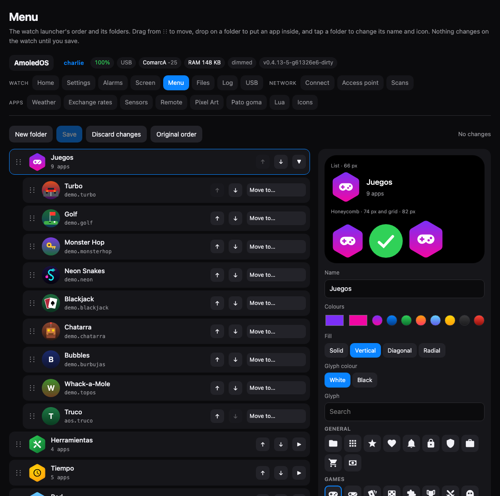

# The launcher's order and folders

The launcher shows its apps in the order the user chose, with folders, and the
choice is made in the web portal at `/menu`. Folders are hexagons, so they are
never mistaken for an app, whose icon is a circle. This came in with v0.5.0,
together with room for 256 apps: at 58 the menu was already long to scroll.



## What the user sees

On the watch, the launcher's three styles (list, grid, honeycomb) show the top
level in the chosen order: apps and folders mixed. A folder in the list style
says how many apps it holds. Tapping one opens it as a second page in the same
style, with its name on top; the name, a swipe right or the button closes it.
An app opened from a folder returns to the folder when it closes. Going back
to the clock forgets the folder: the next time the menu opens it starts at the
top.

In the portal, `/menu` lists the top level with the folders unfolding under
it. Things move by dragging the handle (finger or mouse), by the arrows, or by
the "move to" menu; dropping an app on the middle of a folder puts it inside.
Tapping a folder opens its editor:

- the name, up to 39 bytes of UTF-8 (accents are fine: the font has Latin-1);
- two colours, or one of eight quick palettes;
- the fill: solid, vertical, diagonal or radial;
- the glyph, from a catalogue of 66, and whether it is white or black.

The preview draws the icon at the three launcher sizes next to an app's circle.
Nothing reaches the watch until **Save**; **Original order** deletes the file.

## menu.txt

The whole state is one text file, `menu.txt`, at the root of the card (SPIFFS
when there is no card, like the icons). The portal writes it; the watch only
reads it. A line per entry, in order:

```
# comments and blank lines are ignored
app aos.settings
folder f1 7B2FF7 F107A3 v gamepad-variant w Games
  app demo.turbo
  app demo.golf
end
app aos.music
```

`folder <id> <colour A> <colour B> <fill> <glyph> <glyph colour> <name>`:

| Field | Values |
|---|---|
| id | any token up to 15 characters, unique; the portal uses `f1`, `f2`... |
| colours | six hex digits each |
| fill | `s` solid, `v` vertical, `d` diagonal, `r` radial |
| glyph | an MDI name from the catalogue; an unknown one draws the first (`folder`) |
| glyph colour | `w` white, `b` black |
| name | the rest of the line, as written |

The rules, which `aos_menu.c` applies and the page repeats:

- **What the file does not mention still shows**, at the end of the top level
  in its usual order. That is where a newly installed app appears.
- **What the file mentions but is not installed is skipped and kept.** Put the
  app back on the card and it returns to its place. The page shows it dimmed,
  with a button to drop it.
- **One level of folders, and an app in one place.** A second line for the
  same id is ignored; a `folder` inside a folder is an error.
- **All or nothing.** A file that does not parse is ignored whole and the log
  says which line; the portal validates with the same parser before writing,
  and writes through a temporary file and a rename.

`GET /api/menu` returns the file as it is (empty when there is none);
`POST /api/menu` takes the whole new file as the body, or an empty body to
delete it. The launcher is rebuilt on the UI's next tick.

## The folder icon

`aos_folder_icon.c` computes every pixel into one ARGB8888 image per folder
when the launcher is built, and after that the icon is only copied, like any
image; scrolling the menu does not draw a hexagon.

- **The hexagon** is the exact signed distance to a rounded hexagon, pointy
  side up (the orientation that sits in the honeycomb): one pixel of
  antialiasing at the edge and real arcs at the corners, radius 0.24 of the
  circumradius, with the rounded tip touching the image's edge.
- **The fill** is a formula of the pixel's position: vertical `y/S`, diagonal
  `(x+y)/2S`, radial from `(0.4S, 0.35S)` over `0.7S`.
- **The glyph** comes from one 42 px font. LVGL rasterises it to an A8 mask
  and it is resampled bilinearly to half the icon's height, centred on its ink,
  so one font serves the 66, 74 and 82 px of the three styles.

An 82 px icon is 6,724 pixels and takes well under a millisecond. The image is
freed with its object, and dropped from LVGL's image cache first: the board
keeps a 4 MB cache keyed by the source pointer, and a freed buffer left in it
would be drawn from later.

The portal's preview draws the same shape as an SVG with the same numbers and
the glyph's SVG path from the same MDI release. Against the simulator's pixels
at 82 px the mean difference is 3 in 255; what differs is the antialiasing.

### The glyphs

[Material Design Icons](https://pictogrammers.com/library/mdi/) 7.4.47
(Pictogrammers Free License; the icons derived from Google's are Apache 2.0).
MDI is published both as a font and as SVG paths of the same drawings, which is
what lets the watch draw a font glyph and the page an SVG and show the same
thing. `tools/gen_folder_glyphs.py` holds the catalogue, 66 icons in nine
groups, and writes the three files that must agree: the LVGL font
(`aos_folder_font.c`, ~37 KB of flash), the name table the firmware reads
`menu.txt` with (`aos_folder_glyphs.c`), and the page's copy
(`components/aos_web/glifos.js`). The names are MDI's own and are what the file
stores, so they are never renamed; adding one is free.

## 256 apps

Every ceiling on apps had bitten once by drifting below another: the simulator
held 32 with 34 apps in `apps/`, and two of them were missing there. They are
tied together now:

| Ceiling | Was | Now |
|---|---|---|
| `AOS_MAX_APPS`, the launcher | 80 | 256 |
| `MAX_DYNAPPS`, the loader | 48 | 256 − `AOS_BUILTIN_RESERVE` (32) = 224 |
| icons brought by apps | 40 | 256, a buffer taken on first use |
| icon files | 48 | 256, same |
| `MAX_SIM_APPS`, the simulator | 32 | 256 |
| scripts that become apps (`lua.so`) | 16 | 192 |

A build-time check keeps the built-in apps under their reservation. Internal
RAM is unchanged; PSRAM `.bss` grows 55 KB. The icon tables used to carry a
256-byte blob in every entry (150 KB at 256 entries); now an entry takes its
buffer the first time it is used and never frees it, so the portal, which reads
the blobs from another task, can never read freed memory.

The tables were never what 256 costs. Measured on the board with 34 modules
and 200 Lua scripts (245 apps):

**Building the launcher.** A cell costs ~14 ms (the icon's objects, the label,
the flex layout). Built all at once, 245 cells held the UI task for over three
seconds and the watchdog restarted the watch, with no core dump and
`boot_reason: watchdog`. Pages now build 18 cells, enough for any style's
first screen, and a timer adds the rest four per tick:

| | First screen | Complete |
|---|---|---|
| top level, 245 entries | 179 ms | 5.3 s, in the background |
| top level, 48 entries | 350 ms | 1.1 s |
| a folder of 187 apps | 148 ms | 3.6 s |

The screen answers the whole time and the finger can scroll what is there. The
245 cells take ~280 KB of PSRAM.

**The boot scan.** Every `.so` is opened at boot to read its descriptor. It
took 16.1 s for the 34 modules and 190 scripts, and the split showed where:

| | Before | After |
|---|---|---|
| whole scan | 16.1 s | 5.3 s |
| 34 modules | 4.75 s | 1.26 s (37 ms each) |
| symbol lookups (2,634) | ~3.5 s | 45 ms |
| 190 scripts | 11.3 s | 4.0 s |

The symbol lookup was a `strcmp` walk of the firmware's 2,767-entry table per
undefined symbol, and a libc symbol such as `memcpy` walked all of it before
the loader's own table was asked. A sorted index of pointers (11 KB of PSRAM,
12 ms to build) makes it a binary search. The same lookup runs every time an
app opens, so apps open faster too. A script costs one `fopen` on a FAT
directory of 200 files (~21 ms): `lua.so` stopped also opening the `.aic` of
every script and now only opens the ones the directory listing showed.

**Scripts crowding out apps.** With 200 scripts, `lua.so` came before
`turbo.so` in the directory, took the slots, and Turbo and Monster Hop were the
ones left out. The scan now registers one app per module first and the extra
apps of multi-app modules after, so a card full of scripts never pushes a real
app out of the launcher.

**The boot log.** The ELF loader logged every symbol of every module at INFO:
hundreds of lines per `.so`, which is why the 16 KB log ring had forgotten the
boot seven seconds in. Those tags are at WARN now; the scan's summary is one
line:

```
aos_dynapp: scan: 34 modules, 224 apps, 5260 ms (modules 1263 ms, extra apps 3997 ms;
            open 1196, of it symbols 45 for 2634 lookups; lock wait 59, register 71)
ui: launcher built: 245 apps, style 0, 179 ms
ui: page complete: 245 cells, 5322 ms
```

## Also fixed on the way

The grid centred its rows as a block and the honeycomb centred its lattice, so
a long menu opened at its middle rows with the first apps above the top edge.
Harmless while the order was arbitrary; both start at the first row now.

## Files

| File | What it does |
|---|---|
| `components/aos_ui/aos_menu.c` | reads `menu.txt`, validates it for the portal, resolves it against the installed apps |
| `components/aos_ui/aos_folder_icon.c` | the hexagon and the glyph, into an image |
| `components/aos_ui/aos_launcher.c` | pages built a few cells at a time; folders as a second page |
| `components/aos_ui/aos_folder_font.c`, `aos_folder_glyphs.c` | generated: the glyph font and its names |
| `components/aos_web/menu.html` | the `/menu` page |
| `components/aos_web/glifos.js` | generated: the glyphs' SVG paths for the page |
| `components/aos_web/aic.js` | the AIC interpreter `/iconos` and `/menu` share |
| `tools/gen_folder_glyphs.py` | the glyph catalogue, and the generator of the three files above |
