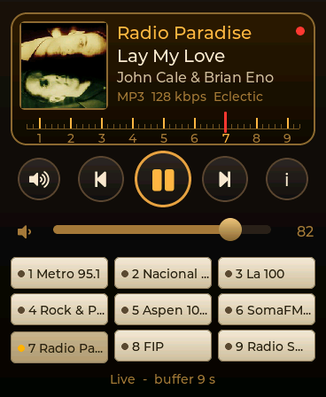
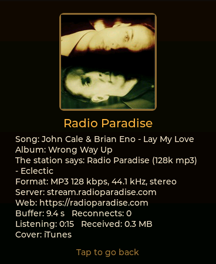
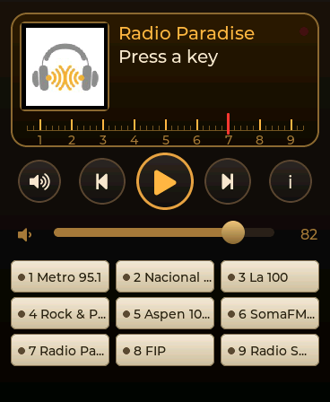

# Internet radio

A radio on the wrist: nine preset keys, a lit dial with the station, the song
and its cover, and a needle over a numbered scale. The keys are chosen in the
portal's `/radio` page from a list of stations kept on the card, searched in
radio-browser.info's open directory. MP3 since v0.8.0; AAC (LC, HE, HE v2)
and HLS since v0.8.1. Every figure here was measured on charlie.local (v2
board) on 2026-09-26, against real stations.

  

## How it is split

The sound is the firmware's; the app is the front panel.

```
aos_radio.c     reader task        station -> redirects, playlists, ICY, HLS -> byte ring (192 KB, PSRAM)
aos_audio.c     player_task        byte ring -> minimp3 or AAC -> (L+R)/2 -> PCM ring (2 s, PSRAM)
aos_hal_esp32.c player_out_task    PCM ring -> ES8311
apps/radio      the panel          aos_hal_radio_play(keys, 9, i), then reads the state back
aos_web         /radio, /api/radio the keys (NVS), the list and the logos (card)
```

A station is **one more source for the player** that plays the card's MP3s
(MUSIC.md): the same decoder task, the same PCM ring and writer, the same
yielding to an app that opens the speaker. So what the Music player got for
free, the radio gets too: it goes on with the app closed, the control centre
drives it (its title row shows the song, or the station between songs), and
`/api/player` measures it. `aos_audio_open_src()` is the only new entry into
the decoder: MP3 or AAC from a function instead of a file, with no tags, no
length and no seeking. Which of the two is decided from the bytes, not from
the server's `Content-Type`: an ADTS header has layer bits 00, which no MP3
frame has, and the next header must sit where the first says its frame ends.

The app hands the whole list of keys to `aos_hal_radio_play()`, so next and
previous walk the keys from anywhere: the app, the control centre, the portal.

## What a station URL turns out to be

In the order the reader meets them, all seen on stations from radio-browser:

| What | Seen on | What the reader does |
| --- | --- | --- |
| A 302 to a numbered edge server | StreamTheWorld (Metro, Aspen, La 100, Rock & Pop...) | follows it. The address carries a token that expires: after a drop it starts again from the station's own URL |
| A 302 with a **relative** `Location` | Mediainbox (La Popu) | resolved against the URL that sent it |
| A `.pls` or `.m3u` | older stations | the first http(s) line is the stream |
| HLS (`.m3u8` with `#EXT-X-`) | Radio 10, Con Vos, Radio Deejay, France Inter, RMC... | played since v0.8.1: see "HLS" below |
| `HTTP/1.0 200`, `HTTP/1.1 200` or `ICY 200 OK` | Icecast, CDNs, Shoutcast 1 | all three taken |
| `Content-Type: audio/aac` or `audio/aacp` | Radio Mitre, Rock & Pop and La Red's AAC streams, El Destape | played since v0.8.1 (ADTS); v0.8.0 refused it |
| Ogg, Opus, FLAC, `audio/mp4` | Radio Paradise's FLAC and others | refused with the type ("...: only MP3 and AAC play") |
| chunked transfer | none so far (HTTP/1.0 is asked for) | taken apart anyway |

With `Icy-MetaData: 1` the server interleaves, every `icy-metaint` bytes of
audio, a length byte and `StreamTitle='Artist - Title';`. The reader takes it
out before the decoder sees anything and **remembers the audio byte where it
arrived**. The decoder reports when it has read past that byte, and the
player publishes the title when that sample reaches the speaker: with ~10 s
of buffer, a title shown when it was downloaded would change ten seconds
before the song does.

Two repairs on the way:

- **Twice-encoded UTF-8.** METRO 95.1 sends "Así" as `C3 83 C2 AD`: UTF-8 read
  as Latin-1 and encoded again. Valid UTF-8 whose characters all fit in a
  byte, and whose bytes are UTF-8 again, is undone once. Latin-1 titles
  (invalid UTF-8) are converted; real UTF-8 is left alone.
- A title of only punctuation ("-", La Nación +Música between songs) is
  nothing, and the dial shows the station's own name.

## AAC (v0.8.1)

Decoded on the board by Espressif's `esp_audio_codec` (2.6.2), a prebuilt
library under its modified MIT licence, free to use and ship on Espressif
chips, which is all this firmware runs on. It does AAC-LC, HE-AAC (SBR) and
HE-AACv2 (PS); AAC-Plus is on, because most AAC radio is HE-AAC at 32-64
kbps and without SBR it comes out at half the rate and in mono. The
simulator and `tools/radio_bench` decode with libavcodec behind the same
three calls (`aos_aac.h`), the way `sim_codec.c` stands in for the H.264
decoder of the cameras. The dial says which one it is from what the decoder
gives back: twice the header's rate is SBR, two channels out of a mono
header is PS.

| Station | Codec | kbps | CPU, one core | Time to sound |
| --- | --- | --- | --- | --- |
| Radio Mitre (ICY) | HE-AAC | 64 | 26 % | 2.0-3.0 s |
| Radio Disney AR (ICY) | HE-AAC | 128 | 25 % | 3.2 s |
| El Destape (ICY, https) | HE-AACv2 | 48 | 38 % | 3.7-4.4 s |
| Radio 10 (HLS) | AAC-LC | 65 | 11 % | 3.8 s |
| France Inter (HLS) | AAC-LC 48 kHz | 190 | 17 % | 1.1-1.5 s |
| Radio Deejay (HLS, master) | HE-AAC 48 kHz | 122 | 28 % | 7.3-8.4 s |
| RMC (HLS) | AAC-LC mono | 128 | 9 % | 2.8 s |

SBR is what costs: HE-AAC takes two to three times the CPU of MP3 at the
same bitrate, and PS on top of it another half. The library's 51 KB go to
PSRAM (its buffers are above the malloc threshold); internal RAM while an
AAC station plays is 23.8 KB, against 17.9 with MP3. Four minutes of El
Destape (HE-AACv2, the heaviest) with the screen off: 0 underruns, buffer
between 8.1 and 10.6 s, the PCM ring never under 1.6 s. The firmware grew
123 KB (4,012,032 -> 4,138,160 B).

## HLS (v0.8.1)

A station that answers with an `.m3u8` does not stream: it lists segments
of a few seconds and a player fetches them one after the other, reloading
the list for the next ones. The reader does the same:

- **A master playlist** (`#EXT-X-STREAM-INF`) is the same station at several
  rates: the audio-only variant (no `avc1`/`hvc1` in `CODECS`) with the
  highest `BANDWIDTH` up to 160 kbit/s, else the lowest.
- **A live playlist** is joined three segments from its end, as players do,
  and reloaded when its segments run out, every half target duration while
  nothing is new.
- **A segment** is MPEG-TS (PAT, PMT, then the PES payload of the audio PID:
  ADTS AAC or MP3) or packed audio (an ID3 tag, skipped, then ADTS or MP3).
  Either way the ring gets bytes the decoder already knows.
- **Refused with the reason:** fMP4 segments (`#EXT-X-MAP`: SomaFM's HLS),
  encrypted ones (`#EXT-X-KEY`), LATM audio in the TS.
- **Titles:** HLS radio carries none in a way this reads (they would be ID3
  timed metadata in the TS); the dial shows the station.

Two things the stations taught:

- **A segment is known by its name, not by `EXT-X-MEDIA-SEQUENCE`.** RMC's
  server stitches ads in and sends sequence 1 on every reload while the
  segments move on: a reader that trusted the number waited for ever (97 dry
  waits in 12 s on the bench). Segments are told apart by a hash of their
  URI up to the `?`, the last 32 remembered.
- **Every segment is a new connection**, a TLS handshake included, and with
  the WiFi in modem sleep a 6 s segment took up to 5.7 s to arrive on the
  watch: three underruns in four minutes of Radio 10 with the screen off.
  The WiFi now leaves power save while a segment or a playlist is on its way
  (and while a stream reconnects), and goes back between them
  (`aos_radio_busy()`): five minutes with the screen off, 0 underruns, the
  buffer between 7.5 and 16.7 s instead of 2 and 12.

## What it costs

| | At rest | Playing |
| --- | --- | --- |
| Internal RAM | 0 | **17.9 KB** with MP3 (v0.8.0: the reader's stack of 7 KB and the player's two, 10 KB); **23.8 KB** with AAC in v0.8.1, where the reader's stack is 9 KB; back to the byte after stopping |
| PSRAM | 0 | 257 KB: the byte ring (192 KB), the reader's buffers, the decoder's; plus the player's PCM ring, allocated once |
| CPU (decoder, 96-192 kbps) | | **11-12 % of one core** for MP3 (`load_permille` 116-124); AAC in its own section |
| Reader's stack | | 4.7 KB used on a redirect with two TLS handshakes; 6.7 KB on some https servers and HLS master playlists, which left 360 bytes of 7 KB: the big buffers moved to the heap and it has 9 KB (5.5 KB used at most) |
| Firmware | | +51 KB against v0.7.0 (3,960,048 -> 4,012,032 B), 33 KB of it the `/radio` page |

The app itself is 24 KB of `.so` and 51 KB of PSRAM for its two covers.

## Time to sound

From the tap to the first sample, polled through `/api/radio`:

| Station | Path | WiFi in modem sleep | Power save off while connecting |
| --- | --- | --- | --- |
| Radio Paradise | http | 3.3 s | **1.3 s** |
| Nacional Rock | http | 1.2 s | 1.2 s |
| Radio Swiss Jazz | http, 302 to a node | 8.2 s | **2.6 s** |
| SomaFM | https | 6.2 s | **3.0 s** |
| Metro 95.1 | https, 302, https | 10.3 s | **4.1 s** |
| La 100, Rock & Pop | https, 302, https | - | 3.7, 4.2 s |

The lesson: with the screen on the watch's WiFi sits in modem sleep, and a
round trip takes 200-300 ms instead of 10. A TLS handshake is a dozen of them.
So the radio turns power save **off while a station connects** and back to
modem sleep once it plays (`s_radio_ps` in `pm_policy_apply()`). With
Bluetooth up, coexistence needs modem sleep and it is left alone.

The other half: with the screen off the watch normally drops to the
**deepest** modem sleep, whose long listen interval would starve a stream.
While a station plays it never goes deeper than the light one.

## Holding up

Four minutes of Metro 95.1 with the screen off: **0 underruns, 0
reconnects**, the buffer between 9.1 and 10.0 s the whole time, the PCM ring
never under 1.6 s, the decoder at priority 2 throughout (it only rises to 5
when the ring falls under half). Two title changes, both on the song.

A dropped connection is retried by the reader on its own, 1, 2, 4, 8 and then
every 15 s, from the station's own URL; eight failures in a row with no audio
between them and it gives up with the reason. The decoder only sees a pause.
A 404, a 403, an Ogg or FLAC stream or an fMP4 HLS playlist is given up at
once: waiting will not change them.

**Pausing** keeps the connection while the ring holds (about 16 s at 96 kbps,
10 at 160): the watch goes on reading behind the pause. Past that the
connection is let go (a server drops a listener that does not read anyway),
and a pause longer than 20 s resumes **live**, reconnecting: the listener
expects the radio, not a recording of what it said a minute ago.

## Firmware uploads while a station plays (v0.8.1)

On the day of v0.8.0 four of seven OTA uploads failed. Two things were
behind it, found in v0.8.1:

- **With a station playing, the watch reset itself halfway through the
  upload**: three out of three with the screen off. The core dump said task
  watchdog, `IDLE0` starved. Writing the flash stalls the caches of both
  cores on every write; the decoder, slowed down, saw its ring fall under
  half, rose to priority 5 and decoded without ever blocking, and core 0's
  idle task never ran. Now the player stops when an upload begins (the watch
  restarts at the end anyway), and the decoder takes a tick off every 100 ms
  of uninterrupted work whatever it is doing. Four uploads in a row with a
  station playing and the screen off: four took.
- **The WiFi stays out of power save during the upload.** Some of the cuts
  were `bcn_timeout`, beacons missed in modem sleep while the flash was
  being written.

## The covers

In the dial, in order: the song's cover, the key's logo, a drawn speaker
grille.

- **The song's**, from the iTunes Search API
  (`itunes.apple.com/search?entity=song&limit=1&term=artist+title`, over
  https through the HAL's client). iTunes serves its covers at any size by
  URL, so the watch asks for exactly 160 px. A search for a jingle finds
  somebody else's record, so the hit must share its artist's first real word
  with the title; titles without " - ", and those whose "artist" is the
  station itself ("METRO - Dance"), are not searched. It can be turned off
  in `/radio`: what leaves the watch is "artist title".
- **The logo**, made **in the browser** when a station goes on a key: the
  station's favicon drawn on a black 160 px square and saved as JPEG to
  `radio/logoN.jpg`. The firmware never decodes a PNG, an ICO or an SVG.
  When the station's site does not allow the image to be read (no CORS),
  the page asks `wsrv.nl`, a public image proxy, for it.

## The portal

`/radio` has what plays now with its controls, the nine keys (drag one onto
another to swap them, with their logos), **My list** (kept on the card as
`radio/library.json`; the first time, 33 stations checked against this code,
8 of them AAC or HLS), a search in radio-browser.info (country, genre, and
"only what plays", on by default: MP3, AAC and AAC+ in radio-browser's words,
and HLS stations that say nothing of their codec; Ogg, FLAC and fMP4 are
marked in red), a form for an address by hand,
and the covers switch. Each station can be heard in the browser, or tried on
the watch without putting it on a key.

```
GET  /api/radio                          keys, switches, what plays, the stream's figures
POST /api/radio  do=set&k=N&name=&url=   put a station on key N (0..8)
                 do=clear&k=N | do=swap&a=&b=
                 do=play&k=N | do=test&name=&url=
                 do=pause|resume|stop|next|prev | do=vol&v= | do=art&on=
```

The keys are NVS strings `rad0`..`rad8` = `name \x1F url` and `rad_gen` goes
up on every save: the arrangement of the cameras, and the app rebuilds its
keys when it moves.

## Testing without the board

- **The simulator plays the radio for real**: the same `aos_radio.c` and
  `aos_audio.c`, and SDL for the sound (`AOS_SIM_RADIO_MUTE=1` decodes in
  silence). The keys come from `sim/sim_fs/prefs.txt`, the same file
  `tools/portal_dev_server.py` writes from the `/radio` page.
- **`tools/radio_bench/radio_bench.c`** runs the stream code alone against a
  URL and says what it found: redirects, headers, codec, titles, and the
  decoded audio as a WAV if asked. The first list was checked with it: 26 of
  28 candidates played; the other two were AAC and a host that no longer
  exists. For v0.8.1, 13 of 14 AAC and HLS stations played at the first try;
  the 14th was SomaFM's fMP4 HLS, refused as it should be.
  `AOS_RADIO_DEBUG=1` prints the HLS reader's steps with their times.

## Not done

- **HLS in fMP4, and titles from HLS.** fMP4 segments need an MP4 box
  reader; titles would come from ID3 timed metadata in the TS. Neither is
  here yet.
- **The battery cost.** The CPU stays at 240 MHz and the WiFi out of deep
  modem sleep while a station plays. Not measured yet
  (`tools/battery_night.py`, an hour with the radio and one without).
